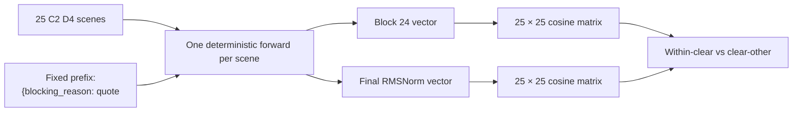

<callout icon="🧠" color="blue_bg">
	**핵심 결과:** C2·D4의 25개 장면에서 `blocking_reason` 첫 값을 생성하기 직전 latent를 비교했다. FC_CLEAR 내부–외부 cosine gap은 **Block 24의 0.00090에서 Final의 0.00542로 증가**했다. 실제 `NONE`인 C1–C4만 보면 Final gap은 **0.01307**이었다. 즉 clear 장면의 상대적 군집성이 중간층보다 마지막 표현에서 더 강해졌다.
</callout>

실험: `l3_v19_c2_d4_reason_latent_20260918`  
원본: `l3_primary_blocker_v19 · C2 D4`  
모델: `Qwen/Qwen3-VL-30B-A3B-Instruct`  
분석 단위: **25 scenes · scene당 deterministic vector 1개**  
주 비교: **Decoder Block 24 vs Final RMSNorm**

<table_of_contents/>

## 1. 확인하려는 가설

<callout icon="💡" color="green_bg">
	VLM이 blocker 유무와 장면 구조를 잘 구별한다면 **clear scene끼리의 cosine similarity는 높고**, clear scene과 다른 scene의 similarity는 상대적으로 낮아야 한다. 이 차이가 중간 layer보다 마지막 layer에서 커지는지도 확인한다.
</callout>

이 분석은 reason GT class끼리 군집을 비교하는 실험이 아니다. **장면 하나를 점 하나로 두고 25개 장면 사이의 표현 유사도**를 비교한다.

주 비교 그룹은 장면 family 이름이 `FC_CLEAR`인 C1–C5다. 다만 C5는 이름과 달리 C2·D4에서 실제 GT가 `CLEARANCE_OVERLAP`이므로, 실제 direct-graspable 상태인 `NONE` 장면 C1–C4도 별도로 계산했다.



## 2. v23 방식에서 무엇을 그대로 가져왔나

<table fit-page-width="true" header-row="true">
	<tr><td>항목</td><td>이번 실험</td><td>의미</td></tr>
	<tr><td>Forward</td><td>Transformers BF16 · batch 1</td><td>실제 로컬 30B checkpoint 사용</td></tr>
	<tr><td>Sampling</td><td>**없음**</td><td>답변 토큰을 생성하지 않음</td></tr>
	<tr><td>독립점</td><td>Scene</td><td>25개 장면 = 25개 latent vector</td></tr>
	<tr><td>v19의 5 seeds</td><td>메타데이터만 사용</td><td>latent point를 5개로 복제하거나 평균하지 않음</td></tr>
	<tr><td>Layer</td><td>48 decoder blocks + final RMSNorm 저장</td><td>주 분석은 Block 24와 Final만 비교</td></tr>
	<tr><td>정규화</td><td>장면 vector별 L2 normalization</td><td>dot product가 cosine similarity가 됨</td></tr>
</table>

### v23과 달라진 readout 위치

v23은 답변 생성 직전 마지막 입력 token을 읽었다. 이번에는 사용자가 지정한 **`blocking_reason` 값 위치**로 옮겼다. 모든 장면에 다음 공통 assistant prefix만 추가했다.

```json
{"blocking_reason": "
```

추출 지점은 opening quote 다음, 즉 첫 reason token을 예측하기 직전이다.

```text
{"blocking_reason": "  ← 이 마지막 공통 token의 hidden state
                       ↑ 아직 NONE/BOTH/OCCLUSION/CLEARANCE를 넣지 않음
```

<callout icon="🔒" color="gray_bg">
	정답 label, 모델 출력 label, blocker ID는 forward 입력에 넣지 않았다. 따라서 동일 단어 token 때문에 같은 label끼리 cosine이 인위적으로 높아지는 문제를 피했다.
</callout>

## 3. 데이터와 장면 키

<image src="file-upload://3df952c9-e273-8182-bd17-00b28fea1ce1"></image>

| Short ID | Family | Scene |
|---|---|---|
| B1–B5 | FC_BLOCKED | `scene_fc_blocked_v01–v05` |
| C1–C5 | FC_CLEAR | `scene_fc_clear_v01–v05` |
| L1–L5 | LIFT_AND_RELOCATE | `scene_lift_and_relocate_v01–v05` |
| R1–R5 | ROTATE | `scene_rotate_v01–v05` |
| T1–T5 | TRANSLATE | `scene_translate_v01–v05` |

C2·D4의 기존 출력 성능은 reason **60/125 = 48.0%**, blocker ID **116/125 = 92.8%**였다. 이번 latent 추출은 이 125개 stochastic 응답을 다시 생성하지 않고, 각 장면의 고정 입력을 한 번씩 forward했다.

## 4. Block 24와 Final의 전체 장면 cosine

<image src="file-upload://3df952c9-e273-811b-a61e-00b2384736a2"></image>

행·열 표시 순서: `C1–C5 → B1–B5 → T1–T5 → R1–R5 → L1–L5`

### 읽는 법

- 각 cell은 두 장면의 cosine similarity다.
- 흰 경계선은 5개 scene family를 나눈다.
- 대각선은 자기 자신이므로 항상 1이다.
- 두 heatmap은 같은 color scale을 사용한다.

Block 24에서는 거의 모든 쌍이 `0.998` 이상이라 장면 간 차이가 매우 작다. Final RMSNorm에서는 범위가 넓어지고 family 내부 block과 개별 장면 차이가 더 잘 보인다.

<callout icon="⚠️" color="yellow_bg">
	cosine 절대값이 0.98–1.00으로 높은 이유는 모든 입력이 같은 시스템 지시, 같은 task prompt, 같은 JSON prefix를 공유하기 때문이다. 따라서 “0.99라서 동일하다”보다 **동일 readout에서 장면군 내부와 외부의 상대 차이**를 봐야 한다.
</callout>

## 5. Clear-scene 가설의 직접 검증

<image src="file-upload://3df952c9-e273-816f-8c74-00b2948fba40"></image>

### 5.1 FC_CLEAR family C1–C5

<table fit-page-width="true" header-row="true">
	<tr><td>Readout</td><td>Clear 내부</td><td>Clear ↔ 다른 family</td><td>Gap</td></tr>
	<tr><td>Block 24</td><td>0.999321</td><td>0.998419</td><td>**0.000902**</td></tr>
	<tr color="green_bg"><td>Final RMSNorm</td><td>0.990699</td><td>0.985283</td><td>**0.005416**</td></tr>
</table>

- Final gap은 Block 24보다 **0.004513 증가**했다.
- gap 크기는 약 **6.0배**가 됐다.
- FC_CLEAR 내부 cosine 자체도 낮아졌지만, clear–other cosine이 더 크게 낮아져 상대적 분리가 커졌다.

### 5.2 실제 direct-graspable `NONE` 장면 C1–C4

<table fit-page-width="true" header-row="true">
	<tr><td>Readout</td><td>NONE 내부</td><td>NONE ↔ 나머지 장면</td><td>Gap</td></tr>
	<tr><td>Block 24</td><td>0.999363</td><td>0.998448</td><td>**0.000915**</td></tr>
	<tr color="green_bg"><td>Final RMSNorm</td><td>0.997376</td><td>0.984311</td><td>**0.013065**</td></tr>
</table>

- Final gap은 Block 24보다 **0.012151 증가**했다.
- gap은 약 **14.3배**가 됐다.
- 사용자의 “clear끼리는 높고 clear–other는 낮아야 한다”는 예상은 실제 NONE 장면 C1–C4에서 더 강하게 나타났다.

<callout icon="✅" color="green_bg">
	**가설과 일치하는 관측:** clear 장면의 상대적 응집력은 이미 Block 24에서 양수였고, Final에서 훨씬 커졌다. 마지막 reason decision representation이 중간 표현보다 clear/non-clear 장면 구조를 더 강하게 반영한다.
</callout>

## 6. C5가 보여주는 중요한 예외

`scene_fc_clear_v05`는 family 이름은 FC_CLEAR지만 C2·D4의 실제 상태는 다음과 같다.

```json
{
  "scene": "scene_fc_clear_v05",
  "target_id": 62,
  "blocking_reason": "CLEARANCE_OVERLAP",
  "valid_blocker_ids": [82]
}
```

v19 C2·D4에서 C5는 5 seeds 모두 reason과 blocker를 정확히 출력했다.

```json
{"blocking_reason": "CLEARANCE_OVERLAP", "blocker_id": 82}
```

Final latent에서 C5의 평균 cosine은 다음과 같다.

| 비교 대상 | 평균 cosine |
|---|---:|
| C1–C4 | **0.980683** |
| FC_CLEAR 이외 20장면 | **0.988447** |

C5의 가장 가까운 장면도 clear 장면이 아니라 `B4`였다. cosine은 **0.997230**이다. Block 24에서도 최근접 장면은 `B5`였다.

<callout icon="🔍" color="purple_bg">
	C5는 이름이 FC_CLEAR라고 해서 C1–C4 군집에 남지 않았다. 실제로 clearance blocker가 있는 C5가 final latent에서 clear 장면보다 다른 장면들에 가까워진 것은, 단순 family 이름이나 배경만 복제한 군집보다 **현재 장면의 방해 상태가 late representation에 반영됐을 가능성**과 일치한다.
</callout>

다만 이것은 장면 하나의 사례이므로 인과 증명으로 해석하면 안 된다. matched counterfactual이 필요하다.

## 7. 어떤 장면 쌍이 더 가까워지고 멀어졌나

<image src="file-upload://3df952c9-e273-81c9-82f6-00b2ac4ba86a"></image>

- 빨강: Final에서 Block 24보다 더 비슷해진 장면 쌍
- 파랑: Final에서 더 멀어진 장면 쌍
- C1–C4 내부는 상대적으로 유지되지만, 여러 clear–blocked 쌍은 Final에서 더 멀어진다.
- 변화량은 절대 cosine이 아니라 `Final cosine − Block 24 cosine`이다.

## 8. Scene family 평균 구조

<image src="file-upload://3df952c9-e273-81f1-8650-00b2564fe41f"></image>

<table fit-page-width="true" header-row="true">
	<tr><td>지표</td><td>Block 24</td><td>Final</td></tr>
	<tr><td>최근접 장면이 같은 family인 비율</td><td>16/25 · 64%</td><td>18/25 · **72%**</td></tr>
	<tr><td>FC_CLEAR 내부 평균</td><td>0.999321</td><td>0.990699</td></tr>
	<tr><td>FC_CLEAR ↔ FC_BLOCKED</td><td>0.998817</td><td>0.980743</td></tr>
	<tr><td>FC_CLEAR ↔ LIFT</td><td>0.998186</td><td>0.986395</td></tr>
	<tr><td>FC_CLEAR ↔ ROTATE</td><td>0.998455</td><td>0.989270</td></tr>
	<tr><td>FC_CLEAR ↔ TRANSLATE</td><td>0.998217</td><td>0.984724</td></tr>
</table>

Final에서 family별 구조가 전반적으로 강해졌지만, 완벽한 family 분리는 아니다. 특히 C5 같은 상태 예외와 서로 유사한 shelf 구성의 영향이 함께 존재한다.

## 9. 네트워크 전체에서 분리는 언제 커졌나

<image src="file-upload://3df952c9-e273-8189-b125-00b232afba0e"></image>

메인 비교는 사전에 정한 Block 24와 Final이다. 위 곡선은 저장된 48개 block을 이용한 보조 분석이다.

- FC_CLEAR family gap은 **Block 40에서 0.01272로 최대**였다.
- 실제 NONE C1–C4 gap은 **Block 42에서 0.03402로 최대**였다.
- 이후 gap이 줄지만 Final에서도 Block 24보다 큰 상태를 유지했다.
- 즉 clear/non-clear 분리는 중간층 전반에서 강한 것이 아니라 **late decoder 구간에서 급격히 나타났다.**

Final RMSNorm이 peak block보다 낮다는 사실도 중요하다. 모델의 최종 readout이 late-layer 분리를 그대로 최대치로 보존하지는 않는다.

## 10. Clear 장면별 상세 프로파일

<image src="file-upload://3df952c9-e273-813e-be8a-00b2cb5f15da"></image>

- C1–C4는 Final에서 다른 clear 장면과의 평균 cosine이 다른 family보다 높다.
- C5만 방향이 반대다. C5는 실제로 `CLEARANCE_OVERLAP`이므로 이 예외가 의미 있다.

<image src="file-upload://3df952c9-e273-8106-9bad-00b2b2268006"></image>

이 그림은 C1–C5 각각을 25개 전체 장면과 비교한다. Block 24의 거의 균일한 행이 Final에서 서로 다른 패턴으로 바뀌는 것을 볼 수 있다.

## 11. PCA 보조 시각화

<image src="file-upload://3df952c9-e273-81c5-87c1-00b206b2279b"></image>

PCA는 cosine 분석의 보조 그림일 뿐이며, 결론은 원래 2,048차원에서 계산한 cosine으로 내렸다. 2차원상 거리나 축 방향을 Block 24와 Final 사이의 실제 이동 경로로 해석하면 안 된다.

## 12. 무엇을 말할 수 있고, 무엇을 말하면 안 되는가

### 관측으로 말할 수 있는 것

1. C2·D4의 fixed pre-reason state에서 clear 장면 내부 cosine이 clear–other보다 높다.
2. 이 상대 차이는 Block 24보다 Final에서 크다.
3. 실제 NONE인 C1–C4만 보면 차이가 더 강하다.
4. C5는 family 이름보다 현재 clearance 상태에 더 일치하는 예외 패턴을 보인다.
5. 주요 분리는 block 40–42 부근에서 가장 크게 나타난다.

### 아직 말하면 안 되는 것

- VLM이 blocker의 물리적 인과관계를 완전히 이해했다.
- 이 latent 차이가 최종 reason 오답의 직접 원인이다.
- cosine gap만으로 unseen scene의 clear/blocked를 분류할 수 있다.
- C5 한 사례만으로 family confound가 제거됐다.
- historical vLLM 출력과 Transformers latent가 수치적으로 동일한 실행 경로다.

<callout icon="⚠️" color="yellow_bg">
	이번 분석은 **descriptive representation analysis**다. 같은 prompt와 prefix를 공유한 25개 장면 안에서의 상대 구조를 보여주지만, held-out probe나 causal intervention은 수행하지 않았다. 또한 pairwise cosine은 한 장면이 여러 쌍에 반복되므로 독립 표본이 아니다.
</callout>

## 13. 다음 검증 실험

1. 같은 배치에서 blocker만 제거한 clear/blocked matched pair를 만든다.
2. 이미지와 geometry를 각각 교환해 어떤 입력이 late-layer separation을 만드는지 확인한다.
3. C5 같은 family-name/actual-state 불일치 장면을 여러 개 추가한다.
4. Block 40·42·Final의 latent에 held-out linear probe를 적용한다.
5. `blocking_reason` 출력 오류 사례와 latent nearest-neighbor 구조가 연관되는지 사전 정의된 지표로 검증한다.

## 14. 재현 자료

- 분석 요약 JSON  
<file src="file-upload://3df952c9-e273-812c-b4ee-00b2066c68aa"></file>
- 추출 manifest · readout·hash·환경·무결성  
<file src="file-upload://3df952c9-e273-8148-8ec7-00b2827c9230"></file>
- 25장면 입력·GT·기존 5-seed 출력 기록  
<file src="file-upload://3df952c9-e273-818b-b1aa-00b289180224"></file>
- Block 24·Final의 300개 장면 쌍 cosine CSV  
<file src="file-upload://3df952c9-e273-81a9-a7fd-00b23bcc5846"></file>
- 자동 생성 요약 보고서  
<file src="file-upload://3df952c9-e273-8105-9d54-00b2502f7657"></file>
- 전체 재현 묶음: hidden states, cosine matrices, records, scripts  
<file src="file-upload://3df952c9-e273-81dc-9ad6-00b23c932995"></file>

ZIP SHA-256:

```plain text
704c253bc730564080eb1cabbdc13ffed62895c0c04a6abb4bb5ae662a5bc4e6
```

로컬 경로:

```plain text
experiments/l3_v19_c2_d4_reason_latent_20260918/
scripts/extract_l3_c2_d4_reason_latent_v1.py
scripts/analyze_l3_c2_d4_reason_latent_v1.py
```

<callout icon="✅" color="green_bg">
	**최종 해석:** 사용자가 예상한 clear-scene similarity 구조는 관측됐다. Block 24에서는 차이가 매우 작았지만, late decoder에서 커졌고 Final에서도 유지됐다. 특히 실제 clear인 C1–C4는 강하게 모였고, 실제 clearance blocker가 있는 C5는 그 군집에서 벗어났다. 다만 이것은 장면 표현의 상대 구조에 대한 증거이며, 물리적 blocker 이해의 인과 증명은 아니다.
</callout>
