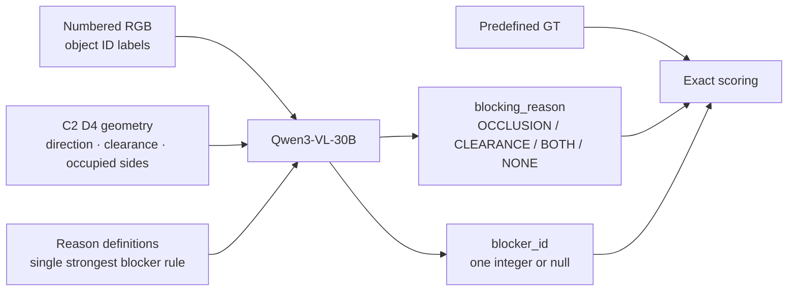
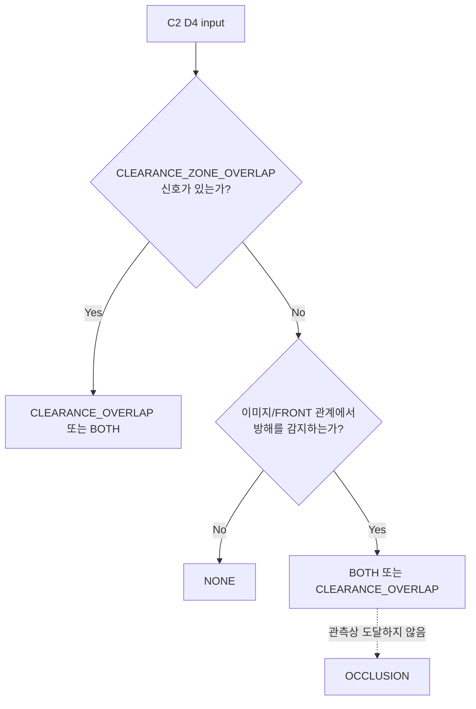

<callout icon="🔎" color="blue_bg">
	**C2·D4만 분리한 핵심 결과:** 25장면 × 5 seeds = **125회**에서 blocker ID는 **116/125 = 92.8%**였지만, blocking reason은 **60/125 = 48.0%**였다. 정답이 `OCCLUSION`인 35회에서 모델이 `OCCLUSION`을 **한 번도 출력하지 않은 것**이 가장 큰 병목이다.
</callout>

실험 버전: `l3_primary_blocker_v19`  
조건: `C2 · R_QUALITATIVE · D4`  
모델: `Qwen/Qwen3-VL-30B-A3B-Instruct`  
분석 단위: 25 scenes × 5 seeds = 125 API calls  
Seeds: 28101, 28102, 28103, 28104, 28105

<table_of_contents/>

## 1. 이 페이지가 답하는 질문

이 페이지는 v19 전체 비교가 아니라 **C2 D4에서 모델이 blocking reason을 어떻게 판정한 것으로 보이는지**만 상세히 분석한다.

- `blocking_reason`: 가림·clearance·둘 다·없음 중 하나
- `blocker_id`: 가장 강하게 직접 grasp를 방해해 먼저 제거할 visible object **하나**
- GT는 실험 데이터에 사전 정의되어 있고, VLM은 numbered RGB와 C2 D4 geometry를 보고 JSON을 출력했다.
- Reason 정답은 GT enum과 exact match, blocker 정답은 출력 ID가 `valid_blocker_ids`에 포함되는지로 판정했다.



## 2. 모델에 실제로 준 판정 규칙

```plain text
Identify why the target is not directly graspable and select exactly one
visible causal blocker for the next action.

OCCLUSION means the target is not FULL.
CLEARANCE_OVERLAP means another object is within 5 cm of the target's outer
boundary. BOTH means both conditions hold. NONE means the target is directly
graspable.

Choose the single object that most strongly prevents direct graspability and
should be removed first. If several objects contribute, select the one whose
removal would most improve direct graspability. Do not list alternatives. Use
null when the reason is NONE.
```

출력 schema는 다음 두 필드만 허용했다.

```json
{
  "blocking_reason": "OCCLUSION | CLEARANCE_OVERLAP | BOTH | NONE",
  "blocker_id": "integer | null"
}
```

<callout icon="⚠️" color="yellow_bg">
	**중요:** API 로그에는 모델의 숨은 chain-of-thought가 저장되지 않고 최종 JSON만 남는다. 따라서 아래의 “판단 방식”은 내부 생각을 직접 열람한 것이 아니라, **실제로 제공된 입력과 125개 최종 출력의 반복 패턴으로부터 추론한 설명**이다.
</callout>

## 3. C2 D4 입력에는 무엇이 있었나

`C2`는 `R_QUALITATIVE`, `D4`는 방향을 `LEFT / RIGHT / FRONT / BEHIND` 수준으로 양자화한 조건이다.

<table fit-page-width="true" header-row="true">
	<tr>
		<td>입력 필드</td>
		<td>의미</td>
		<td>Reason 판정에 주는 정보</td>
	</tr>
	<tr>
		<td>`center_direction`</td>
		<td>다른 물체 중심이 target 기준 어느 방향인지</td>
		<td>앞쪽 물체 후보를 알 수 있으나 실제 가림을 직접 확정하지는 않음</td>
	</tr>
	<tr>
		<td>`clearance_zone`</td>
		<td>5 cm clearance zone의 CLEAR / OVERLAP</td>
		<td>`CLEARANCE_OVERLAP`의 구조화된 직접 신호</td>
	</tr>
	<tr>
		<td>`occupied_target_sides`</td>
		<td>물체 footprint가 target 어느 면을 차지하는지</td>
		<td>접근 방해 방향의 보조 신호</td>
	</tr>
	<tr color="yellow_bg">
		<td>없었던 필드</td>
		<td>`FULL / PARTIAL`, `is_occluded` 같은 target visibility 상태</td>
		<td>`OCCLUSION`은 numbered RGB에서 시각적으로 추론해야 함</td>
	</tr>
</table>

실제 C2 D4 입력 예시 — `scene_fc_blocked_v05`, target 59:

```json
{
  "condition": "R_QUALITATIVE",
  "direction_resolution": "D4",
  "target_id": 59,
  "relations": [
    {"object_id": 26, "center_direction": "RIGHT", "clearance_zone": "CLEARANCE_ZONE_OVERLAP", "occupied_target_sides": ["RIGHT"]},
    {"object_id": 69, "center_direction": "RIGHT", "clearance_zone": "CLEARANCE_ZONE_CLEAR", "occupied_target_sides": ["RIGHT"]},
    {"object_id": 92, "center_direction": "LEFT",  "clearance_zone": "CLEARANCE_ZONE_CLEAR", "occupied_target_sides": ["LEFT"]}
  ]
}
```

여기서는 ID 26의 clearance overlap은 JSON에 명시되지만, target 59의 occlusion 여부는 별도 필드로 주어지지 않는다.

## 4. 전체 정확도 — Reason과 ID의 큰 격차

<image src="file-upload://3df952c9-e273-81cd-81f8-00b24657336a"></image>

<table fit-page-width="true" header-row="true">
	<tr>
		<td>지표</td>
		<td>정답</td>
		<td>정확도</td>
		<td>해석</td>
	</tr>
	<tr color="orange_bg">
		<td>Blocking reason</td>
		<td>60/125</td>
		<td>**48.0%**</td>
		<td>원인 enum exact match</td>
	</tr>
	<tr color="blue_bg">
		<td>Blocker ID</td>
		<td>116/125</td>
		<td>**92.8%**</td>
		<td>valid blocker 번호 선택</td>
	</tr>
	<tr color="purple_bg">
		<td>Joint</td>
		<td>60/125</td>
		<td>**48.0%**</td>
		<td>Reason과 ID를 모두 맞힘</td>
	</tr>
</table>

<callout icon="📌" color="blue_bg">
	**92.8%는 reason 정확도가 아니다.** C2 D4에서 물체 번호만 116/125 맞힌 값이다. Reason은 48.0%이고, 둘을 모두 맞힌 joint도 48.0%다.
</callout>

### Reason–blocker 결합 분해

<image src="file-upload://3df952c9-e273-81ae-82a3-00b2f303fc09"></image>

<table fit-page-width="true" header-row="true">
	<tr><td>분류</td><td>횟수</td><td>비율</td></tr>
	<tr color="green_bg"><td>Reason·blocker 모두 정답</td><td>60</td><td>48.0%</td></tr>
	<tr color="blue_bg"><td>Blocker만 정답</td><td>56</td><td>44.8%</td></tr>
	<tr><td>Reason만 정답</td><td>0</td><td>0.0%</td></tr>
	<tr color="red_bg"><td>둘 다 오답</td><td>9</td><td>7.2%</td></tr>
</table>

Reason만 맞고 ID가 틀린 경우가 0회다. 반대로 ID는 맞지만 reason label만 틀린 경우가 56회이므로, C2 D4의 핵심 문제는 대체로 **방해 물체 탐색보다 원인 유형 표현**에 있다.

## 5. 모델이 실제로 어떤 reason을 출력했나

<image src="file-upload://3df952c9-e273-81a9-bc74-00b22e02bcf9"></image>

<table fit-page-width="true" header-row="true">
	<tr><td>출력 reason</td><td>횟수</td><td>비율</td></tr>
	<tr color="red_bg"><td>`OCCLUSION`</td><td>**0**</td><td>**0.0%**</td></tr>
	<tr color="blue_bg"><td>`CLEARANCE_OVERLAP`</td><td>63</td><td>50.4%</td></tr>
	<tr color="purple_bg"><td>`BOTH`</td><td>44</td><td>35.2%</td></tr>
	<tr color="green_bg"><td>`NONE`</td><td>18</td><td>14.4%</td></tr>
</table>

모델은 125회 전체에서 `OCCLUSION`이라는 최종 label을 단 한 번도 내지 않았다. 가림을 완전히 무시했다고 단정할 수는 없지만, 최종 분류에서는 `BOTH` 또는 `CLEARANCE_OVERLAP`로 흡수됐다.

## 6. 혼동행렬과 class별 성능

<image src="file-upload://3df952c9-e273-8159-a6f3-00b2d91b24be"></image>

GT 행 기준 실제 횟수:

<table fit-page-width="true" header-row="true" header-column="true">
	<tr><td>GT \ Pred</td><td>OCCLUSION</td><td>CLEARANCE</td><td>BOTH</td><td>NONE</td><td>합계</td></tr>
	<tr color="red_bg"><td>OCCLUSION</td><td>0</td><td>12</td><td>23</td><td>0</td><td>35</td></tr>
	<tr color="blue_bg"><td>CLEARANCE</td><td>0</td><td>24</td><td>1</td><td>0</td><td>25</td></tr>
	<tr color="purple_bg"><td>BOTH</td><td>0</td><td>27</td><td>18</td><td>0</td><td>45</td></tr>
	<tr color="green_bg"><td>NONE</td><td>0</td><td>0</td><td>2</td><td>18</td><td>20</td></tr>
</table>

<image src="file-upload://3df952c9-e273-8110-98f7-00b213a9cb55"></image>

<table fit-page-width="true" header-row="true">
	<tr><td>GT class</td><td>Support</td><td>Precision</td><td>Recall</td><td>F1</td></tr>
	<tr color="red_bg"><td>OCCLUSION</td><td>35</td><td>0.0%</td><td>**0.0%**</td><td>0.0%</td></tr>
	<tr color="blue_bg"><td>CLEARANCE_OVERLAP</td><td>25</td><td>38.1%</td><td>**96.0%**</td><td>54.5%</td></tr>
	<tr color="purple_bg"><td>BOTH</td><td>45</td><td>40.9%</td><td>**40.0%**</td><td>40.4%</td></tr>
	<tr color="green_bg"><td>NONE</td><td>20</td><td>100.0%</td><td>**90.0%**</td><td>94.7%</td></tr>
</table>

핵심 오류 흐름은 두 가지다.

1. GT `OCCLUSION` 35회 → `BOTH` 23회, `CLEARANCE_OVERLAP` 12회
2. GT `BOTH` 45회 → `CLEARANCE_OVERLAP` 27회

즉, `CLEARANCE_OVERLAP`은 거의 놓치지 않지만 recall 96.0%, 다른 class까지 clearance로 끌어오기 때문에 precision은 38.1%에 머문다.

## 7. “어떻게 판단했는가”에 대한 증거 기반 해석

<table fit-page-width="true" header-row="true">
	<tr><td>관측된 사실</td><td>가능한 해석</td><td>확실성</td></tr>
	<tr>
		<td>C2 JSON에 `CLEARANCE_ZONE_OVERLAP`이 직접 제공됨</td>
		<td>모델이 명시적 구조화 신호를 강하게 우선한 것으로 보임</td>
		<td>입력·출력으로 강하게 지지됨</td>
	</tr>
	<tr>
		<td>target visibility 상태는 JSON에 없음</td>
		<td>OCCLUSION은 이미지에서 따로 읽어야 해 더 어려웠을 가능성</td>
		<td>입력 설계에서 확인, 원인성은 추론</td>
	</tr>
	<tr>
		<td>`OCCLUSION` 출력 0/125</td>
		<td>순수 가림을 독립 class로 확정하는 판정 경로가 작동하지 않음</td>
		<td>출력에서 직접 확인</td>
	</tr>
	<tr>
		<td>GT BOTH의 27/45를 CLEARANCE로 축약</td>
		<td>가림 신호를 보존하지 못하고 명시적 clearance 신호만 남김</td>
		<td>혼동행렬에서 직접 확인</td>
	</tr>
	<tr>
		<td>Blocker 92.8%, reason 48.0%</td>
		<td>“어느 물체가 문제인가”와 “왜 문제인가”가 분리되어 있음</td>
		<td>정량 결과로 강하게 지지됨</td>
	</tr>
</table>

### 관측 결과로 재구성한 판정 경향



이 흐름은 모델 코드가 아니라 125개 출력에서 역으로 정리한 **행동 수준의 근사 설명**이다. 특히 가림-only 장면에서도 `OCCLUSION` 대신 `BOTH`나 `CLEARANCE_OVERLAP`를 내므로, reason label은 물체 선택 결과만큼 신뢰하면 안 된다.

## 8. Scene family별 결과

<image src="file-upload://3df952c9-e273-81ba-8b8c-00b241f97ca5"></image>

<table fit-page-width="true" header-row="true">
	<tr><td>Family</td><td>Reason</td><td>Blocker ID</td><td>Joint</td><td>주요 패턴</td></tr>
	<tr color="green_bg"><td>FC_CLEAR</td><td>23/25 · 92%</td><td>23/25 · 92%</td><td>23/25 · 92%</td><td>NONE은 대체로 안정적, 2회 false positive</td></tr>
	<tr color="blue_bg"><td>FC_BLOCKED</td><td>19/25 · 76%</td><td>25/25 · 100%</td><td>19/25 · 76%</td><td>ID는 완벽, 일부 BOTH를 CLEARANCE로 축약</td></tr>
	<tr><td>TRANSLATE</td><td>6/25 · 24%</td><td>25/25 · 100%</td><td>6/25 · 24%</td><td>ID는 완벽하지만 reason이 흔들림</td></tr>
	<tr><td>ROTATE</td><td>0/25 · **0%**</td><td>18/25 · 72%</td><td>0/25 · 0%</td><td>GT OCCLUSION을 전부 다른 label로 출력</td></tr>
	<tr><td>LIFT_AND_RELOCATE</td><td>12/25 · 48%</td><td>25/25 · 100%</td><td>12/25 · 48%</td><td>BOTH 인식 여부가 장면별로 갈림</td></tr>
</table>

ROTATE의 reason 0%는 우연한 일부 seed 오류가 아니라 5개 장면 × 5 seeds 전부의 반복 실패다.

## 9. Seed별 안정성

<image src="file-upload://3df952c9-e273-816b-a99d-00b24ab774c9"></image>

<table fit-page-width="true" header-row="true">
	<tr><td>Seed</td><td>Reason</td><td>Blocker ID</td><td>Joint</td></tr>
	<tr><td>28101</td><td>11/25 · 44%</td><td>23/25 · 92%</td><td>11/25 · 44%</td></tr>
	<tr><td>28102</td><td>12/25 · 48%</td><td>22/25 · 88%</td><td>12/25 · 48%</td></tr>
	<tr><td>28103</td><td>11/25 · 44%</td><td>23/25 · 92%</td><td>11/25 · 44%</td></tr>
	<tr color="green_bg"><td>28104</td><td>15/25 · 60%</td><td>24/25 · 96%</td><td>15/25 · 60%</td></tr>
	<tr><td>28105</td><td>11/25 · 44%</td><td>24/25 · 96%</td><td>11/25 · 44%</td></tr>
</table>

Seed별 reason은 44–60% 범위다. 어느 seed도 OCCLUSION을 출력하지 않았으므로 핵심 오류는 특정 seed 하나의 이상치가 아니다.

## 10. Scene별·seed별 전체 패턴

<image src="file-upload://3df952c9-e273-8112-9ed5-00b2ac001efc"></image>

<image src="file-upload://3df952c9-e273-81fc-99f3-00b27b732029"></image>

### Reason 정확도 기준 장면 묶음

- **5/5:** `fc_blocked_v01`, `v03`, `v04`; `fc_clear_v01`, `v03`, `v05`; `lift_and_relocate_v04`
- **4/5:** `fc_blocked_v02`; `fc_clear_v02`, `v04`; `translate_v02`
- **3/5:** `lift_and_relocate_v03`
- **2/5:** `lift_and_relocate_v01`, `v05`; `translate_v05`
- **0/5:** `fc_blocked_v05`; `lift_and_relocate_v02`; `rotate_v01`–`v05`; `translate_v01`, `v03`, `v04`

25장면 중 10장면이 5 seeds 모두 reason 오답이다. 반면 7장면은 5 seeds 모두 정답이라, seed보다 장면 구조의 영향이 크다.

## 11. 대표 장면과 실제 output JSON

### 11.1 명시적 clearance를 안정적으로 맞힘 — `scene_fc_blocked_v03`

<image src="file-upload://3df952c9-e273-81b0-acda-00b21d2e6a31"></image>

- target: **12**
- GT: `CLEARANCE_OVERLAP`, valid blocker `[33]`
- 입력 핵심: ID 33만 `CLEARANCE_ZONE_OVERLAP`
- 결과: 5 seeds 모두 reason·ID 정답

```json
{"seed": 28101, "blocking_reason": "CLEARANCE_OVERLAP", "blocker_id": 33}
{"seed": 28102, "blocking_reason": "CLEARANCE_OVERLAP", "blocker_id": 33}
{"seed": 28103, "blocking_reason": "CLEARANCE_OVERLAP", "blocker_id": 33}
{"seed": 28104, "blocking_reason": "CLEARANCE_OVERLAP", "blocker_id": 33}
{"seed": 28105, "blocking_reason": "CLEARANCE_OVERLAP", "blocker_id": 33}
```

구조화된 clearance 신호와 GT가 일치하는 가장 전형적인 성공 사례다.

### 11.2 물체는 맞지만 BOTH를 clearance로 축약 — `scene_fc_blocked_v05`

<image src="file-upload://3df952c9-e273-81e2-a897-00b2a09b748d"></image>

- target: **59**
- GT: `BOTH`, valid blocker `[26]`
- 입력 핵심: ID 26이 RIGHT + `CLEARANCE_ZONE_OVERLAP`
- 결과: blocker ID는 5/5 정답, reason은 0/5

```json
{"seed": 28101, "blocking_reason": "CLEARANCE_OVERLAP", "blocker_id": 26}
{"seed": 28102, "blocking_reason": "CLEARANCE_OVERLAP", "blocker_id": 26}
{"seed": 28103, "blocking_reason": "CLEARANCE_OVERLAP", "blocker_id": 26}
{"seed": 28104, "blocking_reason": "CLEARANCE_OVERLAP", "blocker_id": 26}
{"seed": 28105, "blocking_reason": "CLEARANCE_OVERLAP", "blocker_id": 26}
```

모델은 “누가 방해하는지”는 일관되게 찾았지만, 이미지에서 함께 읽어야 할 occlusion 성분을 최종 reason에 보존하지 못했다.

### 11.3 BOTH를 안정적으로 맞힌 대조 사례 — `scene_lift_and_relocate_v04`

<image src="file-upload://3df952c9-e273-8177-97d5-00b2a59a8b6d"></image>

- target: **68**
- GT: `BOTH`, valid blocker `[73]`
- 입력 핵심: ID 73이 FRONT + `CLEARANCE_ZONE_OVERLAP` + occupied sides RIGHT/FRONT
- 결과: 5/5 reason·ID 정답

```json
{"seed": 28101, "blocking_reason": "BOTH", "blocker_id": 73}
{"seed": 28102, "blocking_reason": "BOTH", "blocker_id": 73}
{"seed": 28103, "blocking_reason": "BOTH", "blocker_id": 73}
{"seed": 28104, "blocking_reason": "BOTH", "blocker_id": 73}
{"seed": 28105, "blocking_reason": "BOTH", "blocker_id": 73}
```

`FRONT + overlap` 조합이 이미지의 가림과 잘 맞을 때는 BOTH를 안정적으로 낼 수 있음을 보여준다. 따라서 모델이 BOTH 자체를 전혀 못 쓰는 것은 아니며, 장면 의존성이 크다.

### 11.4 순수 OCCLUSION을 가까운 다른 물체의 clearance로 오판 — `scene_rotate_v01`

<image src="file-upload://3df952c9-e273-8123-bc8f-00b2dcd30b3b"></image>

- target: **12**
- GT: `OCCLUSION`, valid blocker `[95]`
- geometry의 모든 물체는 `CLEARANCE_ZONE_CLEAR`
- 실제 가림 후보 ID 95는 FRONT, 그러나 5 seeds 모두 ID 54를 선택

```json
{"seed": 28101, "blocking_reason": "CLEARANCE_OVERLAP", "blocker_id": 54}
{"seed": 28102, "blocking_reason": "CLEARANCE_OVERLAP", "blocker_id": 54}
{"seed": 28103, "blocking_reason": "CLEARANCE_OVERLAP", "blocker_id": 54}
{"seed": 28104, "blocking_reason": "CLEARANCE_OVERLAP", "blocker_id": 54}
{"seed": 28105, "blocking_reason": "CLEARANCE_OVERLAP", "blocker_id": 54}
```

입력 JSON상 overlap이 하나도 없는데도 clearance를 출력했다. 이는 단순한 geometry 규칙 복사만으로 출력이 결정된 것은 아니며, 이미지의 근접성이나 배치를 clearance로 잘못 해석했을 가능성을 보여준다.

### 11.5 Occluder ID는 일부 찾지만 reason은 전부 실패 — `scene_rotate_v04`

<image src="file-upload://3df952c9-e273-8105-a000-00b2d66b8dd5"></image>

- target: **47**
- GT: `OCCLUSION`, valid blocker `[95]`
- geometry의 모든 물체는 `CLEARANCE_ZONE_CLEAR`; ID 95는 FRONT
- Reason 0/5, blocker ID 3/5

```json
{"seed": 28101, "blocking_reason": "CLEARANCE_OVERLAP", "blocker_id": 25}
{"seed": 28102, "blocking_reason": "BOTH",              "blocker_id": 95}
{"seed": 28103, "blocking_reason": "CLEARANCE_OVERLAP", "blocker_id": 25}
{"seed": 28104, "blocking_reason": "BOTH",              "blocker_id": 95}
{"seed": 28105, "blocking_reason": "CLEARANCE_OVERLAP", "blocker_id": 95}
```

28102·28104·28105는 실제 occluder 95를 선택했지만, reason을 `OCCLUSION`으로 표현하지 못했다. **ID 95를 맞힌 것과 이유를 맞힌 것은 별개의 결과**다.

### 11.6 NONE은 대체로 맞지만 한 seed에서 blocker를 생성 — `scene_fc_clear_v02`

<image src="file-upload://3df952c9-e273-8161-8c96-00b2707251f1"></image>

- target: **29**
- GT: `NONE`, valid blocker `[]`
- geometry의 모든 물체는 `CLEARANCE_ZONE_CLEAR`
- 4/5는 NONE/null, seed 28102만 BOTH/10

```json
{"seed": 28101, "blocking_reason": "NONE", "blocker_id": null}
{"seed": 28102, "blocking_reason": "BOTH", "blocker_id": 10}
{"seed": 28103, "blocking_reason": "NONE", "blocker_id": null}
{"seed": 28104, "blocking_reason": "NONE", "blocker_id": null}
{"seed": 28105, "blocking_reason": "NONE", "blocker_id": null}
```

이 장면은 `NONE` 판정이 대체로 안정적이지만 완전히 결정적이지는 않음을 보여준다.

### 11.7 같은 장면에서도 한 seed가 BOTH를 잃음 — `scene_translate_v02`

<image src="file-upload://3df952c9-e273-8102-8e4b-00b249b5b4c6"></image>

- target: **45**
- GT: `BOTH`, valid blocker `[95]`
- 입력 핵심: ID 95가 FRONT + `CLEARANCE_ZONE_OVERLAP`
- Blocker ID 5/5, reason 4/5

```json
{"seed": 28101, "blocking_reason": "BOTH",              "blocker_id": 95}
{"seed": 28102, "blocking_reason": "BOTH",              "blocker_id": 95}
{"seed": 28103, "blocking_reason": "BOTH",              "blocker_id": 95}
{"seed": 28104, "blocking_reason": "BOTH",              "blocker_id": 95}
{"seed": 28105, "blocking_reason": "CLEARANCE_OVERLAP", "blocker_id": 95}
```

## 12. 결론

<callout icon="✅" color="green_bg">
	**C2 D4는 blocker 번호를 찾는 조건으로는 강하지만, blocker의 원인을 정확히 이름 붙이는 조건으로는 약하다.** 특히 `OCCLUSION` recall이 0%이고, `BOTH`의 60%가 clearance-only로 축약됐다.
</callout>

1. **명시적 geometry 신호의 영향:** clearance overlap은 구조화되어 있어 거의 놓치지 않았다.
2. **시각적 occlusion의 병목:** visibility 상태가 별도 필드에 없어 이미지에서 읽어야 했고, 최종 `OCCLUSION` label은 0회였다.
3. **ID와 reason 분리 필요:** 56회는 물체 번호는 맞고 이유만 틀렸다.
4. **장면 의존성:** 10장면은 5 seeds 모두 reason 오답, 7장면은 모두 정답이었다.
5. **평가 보고 시 주의:** C2 D4의 92.8%는 blocker ID 정확도이며, reason 정확도는 48.0%다.

### 다음 실험 권고

- reason을 `is_occluded`와 `has_clearance_overlap` 두 boolean으로 나눠 평가한 뒤 BOTH를 합성한다.
- C2에 target visibility를 직접 주는 조건을 추가해, 이미지 기반 occlusion 추론과 geometry 기반 판정을 분리한다.
- ROTATE 장면에서 가까운 비원인 물체와 실제 occluder를 교환한 matched counterfactual을 만든다.
- blocker ID와 blocking reason을 항상 별도 지표로 보고한다.

## 13. 원본 자료

- 125회 상세 분석 JSON  
<file src="file-upload://3df952c9-e273-8118-bf79-00b2d5ebb058"></file>
- 125회 최종 출력 CSV  
<file src="file-upload://3df952c9-e273-81b3-803b-00b2501aa03c"></file>
- 자동 생성 요약 Markdown  
<file src="file-upload://3df952c9-e273-8123-857b-00b22cc47437"></file>

로컬 산출물:

```plain text
experiments/vlm_action_geometry_single_info_l3_primary_blocker_v19/results/c2_d4_reason/analysis.json
experiments/vlm_action_geometry_single_info_l3_primary_blocker_v19/results/c2_d4_reason/all_125_outputs.csv
experiments/vlm_action_geometry_single_info_l3_primary_blocker_v19/results/c2_d4_reason/visualizations/
```
