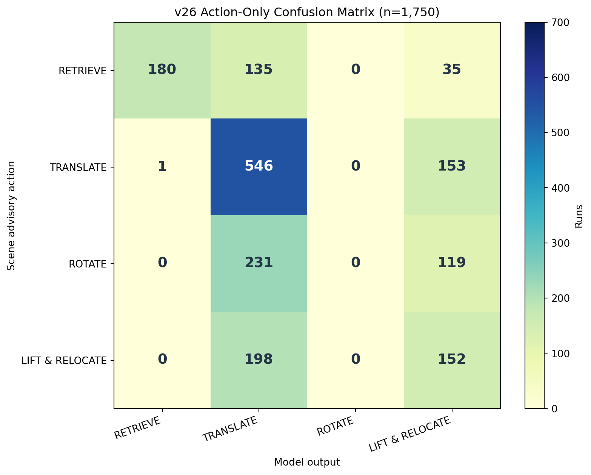
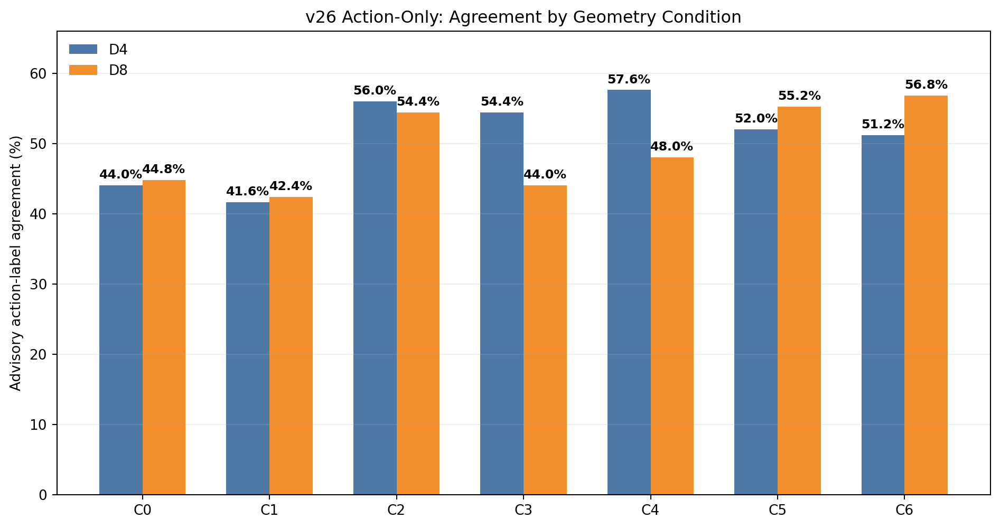

# L4 action-only v26: 1,750회 완료

## 무엇을 바꿨나

v25와 같은 25장면 × 7 geometry 조건 × D4/D8 × 5 seed 및 frozen L3 `blocking_reason`·`blocker_id`를 사용했다. L4 출력은 `{"action":"..."}` 한 필드로 제한했다. `object_id`, 방향, 거리, 각도, 목적지는 출력하지 않는다. C0/C1에도 비교 가능한 동일 셀 구조를 유지했다.

이 결과는 **장면 manifest의 L4 `manifest_focus_action_advisory_only`와 action label이 일치하는지**를 평가한다. 방향·거리 등의 실행 parameter가 없으므로 Isaac Sim replay를 하지 않았고, 아래 일치율을 물리적 성공률로 해석하면 안 된다.

## 주요 결과

- JSON 파싱 및 action-only schema 준수: **1,750/1,750 (100%)**
- Scene advisory action 일치: **878/1,750 (50.2%)**
- 모델 출력: TRANSLATE **1,110**, LIFT_AND_RELOCATE **459**, RETRIEVE **181**, ROTATE **0**
- L3 reason과 blocker가 모두 정답인 셀: **456/590 (77.3%)**
- L3 joint 오답 셀: **422/1,160 (36.4%)**
- L3가 정답이고 non-NONE인 셀: **304/438 (69.4%)**
- L3가 오답이고 non-NONE인 셀: **394/1,131 (34.8%)**
- C2 D8: **68/125 (54.4%)**

| Scene advisory action | RETRIEVE 출력 | TRANSLATE 출력 | ROTATE 출력 | LIFT_AND_RELOCATE 출력 | 일치율 |
|---|---:|---:|---:|---:|---:|
| RETRIEVE | 180 | 135 | 0 | 35 | 51.4% |
| TRANSLATE | 1 | 546 | 0 | 153 | 78.0% |
| ROTATE | 0 | 231 | 0 | 119 | 0.0% |
| LIFT_AND_RELOCATE | 0 | 198 | 0 | 152 | 43.4% |

## C2 D8 상세

| Advisory action | RETRIEVE 출력 | TRANSLATE 출력 | ROTATE 출력 | LIFT_AND_RELOCATE 출력 |
|---|---:|---:|---:|---:|
| RETRIEVE | 18 | 6 | 0 | 1 |
| TRANSLATE | 0 | 30 | 0 | 20 |
| ROTATE | 0 | 11 | 0 | 14 |
| LIFT_AND_RELOCATE | 0 | 5 | 0 | 20 |

예: `scene_rotate_v02`, C2 D8, seed 28102는 GT advisory `ROTATE`, frozen L3 blocker `50`, 실제 모델 출력 `{"action":"LIFT_AND_RELOCATE"}`였다. `scene_lift_and_relocate_v02`의 같은 조건·seed에서는 GT advisory와 출력이 모두 `LIFT_AND_RELOCATE`였다.

## v25와 같은 action-label 기준으로만 대조

v25의 action-label advisory 일치는 **879/1,750**, v26은 **878/1,750**으로 총계는 사실상 같다. 같은 셀을 짝지어 보면 두 버전 모두 일치 726건, v25만 일치 153건, v26만 일치 152건, 둘 다 불일치 719건이다. 이 비교는 **action label만** 비교한 것이며 v25의 물리 성공률과 비교한 수치가 아니다. 또한 v26은 출력 schema뿐 아니라 parameter 관련 프롬프트 문장도 제거한 복합 변경이므로 차이를 한 요소의 인과효과로 단정할 수 없다.

## 해석과 제한

1. Parameter 부담을 없애자 LIFT_AND_RELOCATE 선택은 생겼다. 그러나 ROTATE는 350개의 해당 장면에서도 **0회** 선택돼, 병목이 방향·거리 출력만의 문제는 아님을 시사한다.
2. `FC_CLEAR` family 중 일부에는 L3가 non-NONE을 준 경우가 있어 RETRIEVE 대신 blocker action을 고르게 된다. 이때 action advisory 불일치를 L4 단독 오류로 돌리면 안 된다.
3. Scene GT의 action은 `advisory_only`다. 다른 action으로도 물리적으로 성공할 가능성을 배제하지 않는다.
4. C0/C1의 D4/D8 동일 입력·동일 seed 250쌍 중 prompt hash는 전부 같았지만 3쌍에서 출력 action이 달랐다. 소수의 실행 비결정성이 있다.

원본 실행별 결과는 [run_outcomes.csv](run_outcomes.csv), 모든 집계는 [results.json](results.json)에 있다. 추론 원본은 `logs/runs.jsonl`, frozen prompt와 schema는 `prompts/l4_en.txt`, `schemas/l4_action_only.json`을 참조한다.
