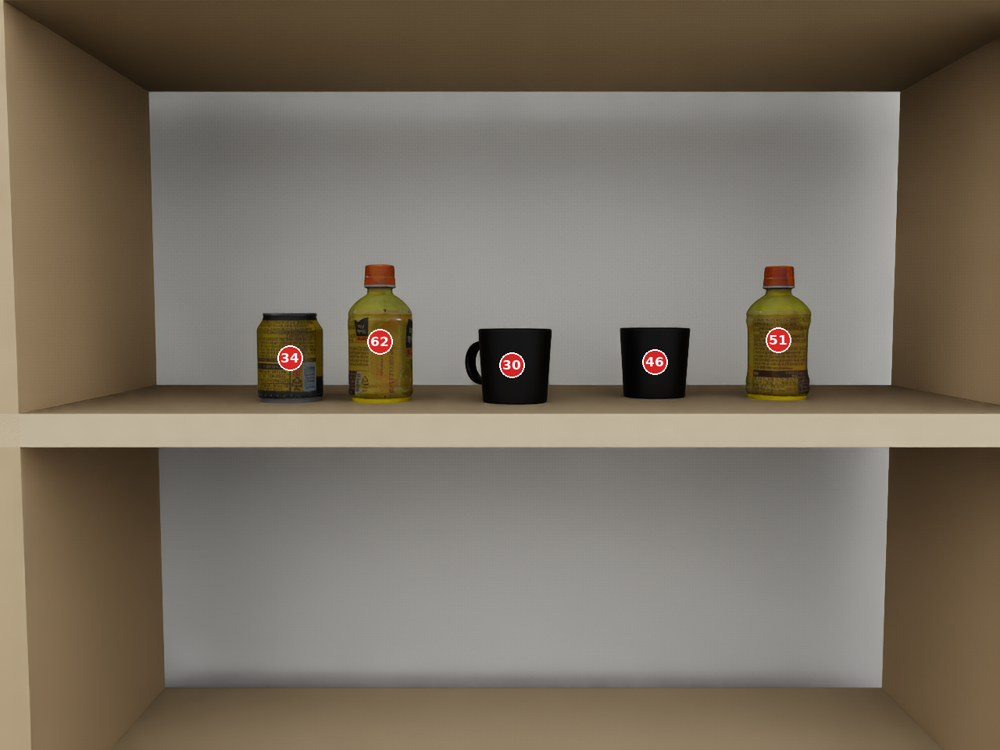
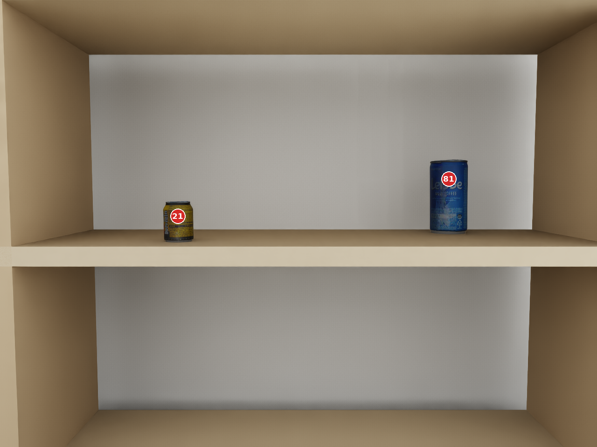

# Numbered RGB 기반 VLM 기초 능력 평가 — N0·N1·N2·N3

| 항목 | 내용 |
|---|---|
| Status | **Complete** |
| Main model | `Qwen/Qwen3-VL-30B-A3B-Instruct` |
| Runtime | vLLM offline, batch size 1 |
| Main repeats | 장면–조건별 고정 seed 5개 |
| Source project | `/home/ssu/ShelfScene` |

SAM instance mask 위에 희소한 두 자리 ID badge를 합성한 **Numbered RGB**를 VLM이 실제 조작 의사결정의 object reference로 사용할 수 있는지 검증한 완료 실험입니다. 최종 manipulation 판단을 한 번에 평가하지 않고, 실패 원인을 분리할 수 있도록 N0–N3의 의존 단계로 나눴습니다.

```text
SAM instance masks
        ↓
Numbered RGB
        ↓
N0: visible ID set
        ↓
N1: ID → object semantics
        ↓
N2: natural-language target → ID
        ↓
N3: ID ↔ ID spatial relations
        ↓
Manipulation sub-goal / next-step decision
```



## 1. 공통 실험 구성

### Numbered RGB

- 각 visible instance mask에 빨간 원, 흰색 외곽선, 흰색 굵은 숫자 badge를 하나씩 부여했습니다.
- ID는 `1..N` 연속 번호나 좌→우 순서가 아니라 장면별 **무작위 희소 두 자리 정수**를 사용했습니다.
- 동일 장면과 paired condition에서는 같은 image와 ID mapping을 사용했습니다.
- badge는 identity marker일 뿐 위치·크기·깊이 단서가 아니라고 prompt에 명시했습니다.

### 공통 추론 원칙

- 평가 장면의 정답 예시를 넣지 않는 zero-shot prompt
- 영어 prompt
- batch size 1
- 장면–조건별 seed `28101`–`28105`
- strict parse/compliance와 task accuracy를 분리 기록
- 장면 전체 exact와 instance/pair 단위 지표를 함께 기록
- prompt, schema, image hash, model/runtime, raw response를 JSONL에 보존

N0의 대표 비교는 temperature 0.7로 수행했고, N1은 temperature 0.3/0.5/0.7을 ablation했습니다. 이후 권장 기본 조건은 temperature 0.3, top-p 0.9, forced JSON이었습니다.

## 2. 단계 정의

| 단계 | 핵심 질문 | 대표 출력 | 주요 지표 |
|---|---|---|---|
| N0 | 보이는 번호를 모두 읽는가? | `{"visible_ids":[17,42,86]}` | ID-set exact, micro P/R/F1, 누락·추가·중복 |
| N1 | 각 ID가 어떤 물체인가? | ID별 category와 color | object/color/joint accuracy, scene mapping exact |
| N2 | 자연어 target을 올바른 ID와 연결하는가? | `{"matching_ids":[17]}` | target-ID/set exact, absent FPR |
| N3 | 물체들의 좌우·앞뒤 관계를 이해하는가? | ordering 또는 target-relative relation | full-order exact, all-pairs accuracy, relation exact |

## 3. 단계별 설계와 결과

### N0 — Visible ID Recognition

- 60장면(L3/L4/L5 각 20) × TEXT/forced JSON × 5 seeds = **600 calls**
- 과제는 badge 안에서 보이는 모든 ID를 집합으로 반환하는 것이며 순서는 채점하지 않았습니다.
- TEXT와 forced JSON 모두 ID-set exact, micro precision/recall, parse success가 **100%**였습니다.

원본 기록: [`n0/sparse-id-text-vs-json`](n0/sparse-id-text-vs-json/)

### N1 — ID–Object–Color Semantic Mapping

- 동일한 60장면에 대해 temperature 3수준 × explicit `visible_ids` enumeration on/off × TEXT/forced JSON × 5 seeds = **3,600 calls**
- ID별 object와 color를 open vocabulary로 출력했습니다.
- Enumeration은 1,800회에서 ID 누락·추가·중복과 cross-field 불일치를 모두 제거했습니다.
- Full-output joint exact는 enumeration off 97.778%, on 97.944%로 전체 semantic score의 개선은 작았습니다.
- 가장 큰 main effect는 forced JSON으로, TEXT 96.167% 대비 JSON 99.556%였습니다.
- 권장 N0→N1 조건인 temperature 0.3 + enumeration + forced JSON은 299/300 full-output exact였습니다.
- 잔여 병목은 ID 인식보다 손잡이가 가려진 mug와 같은 zero-shot object naming ambiguity였습니다.

원본 기록: [`n1/explicit-visible-ids-ablation`](n1/explicit-visible-ids-ablation/)

### N2 — Natural-Language Target Grounding

두 개의 완료 실험을 함께 보존했습니다.

1. **Explicit constraint scaffold**
   - 60장면 × Q1 category-present/Q2 category+color/Q3 absent × 5 seeds = **900 calls**
   - overall matching-ID exact 85.111%, category-only 100.000%, category+color 73.333%, hard-negative absent 82.000%
   - baseline 대비 explicit scaffold의 overall paired improvement는 +12.778%p였습니다.
2. **Unified coarse-color N2-Basic**
   - 60장면 × Q1/Q1.5/Q2/Q3 × 5 seeds = **1,200 calls**
   - overall ID-set exact 86.667%, category-only 100.000%, color-only 67.667%, category+color 87.333%, absent 91.667%
   - 160개 target-set 실패 중 153개는 canonical 단일 색상과 perceptually acceptable 색상 사이의 불일치였습니다.

따라서 N2의 strict color 수치를 순수 grounding 실패로 해석하면 안 됩니다. category grounding은 안정적이지만 canonical color GT와 visible perceptual color의 정의가 주요 평가 병목이었습니다.

원본 기록:

- [`n2/explicit-constraint-scaffold`](n2/explicit-constraint-scaffold/)
- [`n2/unified-coarse-color`](n2/unified-coarse-color/)

### N3 — Spatial-Relation Reasoning

N3는 좌→우와 카메라 기준 앞→뒤를 분리하고, complete ordering과 모든 pair의 상대관계를 함께 평가했습니다. scene family, occlusion, object count, size cue, prompt, depth 입력, camera view를 순차적으로 ablation했습니다.

핵심 관찰은 다음과 같습니다.

- 좌→우 정렬은 두 source dataset의 75장면에서 100%였습니다.
- depth용으로 설계되지 않은 N3-D0 27장면에 front→back을 교차 적용했을 때 exact 34.815%, all-pairs 74.667%로 하락했습니다.
- 40장면 depth-input 비교의 pooled full-order exact는 Numbered RGB 44.292%, RGB+Gray 45.208%, RGB+Numbered Gray 45.542%였습니다. depth 이미지를 추가했다고 일관되게 개선되지는 않았습니다.
- 20개 structured-occlusion scene에서 minimal-direct prompt는 full-order exact 80.0%, all-pairs 95.111%였습니다.
- 24° downward/90 cm camera 조건의 120장면 pooled 결과에서는 Numbered RGB가 full-order exact 58.375%, all-pairs 85.972%로 gray-depth 결합 조건보다 높았습니다.
- prompt, camera pose, scene structure와 metric 선택에 따라 exact score가 크게 달라졌으므로 단일 N3 점수로 축약하지 않습니다.

대표 Numbered RGB depth scene:



보존한 기록:

- [`n3/cross-task-75-scenes`](n3/cross-task-75-scenes/) — 375개 추가 cross-task raw calls
- [`n3/occlusion-prompt-comparison`](n3/occlusion-prompt-comparison/) — 500개 raw calls
- [`n3/depth-input-ablation`](n3/depth-input-ablation/) — 40장면 3-input 종합 표
- [`n3/tilted-camera-input-ablation`](n3/tilted-camera-input-ablation/) — 7,200개 scored call records
- [`n3/camera-view-effect`](n3/camera-view-effect/) — 4°/16°/24° camera 비교

## 4. 이 snapshot에 포함된 로그

이 폴더에는 최종 분석에 사용한 **14,375개의 main call-level record**를 포함합니다. 여기에 N1 schema key-order 검증 중 제외된 163개 호출도 `logs/discarded_wrong_json_key_order/`에 별도로 보존했습니다. 제외 로그는 아래 표의 main record 수와 결과 지표에는 포함되지 않습니다.

| 단계 | 실험 | call-level records | 형태 |
|---|---|---:|---|
| N0 | Sparse-ID TEXT vs JSON | 600 | raw `runs.jsonl` |
| N1 | Explicit visible-ID ablation | 3,600 | raw `runs.jsonl` |
| N2 | Explicit constraint scaffold | 900 | raw `runs.jsonl` |
| N2 | Unified coarse color | 1,200 | raw `runs.jsonl` |
| N3 | 75-scene cross-task completion | 375 | raw `runs.jsonl` |
| N3 | Occlusion prompt comparison | 500 | raw `runs.jsonl` |
| N3 | Tilted-camera input ablation | 7,200 | scored JSONL records |

각 raw record에는 가능한 범위에서 scene/run ID, image hash, prompt/schema hash, model/runtime, seed, generation setting, raw response, token count, latency와 GT가 포함됩니다.

## 5. 재현과 감사

- 각 하위 실험의 `config/`, `prompts/`, `audit/`, `results/`, `reports/`를 보존했습니다.
- 실행·setup·analysis 코드 snapshot은 [`reproduction/scripts`](reproduction/scripts/)에 있습니다.
- 전체 장면 이미지와 USD는 중복 용량 때문에 포함하지 않았습니다. 대표 이미지 두 장만 `assets/`에 보존했습니다.
- 원본 실험 경로와 Notion 문서는 [`SOURCES.md`](SOURCES.md)에 정리했습니다.

## 6. 결론

Numbered RGB는 sparse ID를 읽고, ID를 물체 의미와 연결하며, 자연어 target을 instance ID로 grounding하는 인터페이스로 충분히 안정적이었습니다. 반면 N3의 camera-relative depth와 전체 ordering은 장면 구조, 카메라, prompt와 입력 표현에 민감했습니다. 이 결과를 바탕으로 이후 manipulation 실험에서는 temperature 0.3, explicit enumeration, forced JSON을 기본으로 사용하고, geometry 판단은 별도 capability와 information-sensitivity 실험으로 분리했습니다.
