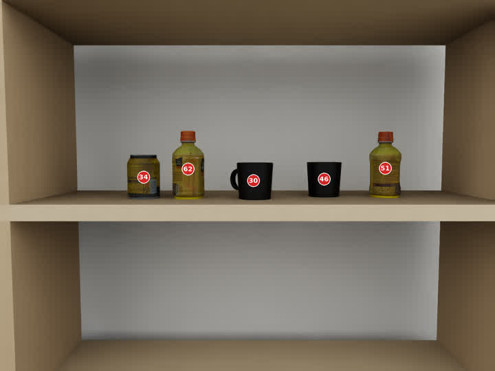
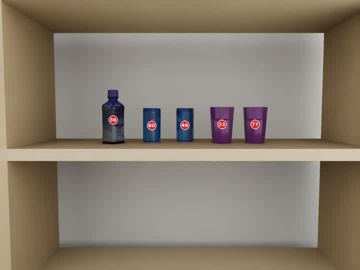
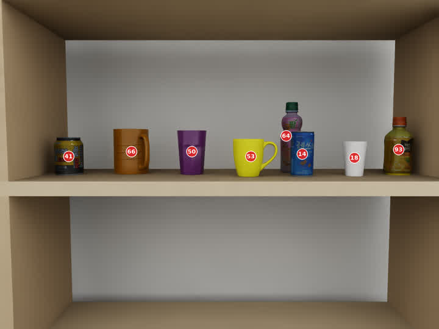
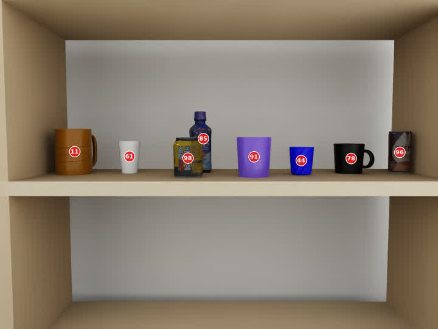
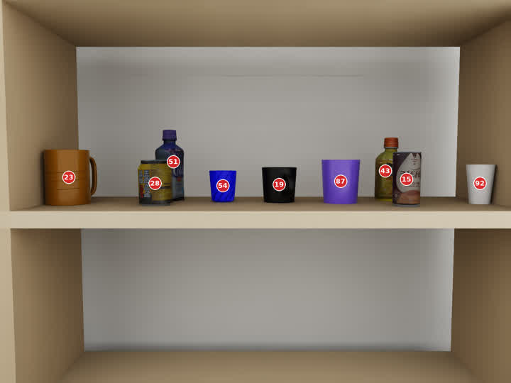
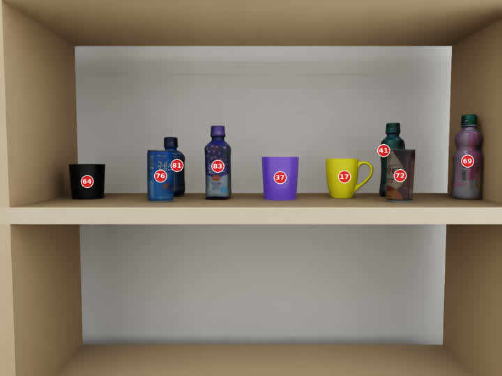

<callout icon="🎯" color="green_bg">
	**핵심 결론:** 60개 numbered RGB scene에 Q1·Q1.5·Q2·Q3를 5개 seed로 평가한 1,200회 실험에서 strict Matching-ID set exact는 **86.667%**, Micro-F1은 **94.605%**였다. Q1 category-only는 100%였고, 전체 visible-ID enumeration·요청 분해·최종 집계도 모두 100%였다. 낮은 strict 점수의 주원인은 VLM이 색을 보지 못한 것이 아니라, 하나의 asset에 지정한 단일 canonical 색과 영상에서 자연스럽게 지각되는 색이 충돌한 것이었다.
</callout>

## 1. 페이지 목적과 실험 위치

이 페이지는 이전 <mention-page url="https://app.notion.com/p/3cf952c9e27381a4909ec6dd4b193f28">N2 Natural-Language Target Grounding — Explicit Constraint Scaffold 실험 결과</mention-page> 이후 수행한 **N2-Basic coarse-color 통합 재실험**을 기록한다. 상위 설계는 <mention-page url="https://app.notion.com/p/3c8952c9e273816dba3ff2fdebb84660">Numbered RGB 기반 VLM 기초 능력 평가 — N0·N1·N2·N3</mention-page>를 따른다.

이번 실험의 목적은 다음과 같다.

- Q1 category-only와 Q1.5 color-only, Q2 category+color, Q3 hard-negative absent를 동일한 prompt 구조로 평가한다.
- 이전에 문제가 된 fine color 표현을 9개 basic color로 정규화한다.
- 모든 confirmed ID의 object/color inventory와 조건 비교 결과를 출력시켜 실패 지점을 관찰한다.
- strict canonical target set과 N1에서 합의한 perceptual color 판정을 분리한다.
- `mug_7`은 N2의 질문 target으로 사용하지 않되, 일반 distractor로는 남긴다.

```plain text
Natural-language request
        ↓
request_constraints: object_type / color
        ↓
complete confirmed-ID enumeration
        ↓
ID별 object_type / basic color 인식
        ↓
ID별 type/color match 판정
        ↓
matches_request
        ↓
matching_ids
```

## 2. 데이터와 실행 조건

<table fit-page-width="true" header-row="true">
	<tr>
		<td>항목</td>
		<td>설정</td>
	</tr>
	<tr>
		<td>Scene</td>
		<td>60개 numbered RGB</td>
	</tr>
	<tr>
		<td>Level</td>
		<td>L3 20개 / L4 20개 / L5 20개</td>
	</tr>
	<tr>
		<td>Query</td>
		<td>Q1 / Q1.5 / Q2 / Q3, scene당 4개</td>
	</tr>
	<tr>
		<td>반복</td>
		<td>각 scene–query를 5개 seed로 반복</td>
	</tr>
	<tr>
		<td>총 호출</td>
		<td>60 × 4 × 5 = **1,200 calls**</td>
	</tr>
	<tr>
		<td>Seeds</td>
		<td>28101, 28102, 28103, 28104, 28105</td>
	</tr>
	<tr>
		<td>Model</td>
		<td>Qwen/Qwen3-VL-30B-A3B-Instruct</td>
	</tr>
	<tr>
		<td>Input</td>
		<td>numbered RGB 1장 + confirmed visible IDs + 영어 자연어 명령</td>
	</tr>
	<tr>
		<td>Output</td>
		<td>강제 JSON, 모든 instance의 상세 진단 필드 포함</td>
	</tr>
	<tr>
		<td>Decoding</td>
		<td>temperature 0.3, top_p 0.9, top_k 0</td>
	</tr>
	<tr>
		<td>Length</td>
		<td>max_tokens 1024, max_model_len 8192</td>
	</tr>
	<tr>
		<td>Runtime</td>
		<td>batch size 1, max_num_seqs 1</td>
	</tr>
</table>

Basic color vocabulary는 `black, blue, brown, green, orange, pink, purple, white, yellow`의 9개로 제한했다. Fine shade는 prompt에서 다음처럼 basic family로 합치도록 지시했다.

- dark blue / navy → blue
- dark purple / violet → purple
- beige / tan / light brown / dark brown → brown
- dark green / teal → green
- gold / golden yellow → yellow

## 3. Query 정의

<table fit-page-width="true" header-row="true">
	<tr>
		<td>Query</td>
		<td>예시</td>
		<td>정답</td>
		<td>검증 능력</td>
	</tr>
	<tr>
		<td>Q1 Category-only present</td>
		<td>`Bring me a can.`</td>
		<td>모든 visible can ID</td>
		<td>종류 기반 target grounding</td>
	</tr>
	<tr>
		<td>Q1.5 Color-only present</td>
		<td>`Bring me something yellow.`</td>
		<td>canonical basic color가 yellow인 모든 ID</td>
		<td>종류 조건 없이 색상 기반 grounding</td>
	</tr>
	<tr>
		<td>Q2 Category+color present</td>
		<td>`Bring me the purple bottle.`</td>
		<td>종류와 canonical color가 모두 맞는 ID</td>
		<td>두 조건의 conjunction</td>
	</tr>
	<tr>
		<td>Q3 Hard-negative absent</td>
		<td>`Bring me the black can.`</td>
		<td>`[]`</td>
		<td>종류 또는 색상만 맞는 partial match 거부</td>
	</tr>
</table>

## 4. 출력 형식과 상세 enumeration의 목적

```json
{
  "request_constraints": {
    "object_type": "bottle",
    "color": "blue"
  },
  "instances": [
    {
      "id": 7,
      "object_type": "bottle",
      "color": "blue",
      "object_type_matches": true,
      "color_matches": true,
      "matches_request": true
    }
  ],
  "matching_ids": [7]
}
```

상세 출력은 실제 배포용 interface를 최적화한 것이 아니라, N2의 기초 능력을 진단하기 위한 구조다. 이를 통해 다음 실패 위치를 분리할 수 있다.

1. confirmed ID를 빠뜨리거나 추가했는가?
2. ID별 object type 또는 color를 잘못 인식했는가?
3. 인식 결과와 요청 조건을 잘못 비교했는가?
4. 각 ID의 boolean 결과를 최종 `matching_ids`에 잘못 집계했는가?

현재 최대 9 objects에서 관측된 최대 출력은 499 tokens였다. 따라서 `max_tokens=1024` 범위에서 잘림 없이 상세 enumeration을 유지할 수 있었으며, 이번 **능력 평가**에서는 확장성보다 오류 귀속 가능성을 우선한다.

## 5. 평가 지표

<table fit-page-width="true" header-row="true">
	<tr>
		<td>지표</td>
		<td>의미</td>
	</tr>
	<tr>
		<td>Matching-ID set exact</td>
		<td>최종 `matching_ids`가 정답 ID 집합과 완전히 같은 호출의 비율. 하나만 누락·추가되어도 해당 호출은 0점이다.</td>
	</tr>
	<tr>
		<td>Micro Precision</td>
		<td>전체 호출에서 모델이 선택한 ID 가운데 실제 정답 ID의 비율</td>
	</tr>
	<tr>
		<td>Micro Recall</td>
		<td>전체 정답 ID 가운데 모델이 찾아낸 ID의 비율</td>
	</tr>
	<tr>
		<td>Micro-F1</td>
		<td>전체 TP·FP·FN을 합산한 뒤 계산한 Precision과 Recall의 조화평균. 복수 target 중 일부만 맞은 경우 부분 성공을 반영한다.</td>
	</tr>
	<tr>
		<td>Request decomposition exact</td>
		<td>자연어 명령에서 required object type과 color 또는 null을 정확히 추출했는가</td>
	</tr>
	<tr>
		<td>Complete ID inventory</td>
		<td>모든 confirmed ID가 `instances`에 정확히 한 번씩 등장했는가</td>
	</tr>
	<tr>
		<td>Canonical basic-color accuracy</td>
		<td>모델의 단일 basic color가 asset에 지정한 하나의 canonical basic color와 같은가</td>
	</tr>
	<tr>
		<td>Perceptual color accuracy</td>
		<td>모델 색상이 N1에서 사람 검수로 허용한 asset별 perceptual palette에 포함되는가</td>
	</tr>
	<tr>
		<td>Aggregation exact</td>
		<td>`matching_ids`가 `matches_request=true`인 ID들과 정확히 같은가</td>
	</tr>
	<tr>
		<td>Absent FPR</td>
		<td>정답이 빈 배열인 Q3에서 하나라도 ID를 선택한 비율</td>
	</tr>
</table>

예를 들어 GT가 `[10,20,30]`이고 prediction이 `[10,20]`이면 set exact는 0점이지만, ID 수준에서는 TP=2, FN=1이므로 Precision 100%, Recall 66.7%, F1 80%다. 따라서 exact와 Micro-F1을 함께 봐야 전체 성공과 부분 성공을 구분할 수 있다.

## 6. 전체 결과

<table fit-page-width="true" header-row="true">
	<tr>
		<td>Scope</td>
		<td>Calls</td>
		<td>Matching-ID set exact</td>
		<td>Micro Precision</td>
		<td>Micro Recall</td>
		<td>Micro-F1</td>
		<td>Absent FPR</td>
	</tr>
	<tr>
		<td>**Overall**</td>
		<td>1,200</td>
		<td>**86.667%**</td>
		<td>94.184%</td>
		<td>95.030%</td>
		<td>**94.605%**</td>
		<td>8.333% (Q3 only)</td>
	</tr>
	<tr>
		<td>Q1 Category-only</td>
		<td>300</td>
		<td>**100.000%**</td>
		<td>100.000%</td>
		<td>100.000%</td>
		<td>100.000%</td>
		<td>해당 없음</td>
	</tr>
	<tr>
		<td>Q1.5 Color-only</td>
		<td>300</td>
		<td>67.667%</td>
		<td>90.861%</td>
		<td>89.913%</td>
		<td>90.385%</td>
		<td>해당 없음</td>
	</tr>
	<tr>
		<td>Q2 Category+color</td>
		<td>300</td>
		<td>87.333%</td>
		<td>94.629%</td>
		<td>93.671%</td>
		<td>94.148%</td>
		<td>해당 없음</td>
	</tr>
	<tr>
		<td>Q3 Hard-negative absent</td>
		<td>300</td>
		<td>**91.667%**</td>
		<td>N/A</td>
		<td>N/A</td>
		<td>N/A</td>
		<td>**8.333%**</td>
	</tr>
</table>

Q3는 모든 GT가 빈 배열이기 때문에 positive ID가 없다. 따라서 Precision·Recall·F1은 정의하지 않고, **absent 판단 정확도 91.667%**와 그 상보 지표인 **false-positive rate 8.333%**로 평가한다.

## 7. 내부 진단 결과

<table fit-page-width="true" header-row="true">
	<tr>
		<td>진단 항목</td>
		<td>결과</td>
		<td>해석</td>
	</tr>
	<tr>
		<td>Request constraints exact</td>
		<td>**100.000%**</td>
		<td>네 query의 종류·색 조건을 모두 정확히 분해</td>
	</tr>
	<tr>
		<td>Complete confirmed-ID inventory</td>
		<td>**100.000%**</td>
		<td>1,200회 모두 ID 누락·추가·중복 없음</td>
	</tr>
	<tr>
		<td>Object-type accuracy</td>
		<td>99.902%</td>
		<td>9,200 instance 판단 중 실제 종류 오류는 극소수</td>
	</tr>
	<tr>
		<td>Canonical basic-color accuracy</td>
		<td>83.880%</td>
		<td>asset별 단일 canonical 색과의 엄격 일치</td>
	</tr>
	<tr>
		<td>Perceptual color accuracy</td>
		<td>**100.000%**</td>
		<td>모든 예측 색상이 이전 N1에서 허용한 perceptual palette 안에 포함</td>
	</tr>
	<tr>
		<td>Logical-rule scene exact</td>
		<td>99.583%</td>
		<td>대부분의 호출에서 단일 조건 또는 AND 진리표를 정확히 적용</td>
	</tr>
	<tr>
		<td>Aggregation exact</td>
		<td>**100.000%**</td>
		<td>모델의 per-ID 판단과 최종 `matching_ids` 사이의 불일치 없음</td>
	</tr>
</table>

<callout icon="🔑" color="blue_bg">
	**중요:** Canonical color 83.880%와 perceptual color 100.000%의 차이는 “색을 못 봤다”는 뜻이 아니다. 모델은 영상에서 자연스러운 색을 선택했지만, evaluator가 하나의 asset에 하나의 색만 허용하면서 strict disagreement가 발생했다.
</callout>

## 8. 5-seed 반복 안정성

<table fit-page-width="true" header-row="true">
	<tr>
		<td>Query</td>
		<td>5/5 성공 scene</td>
		<td>1–4/5 성공 scene</td>
		<td>0/5 성공 scene</td>
	</tr>
	<tr>
		<td>Q1</td>
		<td>60</td>
		<td>0</td>
		<td>0</td>
	</tr>
	<tr>
		<td>Q1.5</td>
		<td>40</td>
		<td>2</td>
		<td>18</td>
	</tr>
	<tr>
		<td>Q2</td>
		<td>52</td>
		<td>1</td>
		<td>7</td>
	</tr>
	<tr>
		<td>Q3</td>
		<td>54</td>
		<td>2</td>
		<td>4</td>
	</tr>
</table>

오류가 특정 seed에서 무작위로 넓게 발생한 것이 아니라, 특정 asset의 색 또는 모양을 일관되게 다르게 해석하는 양상이 강했다. 이는 temperature 변동보다 scene/annotation 조건이 주원인임을 시사한다.

## 9. Level별 strict 결과

<table fit-page-width="true" header-row="true">
	<tr>
		<td>Level</td>
		<td>Q1</td>
		<td>Q1.5</td>
		<td>Q2</td>
		<td>Q3</td>
		<td>Q3 absent FPR</td>
	</tr>
	<tr>
		<td>L3</td>
		<td>100.000%</td>
		<td>90.000%</td>
		<td>100.000%</td>
		<td>100.000%</td>
		<td>0.000%</td>
	</tr>
	<tr>
		<td>L4</td>
		<td>100.000%</td>
		<td>55.000%</td>
		<td>77.000%</td>
		<td>98.000%</td>
		<td>2.000%</td>
	</tr>
	<tr>
		<td>L5</td>
		<td>100.000%</td>
		<td>58.000%</td>
		<td>85.000%</td>
		<td>77.000%</td>
		<td>23.000%</td>
	</tr>
</table>

L3에서 Q1.5·Q2·Q3가 높고 L4/L5에서 낮아졌지만, level마다 asset과 target color 구성이 동일하지 않다. 따라서 이 차이를 순수한 occlusion 인과효과로 단정하지 않는다. 특히 strict color disagreement의 분포가 level 점수에 큰 영향을 준다.

## 10. 실패 160회의 구성

전체 1,200회 중 Matching-ID set exact 실패는 160회였다.

<table fit-page-width="true" header-row="true">
	<tr>
		<td>Query</td>
		<td>실패 원인</td>
		<td>Calls</td>
		<td>비율</td>
	</tr>
	<tr>
		<td>Q1.5</td>
		<td>Canonical color disagreement</td>
		<td>97</td>
		<td>Q1.5의 32.333%</td>
	</tr>
	<tr>
		<td>Q2</td>
		<td>Canonical color disagreement</td>
		<td>38</td>
		<td>Q2의 12.667%</td>
	</tr>
	<tr>
		<td>Q3</td>
		<td>Canonical color disagreement</td>
		<td>18</td>
		<td>Q3의 6.000%</td>
	</tr>
	<tr>
		<td>Q3</td>
		<td>Actual object recognition failure</td>
		<td>7</td>
		<td>Q3의 2.333%</td>
	</tr>
</table>

- **153/160 failures:** 모델이 선택한 색은 perceptual palette상 허용되지만 단일 canonical target set과 충돌
- **7/160 failures:** 실제 object type 오류
- Parse, ID enumeration, outside-candidate, aggregation 오류는 0회

## 11. 반복적으로 나타난 색상 disagreement

아래 count는 unique asset 수가 아니라, 1,200회 호출의 상세 inventory에서 동일 instance가 반복 평가된 횟수를 합산한 값이다.

<table fit-page-width="true" header-row="true">
	<tr>
		<td>Asset</td>
		<td>Canonical</td>
		<td>모델 예측</td>
		<td>Count</td>
		<td>N1 perceptual 판정</td>
	</tr>
	<tr>
		<td>mug_7</td>
		<td>orange</td>
		<td>brown</td>
		<td>634</td>
		<td>허용</td>
	</tr>
	<tr>
		<td>coldgrape</td>
		<td>purple</td>
		<td>blue</td>
		<td>429</td>
		<td>허용</td>
	</tr>
	<tr>
		<td>cocopalm</td>
		<td>pink</td>
		<td>purple</td>
		<td>107</td>
		<td>허용</td>
	</tr>
	<tr>
		<td>minutemad</td>
		<td>yellow</td>
		<td>green / orange</td>
		<td>107 / 31</td>
		<td>허용</td>
	</tr>
	<tr>
		<td>biracsikhye</td>
		<td>yellow</td>
		<td>brown / black</td>
		<td>61 / 23</td>
		<td>허용</td>
	</tr>
	<tr>
		<td>top</td>
		<td>green</td>
		<td>blue</td>
		<td>62</td>
		<td>허용</td>
	</tr>
	<tr>
		<td>cantata</td>
		<td>brown</td>
		<td>black</td>
		<td>29</td>
		<td>허용</td>
	</tr>
</table>

`mug_7`은 전체 semantic color 통계에는 포함되지만, 이번 N2 query의 기대 target으로 직접 묻지 않았다. 따라서 `mug_7`의 orange→brown 634회는 canonical color accuracy를 크게 낮췄지만 Q1.5·Q2 Matching-ID 실패의 직접 주원인은 아니다.

## 12. 대표 실패 사례 검수

### 사례 A — Blue extra: 정답 정의 문제

- Scene: `b0_l3_random_5objects_08`
- Query: `Bring me something blue.`
- Strict GT: `[46,80]`
- 5회 prediction: `[36,46,80]`
- Extra ID 36: `coldgrape`, canonical purple, 모델 blue
- 판단: 실제 영상은 dark blue/purple로 보이며 N1 perceptual palette에서도 blue를 허용한다. 모델의 선택이 시각적으로 타당하다.

### 사례 B — Yellow IDs missing: 렌더링 외관과 asset label 충돌

- Scene: `b0_l4_random_30_45_01`
- Query: `Bring me something yellow.`
- Strict GT: `[41,53,93]`
- 5회 prediction: `[53]`
- ID 41 `biracsikhye`: canonical yellow, 모델 brown 또는 black
- ID 93 `minutemad`: canonical yellow, 모델 green
- 판단: ID 53만 명확한 고채도 yellow이며, 41과 93의 모델 색상도 영상 외관과 perceptual palette에 부합한다.

### 사례 C — Purple bottle missing: 색상 모호성

- Scene: `b0_l4_random_30_45_04`
- Query: `Bring me the purple bottle.`
- Strict GT: `[85]`
- 5회 prediction: `[]`
- ID 85 `coldgrape`: canonical purple, 모델 blue
- 판단: ID 85는 부분 가림 상태이고 dark blue/purple가 함께 보여 단일 purple 정답을 강제하기 어렵다.

### 사례 D — Q3 blue bottle false positive: hard-negative 구성 오류

- Scene: `b0_l5_random_30_45_03`
- Query: `Bring me the blue bottle.`
- Strict GT: `[]`
- 5회 prediction: `[51]`
- ID 51 `coldgrape`: canonical purple, 모델 blue
- 판단: perceptual palette에서 blue를 허용하는 bottle이 실제 장면에 있으므로 “blue bottle absent”라는 Q3 전제가 성립하지 않는다.

### 사례 E — 실제 object-type 오류

- Scene: `b0_l5_random_45_60_02`
- Query: `Bring me the black can.`
- Strict GT: `[]`
- 5회 prediction: `[64]`
- ID 64: 실제 `Mug_2`, 모델 `black can`
- 판단: 실제 category 오류다. 다만 손잡이가 보이지 않아 검은 cup/mug가 원통형 container처럼 보이는 어려운 orientation이다.

나머지 실제 object-type 오류 2회는 `b0_l4_random_30_45_01`의 Q3 `Bring me the blue bottle.`에서 ID 14 `letsbe` can을 bottle로 판단한 경우였다. 다섯 seed 중 2개에서 발생했다.

## 13. 평가 정책 해석

<callout icon="⚠️" color="yellow_bg">
	**Strict score의 한계:** Q1.5 67.667%와 Q2 87.333%를 그대로 “VLM이 색을 못 찾았다”로 해석하면 안 된다. 모델이 출력한 색은 9,200/9,200 instance에서 모두 기존 perceptual 허용색이었다. Strict 실패는 주로 하나의 asset에 하나의 canonical 색만 부여한 target-set 정의와 충돌한 것이다.
</callout>

그렇다고 asset별 perceptual palette의 모든 색을 무조건 target GT에 포함해 재채점하는 것도 안전하지 않다. 예를 들어 `coldgrape`에 blue와 purple을 모두 허용하면 Q3에서 blue bottle이 absent라는 조건 자체가 깨질 수 있다. 즉 semantic color 평가의 다중 허용 정답과 natural-language target set의 정답 정의는 구분해야 한다.

향후 clean N2 평가에서는 다음 원칙을 적용한다.

1. **Scene-level primary color annotation:** asset metadata가 아니라 최종 렌더에서 사람이 가장 자연스럽게 사용하는 basic color를 scene별로 검수한다.
2. **Ambiguous distractor exclusion:** query color가 어떤 distractor의 perceptual palette에도 포함되면 해당 query를 생성하지 않는다.
3. **Q3 validity audit:** requested category+color 조합이 canonical뿐 아니라 perceptual 기준에서도 진짜 absent인지 확인한다.
4. **Strict set exact를 주 지표로 유지:** 단, unambiguous query subset에서 계산한다.
5. **Micro-F1을 보조 지표로 유지:** 복수 target 중 일부 누락·추가를 정량화한다.
6. **현재 strict 결과는 sensitivity analysis로 보존:** 기존 결과를 삭제하거나 사후적으로 임의 재채점하지 않는다.

## 14. 상세 enumeration 유지 결정

현재 출력은 instance마다 `id`, `object_type`, `color`, `object_type_matches`, `color_matches`, `matches_request`를 모두 포함하므로 instance 수가 크게 증가하면 토큰과 latency가 증가한다. 그러나 이번 실험은 실제 deployment interface 최적화가 아니라 **N2 기초 능력의 실패 위치를 관찰하는 평가**다.

- 5 objects: 약 290 output tokens
- 7 objects: 약 390 output tokens
- 8 objects: 약 440 tokens
- 9 objects: 최대 499 tokens
- max_tokens: 1024
- length finish: 0회

따라서 현재 L3–L5의 최대 9 objects 범위에서는 상세 enumeration을 유지한다. Instance 수 확장성은 이후 별도 실험으로 분리하고, 실제 시스템에서는 compact inventory 또는 코드 기반 deterministic matching을 고려한다.

## 15. 실행 감사

- Expected records: **1,200**
- Observed records: **1,200**
- Unique run IDs: **1,200**
- Query별 records: 각 300
- Seed별 records: 각 240
- Batch-size values: `[1]`
- Finish reason: `stop` 1,200
- Parse failures: 0
- Length finishes: 0
- Outside-candidate failures: 0
- Complete ID inventory: 1,200/1,200
- Aggregation consistency: 1,200/1,200
- Maximum observed output: 499 tokens

## 16. 재현 파일

```plain text
/home/ssu/ShelfScene/experiments/b0_n2_basic_unified_coarse_60scenes
```

주요 파일:

- `reports/final_report.md`
- `prompts/system_prompt_en.txt`
- `prompts/user_prompt_template_en.txt`
- `config/experiment_config.json`
- `config/frozen_scenes.json`
- `config/json_schema.json`
- `results/query_summary.csv`
- `results/level_query_summary.csv`
- `results/color_query_summary.csv`
- `results/basic_color_confusions.csv`
- `results/scene_query_stability.csv`
- `results/failures.csv`
- `results/evaluated_records.jsonl`
- `audit/final_audit.json`
- `logs/runs.jsonl`

## 17. 최종 결론

1. **Category-only grounding은 현 조건에서 해결:** Q1 300/300.
2. **N0/Enumeration 병목은 없음:** confirmed-ID inventory 1,200/1,200.
3. **자연어 요청 분해와 최종 집계도 병목이 아님:** 각각 100%.
4. **Q1.5와 Q2 strict 저하는 주로 단일 canonical color GT 문제:** perceptual color는 100%.
5. **Q3 strict 91.667%, absent FPR 8.333%:** 25개 false positive 중 18개는 모호한 canonical color, 7개는 실제 object recognition 오류.
6. **현재 상세 enumeration은 유지:** 기초 능력 진단에 유리하고 최대 9 objects에서는 출력 길이 문제 없음.
7. **다음 clean N2 benchmark의 핵심은 prompt 변경보다 unambiguous target/query 생성 규칙 확립이다.**

<callout icon="📌" color="blue_bg">
	**보고 시 표현:** “N2-Basic unified coarse-color 실험 1,200회에서 strict Matching-ID exact는 86.667%, Micro-F1은 94.605%였다. Category-only는 100%였으며 complete ID inventory, request decomposition, aggregation도 모두 100%였다. 160개 strict 실패 중 153개는 perceptually valid한 색 표현과 단일 canonical target set의 충돌이었고, 실제 object-type 오류는 7개였다. 따라서 다음 평가는 perceptual 기준에서도 모호하지 않은 query만 생성해야 한다.”
</callout>

## 18. 관련 페이지

- <mention-page url="https://app.notion.com/p/3c8952c9e273816dba3ff2fdebb84660">Numbered RGB 기반 VLM 기초 능력 평가 — N0·N1·N2·N3</mention-page>
- <mention-page url="https://app.notion.com/p/3c9952c9e273811fad98daa7c6fa379f">N1 ID–Object–Color Mapping — Explicit visible_ids Enumeration 실험 결과</mention-page>
- <mention-page url="https://app.notion.com/p/3cf952c9e27381a4909ec6dd4b193f28">N2 Natural-Language Target Grounding — Explicit Constraint Scaffold 실험 결과</mention-page>


## 19. Query별 이미지·5-seed 결과 비교

Q1, Q1.5, Q2, Q3는 모두 같은 numbered RGB image와 confirmed ID set을 사용하지만, **적용하는 조건과 정답 집합의 성격이 다르다.** 아래 사례는 이 작은 차이가 실제 결과 차이로 어떻게 이어졌는지 보여준다.

| Query | 사용 조건 | 정답 집합 | 주로 드러나는 실패 |
|---|---|---|---|
| Q1 Category-only present | object type | 해당 종류의 모든 ID | 종류 오인식 |
| Q1.5 Color-only present | color | 종류와 무관하게 해당 색의 모든 ID | 색 경계 모호성, 복수 target 누락·추가 |
| Q2 Category+color present | object type AND color | 두 조건을 동시에 만족하는 모든 ID | target 색 오인식 또는 same-type distractor 혼동 |
| Q3 Hard-negative absent | object type AND color | 존재하지 않으므로 `[]` | 부분 일치 억제 실패, 색 GT 모호성, 종류 오인식 |

### 19.1 네 query가 모두 성공한 기준 사례



Scene: `b0_l3_random_5objects_01`

| Query | 요청 | Strict GT | Seed 28101–28105 | 결과 |
|---|---|---:|---:|---|
| Q1 | Bring me a can. | `[34]` | 5회 모두 `[34]` | 5/5 |
| Q1.5 | Bring me something yellow. | `[34,51,62]` | 5회 모두 `[34,51,62]` | 5/5 |
| Q2 | Bring me the yellow can. | `[34]` | 5회 모두 `[34]` | 5/5 |
| Q3 | Bring me the black can. | `[]` | 5회 모두 `[]` | 5/5 |

이 장면에서는 색상과 종류가 명확하여, 조건을 하나만 쓰거나 AND로 결합하거나 absent를 판단해도 결과가 동일하게 안정적이었다.

### 19.2 같은 장면에서 Q1·Q2는 성공하고 Q1.5만 실패



Scene: `b0_l3_random_5objects_08`

| Query | 요청 | Strict GT | Seed 28101–28105 | 결과 |
|---|---|---:|---:|---|
| Q1 | Bring me a can. | `[46,80]` | 5회 모두 `[46,80]` | 5/5 |
| Q1.5 | Bring me something blue. | `[46,80]` | 5회 모두 `[36,46,80]` | 0/5 |
| Q2 | Bring me the blue can. | `[46,80]` | 5회 모두 `[46,80]` | 5/5 |
| Q3 | Bring me the purple can. | `[]` | 5회 모두 `[]` | 5/5 |

Q1.5는 종류 제한이 없어서 모델이 ID 36 병까지 파란색으로 포함했다. 반면 Q2는 `can` 조건이 추가되므로 동일한 색 판단에도 병 ID 36이 후보에서 제외되어 정답이 되었다. 즉 **Q1.5와 Q2의 차이는 색 인식 자체보다 category constraint가 distractor를 제거했는지**에 있다.

### 19.3 같은 장면에서 Q1·Q2는 안정적이지만 Q1.5와 Q3가 갈림



Scene: `b0_l4_random_30_45_01`

| Query | 요청 | Strict GT | Seed별 예측 | 결과 |
|---|---|---:|---|---|
| Q1 | Bring me a bottle. | `[64,93]` | 5회 모두 `[64,93]` | 5/5 |
| Q1.5 | Bring me something yellow. | `[41,53,93]` | 5회 모두 `[53]` | 0/5 |
| Q2 | Bring me the yellow bottle. | `[93]` | 5회 모두 `[93]` | 5/5 |
| Q3 | Bring me the blue bottle. | `[]` | 28101–28103: `[]`; 28104–28105: `[14]` | 3/5 |

Q1.5에서는 canonical yellow인 ID 41을 brown/black, ID 93을 green으로 보아 두 개를 누락했다. 그러나 Q2에서는 yellow bottle인 ID 93을 정확히 골랐다. Q3의 후반 두 seed는 실제로 blue can인 ID 14를 bottle로 오인해 false positive를 냈다. 따라서 이 한 장면만으로도 **색-only 집합 누락**, **category+color 결합 성공**, **hard-negative에서의 종류 오인식**을 구분할 수 있다.

### 19.4 Q2 실패: 종류는 맞지만 target 색을 다르게 봄



Scene: `b0_l4_random_30_45_04`

| Query | 요청 | Strict GT | Seed 28101–28105 | 결과 |
|---|---|---:|---:|---|
| Q1 | Bring me a bottle. | `[85]` | 5회 모두 `[85]` | 5/5 |
| Q1.5 | Bring me something purple. | `[85,91]` | 5회 모두 `[91]` | 0/5 |
| Q2 | Bring me the purple bottle. | `[85]` | 5회 모두 `[]` | 0/5 |
| Q3 | Bring me the brown bottle. | `[]` | 5회 모두 `[]` | 5/5 |

ID 85의 물체 종류는 bottle로 정확히 읽었지만, canonical purple을 모델은 blue로 일관되게 표현했다. 그래서 Q1은 성공하지만 색 조건이 들어가는 Q1.5와 Q2에서는 ID 85가 빠졌다. **Q2는 category constraint가 있어도 정답 물체 자체의 색이 다르게 해석되면 회복할 수 없다.**

### 19.5 Q3 실패 A: strict 색 GT가 만든 겉보기 false positive



Scene: `b0_l5_random_30_45_03`

- 요청: `Bring me the blue bottle.`
- Strict GT: `[]`
- Seed 28101–28105: 모두 `[51]`
- Strict 결과: 0/5
- 원인: ID 51은 canonical purple bottle이지만 모델은 blue bottle로 일관되게 판단했다.

이 경우는 모델이 부분 일치만 보고 무작정 선택했다기보다, blue/purple 경계의 물체를 사람이 blue라고 부를 수 있는 문제다. Perceptual palette에 blue가 허용된다면 query 자체가 진정한 hard negative가 아니므로 **Q3 생성 단계에서 제외해야 할 모호한 사례**다.

### 19.6 Q3 실패 B: 실제 종류 오인식



Scene: `b0_l5_random_45_60_02`

- 요청: `Bring me the black can.`
- GT: `[]`
- Seed 28101–28105: 모두 `[64]`
- 결과: 0/5
- 원인: ID 64는 실제 black cup/mug이지만 모델이 black can으로 분류했다.

이 사례는 색 GT 모호성과 다른 **실제 object-type recognition failure**다. 손잡이가 가려진 cup/mug의 실루엣이 can처럼 보여 category가 바뀌었고, 그 결과 Q3의 존재하지 않는 AND 조합에 false positive가 발생했다.

### 19.7 이미지 사례가 보여주는 핵심 차이

1. **Q1은 종류만 보므로 가장 안정적이었다.** 전체 300/300이다.
2. **Q1.5는 같은 색의 모든 종류를 모아야 하므로 색 경계와 복수 target에 가장 민감했다.** Strict set exact는 67.667%였다.
3. **Q2는 종류 조건이 색 distractor를 줄여 Q1.5보다 높았지만, target 자체의 색이 다르게 보이면 실패했다.** Strict set exact는 87.333%였다.
4. **Q3는 `[]`를 내야 하므로 한 번의 부분 일치나 종류 오인식도 곧 false positive가 된다.** Strict exact는 91.667%, absent FPR은 8.333%였다.
5. 실패 160건 중 153건이 canonical-color disagreement였으므로, Q1.5·Q2·Q3 비교는 **perceptual color로도 명백한 query subset**에서 다시 계산해야 능력 차이를 공정하게 해석할 수 있다.
