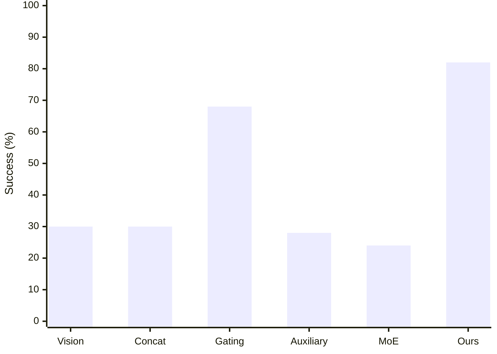
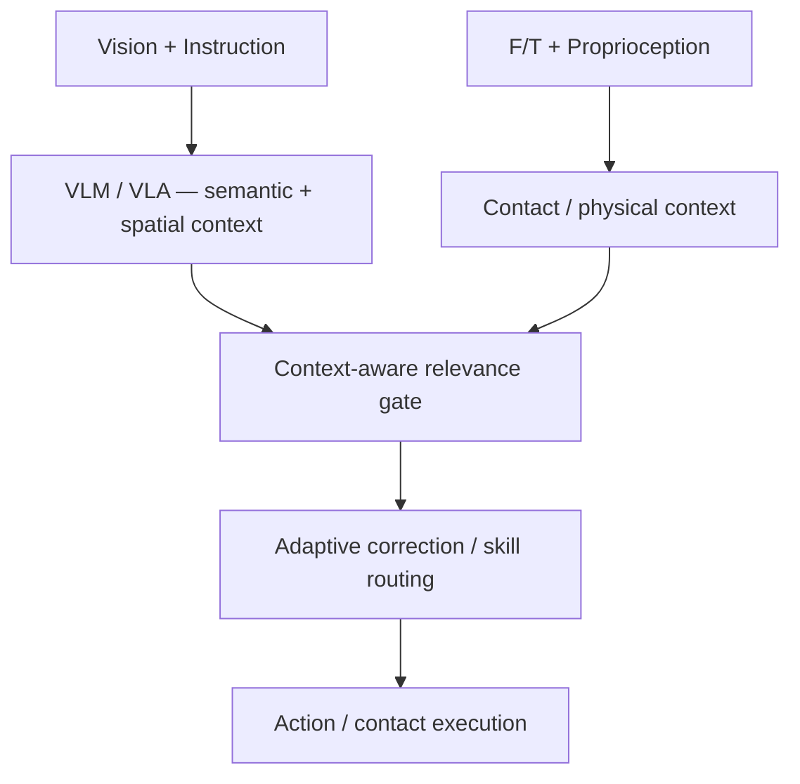

# Learning When to See and When to Feel: Adaptive Vision-Torque Fusion for Contact-Aware Manipulation

[문헌 비교표](../README.md) · [논문](https://arxiv.org/abs/2604.01414) · [노션 원본](https://www.notion.so/3e3952c9e27381779b87c6e8c9c1e328)

> 2026-09-26 노션 정리의 GitHub 스냅샷. 논문별 수치·해석은 원본 정리 기준이며, 이번 이전 작업에서 모든 논문을 재검증한 것은 아니다.

## 현재 연구 목표와의 연결

센서가 유효한 시점과 반영 강도를 분리하는 설계 후보로 검토한다. 관절 외부 토크를 손목 6축 F/T와 동일하게 취급하지 않으며, 시각 가려짐과 접촉 상태에 따른 sub-goal 유지·수정 판단으로의 확장은 연구 가설이다.

이 문헌의 결과를 접촉 기반 sub-goal 생성의 입증으로 간주하지 않는다. 아래 이전 연구 시사점은 작성 당시 맥락을 보존한 것이며 현재의 확정 아키텍처가 아니다.

---

> **관점:** 이 논문은 Vision과 joint torque를 단순히 두 개의 sensor input으로 보지 않는다. **Vision은 free-space planning에 안정적인 base context**, external joint torque는 **contact에서만 신뢰할 수 있는 physical interaction context**로 취급한다. 핵심은 “두 modality를 항상 어떻게 섞을까?”보다 **“지금 torque가 유효한가?”를 먼저 판별하고, 유효할 때만 action denoising을 얼마나 수정하게 할 것인가**이다.

> **한 줄 분류 — Contact-conditioned implicit multimodal fusion with late expert-level guidance**
> Representation-level explicit alignment loss는 없다. 대신 **hard contact prior → torque feature gating → modality-specialized denoisers → CFG-style learned guidance**로 interaction-state-conditioned fusion을 만든다.

| Task | Vision만으로 애매한 정보 | Torque가 주는 context |
| --- | --- | --- |
| Egg boiler lid opening | Twist가 끝났는지 / lift로 전환할 시점 | 회전 저항 변화 |
| Weight-based bottle placement | 외형이 동일한 empty/full bottle 구분 | 물리적 load / weight difference |
| Twisty connector pull-out | rotation limit 도달 여부와 pull 전환 시점 | 저항 증가 / contact state |

Data 규모:
- Bottle: **110 demonstrations**
- Connector: **250 demonstrations**
- Lid: **150 demonstrations**
- Observation sampling: **10 Hz**
## 5. Controlled Comparison — fusion strategy 자체가 중요한가?

*노션 해설 도식을 본문 기준으로 재구성한 도식.*

| Method | Average Success | 이 관점에서의 해석 |
| --- | --- | --- |
| Vision-only | 30% | Contact state / physical interaction 정보 부족 |
| Feature Concatenation | 30% | Unfiltered torque가 visual planning을 방해 |
| Torque Gating | 68% | “언제 torque를 쓰지 말아야 하는가”를 구조적으로 해결 |
| Auxiliary Goals | 28% | Future external torque prediction이 limited data에서 어려운 보조 task |
| MoE | 24% | Pure learned routing이 contact relevance를 제대로 분리하지 못함 |
| MoE w/o torque encoding | 54% | Learned torque representation 자체가 noisy context를 만들 가능성 |
| **Ours** | **82%** | Hard contact prior + learned CFG correction |

> **핵심 ablation 읽기**
> 가장 큰 jump는 **Feature Concatenation 30% → Torque Gating 68%**다. 최종 CFG adaptive fusion이 82%까지 추가 개선하지만, 먼저 **불필요한 modality를 차단하는 것**이 성능 향상의 큰 부분을 설명한다.

### Paper Fig. 6 — Failure Cases Due to Distracting Torque Features

*Contact gating이 없는 baseline에서 관찰된 대표 실패: torque 정보 무시, 부정확한 grasp pose, trajectory deviation. 이 그림은 free-space torque를 무조건 넣는 것이 단순한 sensor enrichment가 아니라 planning disturbance가 될 수 있음을 보여준다.*
## 6. 왜 일반 MoE보다 잘 작동했는가?
### Paper Fig. 7 — Learned F/T Weights: Ours vs Torque-Gated MoE
<columns>
	<column ratio="50">
		
		**(a) Ours** — non-contact에서 weight가 0으로 떨어지고, contact marker가 있는 구간에서만 torque guidance가 활성화된다.
	</column>
	<column ratio="50">
		
		**(b) Torque-Gated MoE** — contact/non-contact 사이 weight 차이가 작아 interaction state를 분명하게 분리하지 못한다.
	</column>
</columns>

> **Figure 7을 이 관점에서 읽는 법**
> 이 그림은 representation alignment의 직접 증거라기보다 **modality utilization이 contact state와 얼마나 잘 결합되어 있는가**를 보여주는 operational evidence다. 제안법은 hard contact prior로 torque relevance를 먼저 제한한 뒤, 그 안에서 learned scale을 사용한다.

논문의 MoE baseline은 두 modality-specific U-Net의 noise prediction을 softmax router로 평균한다.
$$
\hat{\epsilon}=w_{vision}\hat{\epsilon}_{vision}+w_{tor}\hat{\epsilon}_{torque}, \quad w_{vision}+w_{tor}=1
$$
하지만 routing weight는 interaction state에 따라 거의 달라지지 않았다.

| Phase | $w_{vision}$ | $w_{torque}$ |
| --- | --- | --- |
| Non-contact | 0.7634 | 0.2366 |
| Contact | 0.7714 | 0.2286 |

즉 **router에게 모든 것을 맡겼지만 torque relevance가 contact에 맞춰 분리되지 않았다.**
반면 proposed method는:
1. $\phi=0$이면 torque contribution을 **구조적으로 0으로 강제**하고,
2. $\phi=1$일 때만 scale predictor가 correction strength를 학습한다.
Ablation에서도 **Torque-Gated MoE 12/20 vs Ours 16/20**으로 CFG-style fusion이 추가 이점을 보였다.
## 7. Alignment 관점의 정확한 분류

| 항목 | 이 논문 |
| --- | --- |
| Explicit Vision–Torque alignment loss | 없음 |
| Shared latent target / contrastive objective | 없음 |
| Temporal correspondence | 같은 task trajectory 내 synchronized multimodal observation |
| Cross-modal interaction | Contact Gating + feature concat for scale prediction + CFG expert guidance |
| Representation relationship | Vision = base planning context, Torque = contact-dependent correction |
| Alignment Type | **Implicit — operational / policy-level alignment** |

> **주의해서 읽을 부분**
> $w_{torque}$가 contact에 따라 잘 작동한다고 해서 Vision과 Torque embedding 자체가 “잘 aligned되었다”고 말할 수는 없다. 이 논문이 직접 보여주는 것은 **modality utilization이 interaction state에 맞춰 구조화되었다는 것**이다. Representation-level alignment를 주장하려면 embedding similarity, cross-modal probe, correspondence metric 등이 추가로 필요하다.

## 8. 이 관점에서의 강점
- **Modality relevance selection과 fusion을 분리**했다.
- Free-space에서 external joint torque의 inertia/noise가 visual planning을 오염시키는 문제를 구조적으로 해결한다.
- Vision과 Torque를 대칭적인 expert로 보지 않고 **Vision base + Torque corrective context**로 역할을 분리한다.
- 동일 Robomimic Diffusion Policy backbone에서 feature concat, gating, auxiliary objective, MoE를 **controlled comparison**한다.
- MoE router weight와 CFG weight를 분석해 단순 성능 숫자뿐 아니라 **왜 fusion이 작동/실패하는지** 보여준다.
- 별도의 wrist F/T sensor 대신 Franka의 **joint external torque**를 사용하여 hardware 접근성이 높다.
## 9. 이 관점에서의 한계 / 연구 공백
- **Explicit cross-modal alignment objective / metric이 없다.**
- Contact detection이 **predefined external torque threshold**에 의존하며 threshold sensitivity 분석이 부족하다.
- Binary $\phi$로 free-space/contact를 나누므로 partial contact, uncertain contact, sliding/contact mode 등 연속적 interaction state는 표현하지 못한다.
- 3개 real-world task, 10–20 evaluation trials/task 수준으로 범용성·통계적 안정성 검증이 제한적이다.
- Current policy는 F/T를 **passively sense and reason**하며, polishing이나 precision assembly처럼 active force regulation이 필요한 task는 검증하지 않았다.
- Torque-gating이 큰 성능 향상을 설명하지만 **왜 CFG fusion이 MoE보다 더 안정적인지**를 representation-level로 완전히 분해한 분석은 제한적이다.
## 10. ForceVLA와 나란히 보면

| 관점 | ForceVLA | 이 논문 |
| --- | --- | --- |
| 핵심 mismatch | Semantic VL context ↔ physical F/T context | Visual planning reliability ↔ state-dependent torque reliability |
| 주요 fusion 위치 | Post-VLM / late | Hybrid: feature gating + late noise fusion |
| Cross-modal mechanism | Self-attention + sparse MoE | Contact Gating + CFG guidance |
| Learned routing | Task/phase-dependent expert routing | Contact prior 아래 torque correction strength 학습 |
| 중요한 교훈 | Pretrained context를 보존한 뒤 physical modality를 late contextualize | 먼저 modality validity를 결정한 뒤 adaptive fusion |

## 11. 초기 VLA–DRL 구상에 대한 해석 (이전 연구 맥락)

> **아래는 논문의 직접 주장이라기보다 현재 연구 관점에서의 시사점**
> Vision–Language semantic context와 F/T physical context를 처음부터 하나의 raw representation으로 억지로 합치는 것보다, **각 modality가 잘하는 representation을 먼저 만들고, current interaction state에 따라 physical context의 relevance와 correction strength를 분리해 결정하는 구조**가 유효한 연구 가설이 될 수 있다.

이 논문에서 특히 가져갈 수 있는 구조적 가설:
1. **When-to-use**와 **How-much-to-use**를 분리한다.
2. Learned router에게 모든 것을 맡기기보다 **task physics 기반 prior**를 줄 수 있다.
3. Physical modality는 semantic context와 동등한 raw input이 아니라 **interaction-dependent correction signal**로 설계할 수 있다.
4. 향후에는 binary contact gate를 넘어 **continuous contact confidence / contact mode / uncertainty-aware gating**으로 확장할 수 있다.
## 12. Paper / Source
[arXiv abstract](https://arxiv.org/abs/2604.01414)
[Paper PDF — arXiv:2604.01414](https://arxiv.org/pdf/2604.01414)
