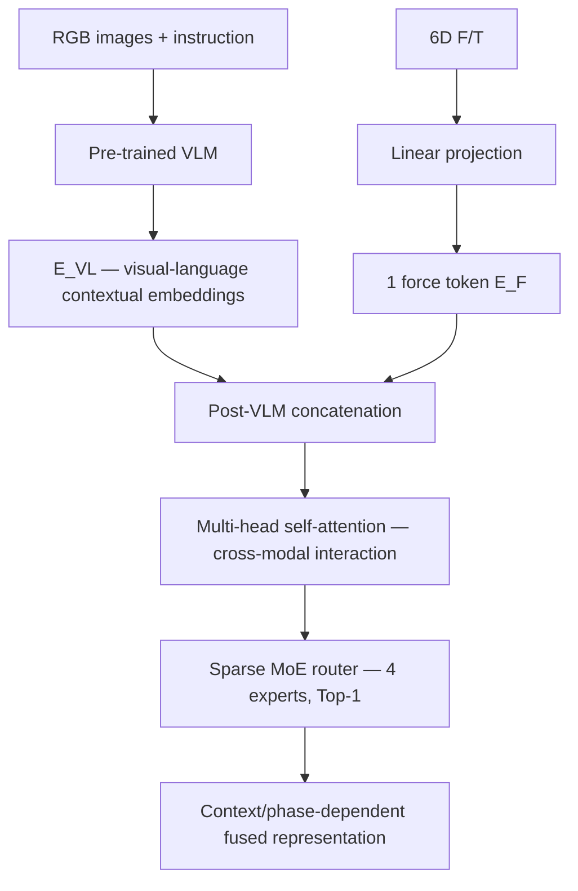
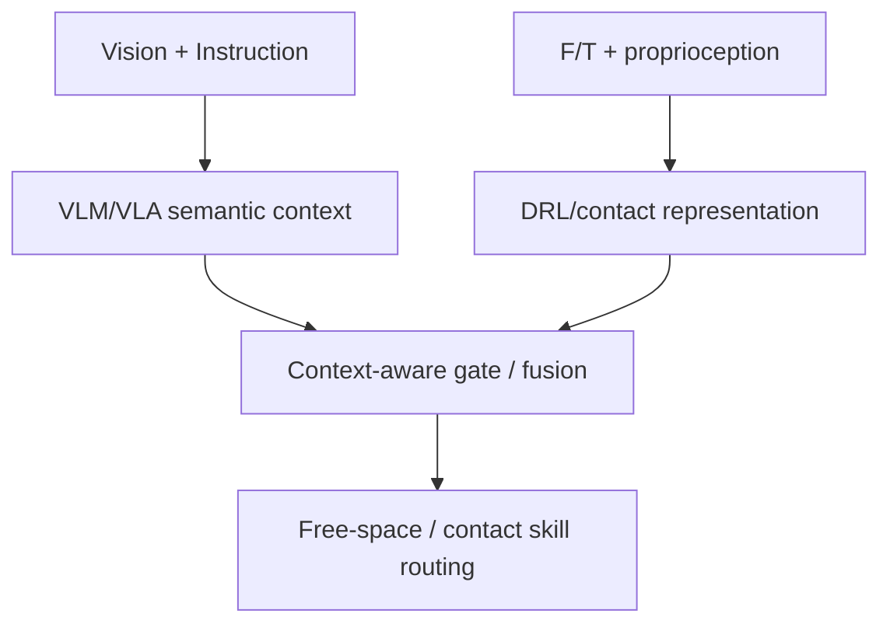

# ForceVLA: Enhancing VLA Models with a Force-aware MoE for Contact-rich Manipulation

[문헌 비교표](../README.md) · [논문](https://arxiv.org/abs/2505.22159) · [노션 원본](https://www.notion.so/3e3952c9e2738134b842f1627e53a17b)

> 2026-09-26 노션 정리의 GitHub 스냅샷. 논문별 수치·해석은 원본 정리 기준이며, 이번 이전 작업에서 모든 논문을 재검증한 것은 아니다.

## 현재 연구 목표와의 연결

VLM 처리 이후에 F/T 표현을 연결하는 위치를 설계 후보로 검토한다. 기존 논문의 행동 출력 대신 sub-goal decoder와 연결했을 때, 접촉 신호가 행동 종류·방향·거리 수정에 기여하는지는 별도로 검증해야 한다.

이 문헌의 결과를 접촉 기반 sub-goal 생성의 입증으로 간주하지 않는다. 아래 이전 연구 시사점은 작성 당시 맥락을 보존한 것이며 현재의 확정 아키텍처가 아니다.

---

> **관점:** 이미지·지시가 만드는 semantic context와 F/T sensor의 물리 신호는 본질적으로 서로 다른 표현 공간에 있다. 이 페이지는 ForceVLA가 이 **heterogeneous modality context mismatch**를 어떻게 다루는지에만 초점을 둔다.

> **한 줄 분류 — Architecture-based implicit multimodal contextualization**
> ForceVLA는 Vision–Language와 F/T를 명시적으로 alignment하는 loss를 두지 않는다. 대신 **VLM-first → post-VLM force injection → self-attention → dynamic MoE routing**으로 context-dependent interaction을 암묵적으로 학습한다.

## 1. 이 논문에서 볼 핵심 질문
- VLM은 대규모 image–language pretraining으로 이미 **visual-linguistic context**를 형성한다.
- 반면 6D F/T는 `[fx, fy, fz, mx, my, mz]` 형태의 물리 센서 값이며, image/text와 자연스럽게 semantic alignment되어 있지 않다.
- 따라서 핵심은 **“F/T를 input으로 넣을 수 있느냐”가 아니라, “pretrained VL context를 깨뜨리지 않으면서 F/T를 어떻게 context화하느냐”**이다.
## 2. 논문의 해결 방식 — 단계별

### 2.1 VLM이 먼저 Vision–Language context를 만든다
논문은 force를 VLM의 초기 image–language fusion 이전이나 동시에 넣지 않고, **primary VLM이 vision과 language를 처리한 뒤** 추가한다. 목적은 pretrained VLM이 이미 학습한 visual-linguistic representation을 보존하는 것이다.
### 2.2 F/T는 하나의 Force Token으로 변환한다
Raw 6-axis F/T `f_raw ∈ R^6`를 linear projection하여 VLM token과 동일한 model dimension의 **하나의 force token** `E_F`로 만든다. 최종 FVLMoE 입력은 `E_in = [E_VL; E_F]`이다.
> **중요:** dimension을 맞춘 것은 representation compatibility를 위한 것이지, semantic alignment가 완료되었다는 뜻은 아니다.
### 2.3 Self-Attention이 실질적인 context bridge 역할을 한다
Concatenation 이후 바로 expert로 보내지 않고, multi-head self-attention + FFN을 먼저 수행한다. 논문은 이를 force·visual·language token 사이의 **holistic interaction**을 위한 shared refinement로 설명한다.
이 관점에서는 self-attention이 다음 역할을 할 수 있다.
- Force token이 현재 image/instruction context를 참조
- VL token이 현재 접촉 상태를 반영
- 동일한 F/T 값이라도 task·scene context에 따라 다른 representation으로 해석될 가능성 제공
즉 `8 N`이라는 값 자체보다 **“현재 plug insertion 상황에서 발생한 lateral contact”**와 같은 context-dependent representation을 학습할 수 있는 구조를 만든다. 단, 이런 semantic label을 직접 supervision한 것은 아니다.
### 2.4 MoE는 alignment 자체보다 context-dependent specialization에 가깝다
Self-attention 이후 각 token은 4개의 MLP expert 중 하나로 **Top-1 routing**된다. Expert의 역할은 사전에 고정하지 않고 학습으로 결정된다.
따라서 이 관점에서는:
- **Self-Attention:** 서로 다른 modality 사이의 정보 교환/맥락화
- **MoE Routing:** 현재 token·task·interaction phase에 맞는 전문 처리 경로 선택
으로 구분하는 것이 적절하다.
## 3. 논문 Figure 3 — ForceVLA 전체 multimodal fusion 구조

**이 관점에서 볼 부분:** Pre-trained VLM이 먼저 VL feature를 만든 뒤, F/T가 별도 token으로 들어가 FVLMoE에서 attention + router + experts를 거친다. 즉 **raw heterogeneous modalities를 VLM 입력에서 단순 동등 결합하지 않는다.**
## 4. Ablation — fusion 위치와 방식이 정말 중요한가?
### Paper Table 3 — Ablation Results

| Model | Success Rate | 이 관점에서의 해석 |
| --- | --- | --- |
| baseline | 45% | Force 없음 |
| linear before VLM | 55% | Early injection도 일정 이득은 있음 |
| MoE before VLM | 0% | 특정 pre-VLM MoE fusion은 완전히 실패 |
| concate after VLM | 60% | VL context 형성 후 단순 force 추가가 early linear보다 우수 |
| **ForceVLA** | **80%** | Post-VLM + attention + adaptive MoE fusion |

> **주의해서 읽어야 할 부분**
> `linear before VLM = 55%`는 baseline 45%보다 높다. 따라서 **“force를 VLM 전에 넣으면 무조건 실패한다”**고 결론 내리면 안 된다. 더 안전한 해석은 **fusion 위치뿐 아니라 fusion 구조가 매우 중요하며, 이 논문에서 가장 안정적이었던 것은 post-VLM adaptive fusion**이라는 것이다.

논문은 `MoE before VLM = 0%`를 pretrained VLM input representation의 feature distribution disruption으로 해석한다. 그러나 이 ablation만으로는 0%의 원인이 router collapse, optimization difficulty, scale mismatch, representation disruption 중 무엇인지 분리되지 않는다.
또한 본문은 `linear before VLM`과 `MoE before VLM`의 정확한 token topology/삽입 위치를 충분히 상세히 설명하지 않는다. 따라서 pre-VLM 구현 세부를 논문 근거 없이 단정하면 안 된다.
## 5. Router Analysis — context/phase-dependent specialization 근거

논문은 Insert Plug와 Peel Cucumber 등에서 task 진행률에 따라 expert 사용 패턴이 달라지는 **temporal specialization**을 관찰한다. 또한 Expert 0은 여러 task에서 광범위하게 사용되어 general-purpose expert일 가능성을 제시한다.
**이 관점에서의 의미:** router가 단순 modality ID만 보고 분기한다기보다, 학습된 token representation에 포함된 **task semantics + temporal/contact context**에 따라 processing path를 바꿀 가능성을 보여준다.
**하지만:** expert specialization은 **cross-modal alignment의 직접 증거는 아니다.** Alignment가 실제 개선되었다면 embedding similarity, attention correspondence, force–vision relation probe 등 별도의 representation-level 분석이 필요하다.
## 6. Visual occlusion / physical uncertainty에서의 의미

Paper Table 2에서 ForceVLA는 Visual Occlusion 조건에서 90% success를 기록했다.

| Model | Visual Occlusion | Average |
| --- | --- | --- |
| π0-base w/o F | 60.00% | 38.93% |
| π0-base w/ F | 30.00% | 31.96% |
| π0-fast w/o F | 50.00% | 52.78% |
| π0-fast w/ F | 50.00% | 32.29% |
| **ForceVLA** | **90.00%** | **63.78%** |

이 결과는 **시각 정보가 약해질 때 force가 보완 modality로 작동할 수 있음**을 보여준다. 다만 이것 역시 “VL–F/T semantic alignment가 잘 되었다”를 직접 측정한 것은 아니다.
## 7. Qualitative motivation — 왜 force가 별도 context를 제공하는가

Figure 1은 초기 insertion misalignment가 있을 때 force feedback이 없는 정책은 pose error를 수정하지 못하지만, ForceVLA는 외력 변화에 따라 insertion strategy를 수정하는 사례를 보여준다.
이 그림은 Vision/Language가 제공하는 **고수준 semantic/spatial context**와 F/T가 제공하는 **즉시적 physical interaction context**의 역할이 다름을 직관적으로 보여준다.
## 8. 데이터 측면의 최소 correspondence
ForceVLA-Data는 vision, proprioception, F/T stream을 **timestamp 기준으로 동기화**해 수집한다. 총 244 trajectories, 약 140k synchronized timesteps다.
따라서 explicit semantic alignment label은 없지만, 최소한 다음 correspondence는 존재한다.
- 같은 timestep의 image
- 같은 timestep의 robot state
- 같은 timestep의 F/T
즉 **temporal correspondence + task success supervision**을 바탕으로 cross-modal relation을 end-to-end로 암묵 학습한다.
## 9. 이 관점에서의 정확한 분류

| 항목 | ForceVLA |
| --- | --- |
| Explicit VL–F/T alignment loss | 없음 |
| Force–image correspondence label | 없음 |
| Temporal synchronization | 있음 |
| Pretrained VL context 보존 | VLM-first / post-VLM force injection |
| Cross-modal interaction | Self-Attention |
| Context-dependent specialization | Sparse MoE, 4 experts, Top-1 |
| Alignment 유형 | **Implicit** |

## 10. 이 관점에서의 강점과 한계
### 강점
- Pretrained VLM의 semantic context를 먼저 보존한 후 physical modality를 추가한다.
- 단순 concat을 최종 fusion으로 쓰지 않고 self-attention으로 joint interaction을 만든다.
- MoE router를 통해 task/phase-dependent specialized processing을 시도한다.
- Early/late/proposed fusion을 비교한 ablation이 있어 **fusion timing의 중요성**을 실험적으로 보여준다.
- Router analysis가 있어 expert specialization에 대한 최소한의 해석 가능성을 제공한다.
### 한계 / 연구 공백
- **Explicit alignment objective가 없다.**
- VL token과 Force token이 실제로 얼마나 잘 contextually aligned되었는지 측정하는 metric이 없다.
- `post-VLM + self-attention only` vs `post-VLM + MoE only` vs `FVLMoE` 분해 ablation이 없다.
- `MoE before VLM = 0%`의 원인을 representation disruption으로 해석하지만 원인 분해 실험이 없다.
- `linear before VLM = 55%`이므로 early fusion 자체를 일반적으로 부정할 수는 없다.
- Router specialization은 task/phase specialization의 증거이지 **modality alignment의 직접 증거는 아니다.**
## 11. 초기 VLA–DRL 구상에 대한 해석 (이전 연구 맥락)

> **논문에서 직접 주장한 내용이 아니라, 현재 연구 관점에서의 시사점**
> Pretrained VLM/VLA가 담당하는 semantic·visual context와 F/T 기반 contact execution을 처음부터 같은 입력 공간에 억지로 넣기보다, **각 representation을 먼저 안정적으로 형성한 뒤 late interaction/gating 단계에서 연결**하는 방향이 타당할 수 있다.

특히 VLA–DRL hybrid에서는 다음 구조적 가설로 연결할 수 있다.

즉 ForceVLA의 중요한 교훈은 **“모든 modality를 하나의 raw input으로 넣는 것”보다 “각 modality가 잘하는 representation을 먼저 만들고, 필요한 시점에 context-aware interaction을 설계하는 것”**으로 읽는 편이 유용하다.
## 12. Paper / source
[arXiv HTML](https://arxiv.org/html/2505.22159v3)
[arXiv abstract](https://arxiv.org/abs/2505.22159)
[ForceVLA PDF](https://arxiv.org/pdf/2505.22159v3)
