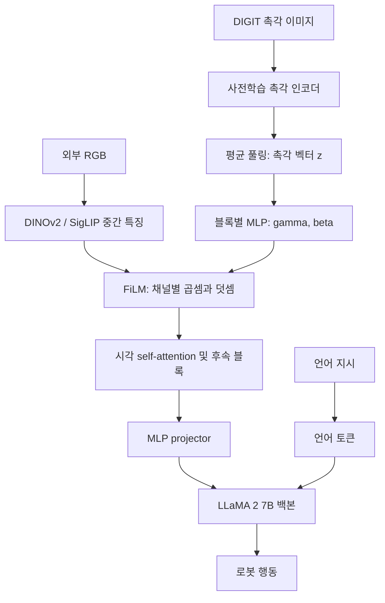
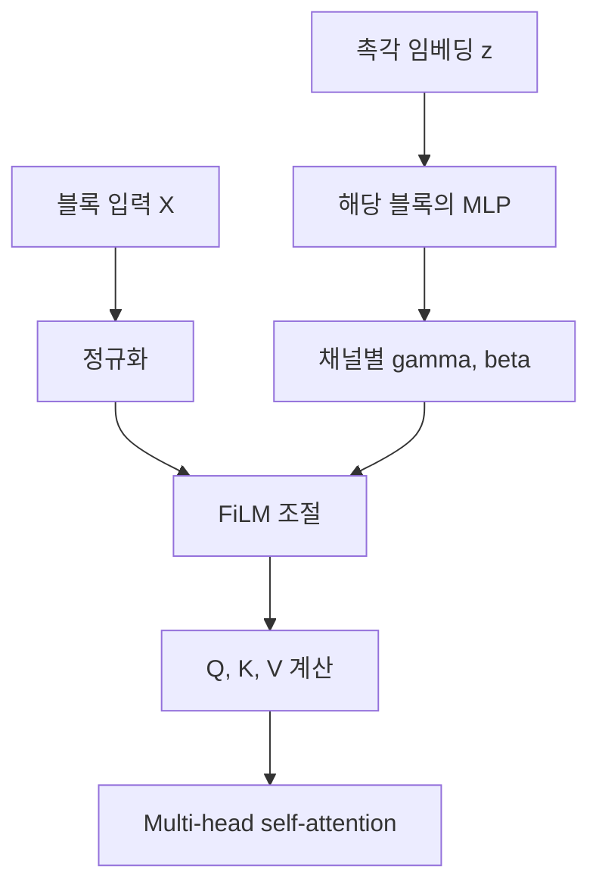
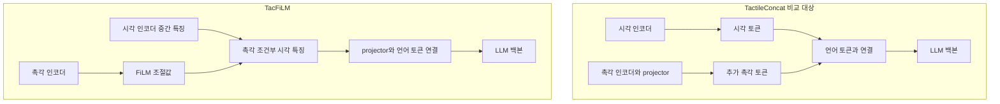
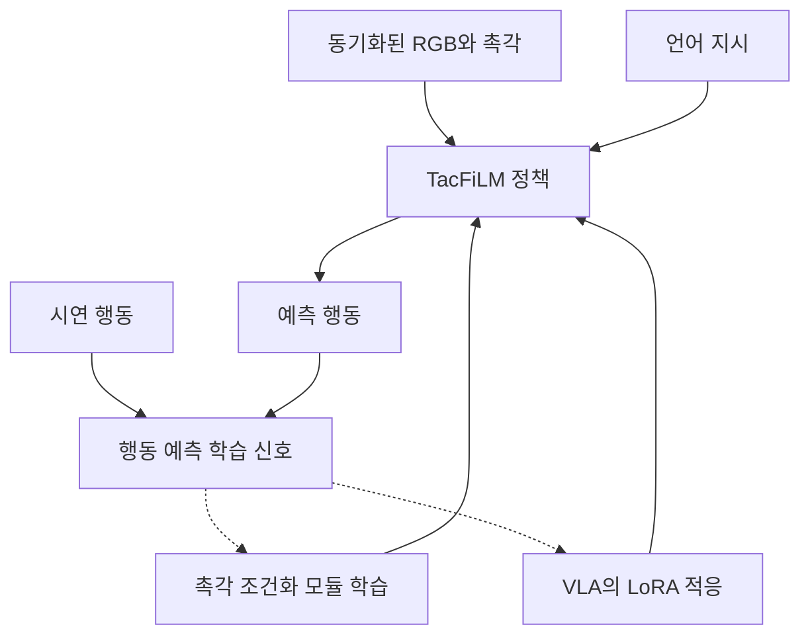

# TacFiLM: Tactile Modality Fusion for Vision-Language-Action Models

[문헌 비교표](../README.md) · [논문](https://arxiv.org/abs/2603.14604) · [노션 원본](https://www.notion.so/3e6952c9e273819bbf87eec7d65dbd72)

> 2026-09-26 노션 정리의 GitHub 스냅샷. 논문별 수치·해석은 원본 정리 기준이며, 이번 이전 작업에서 모든 논문을 재검증한 것은 아니다.

## 현재 연구 목표와의 연결

추가 촉각 토큰 없이 visual feature를 조절하는 설계를 참고한다. 팔에 의한 가려짐 아래에서 물체·접촉·현재 행동의 대응을 유지하고 sub-goal 파라미터를 수정하는 능력은 별도 평가 대상이다.

이 문헌의 결과를 접촉 기반 sub-goal 생성의 입증으로 간주하지 않는다. 아래 이전 연구 시사점은 작성 당시 맥락을 보존한 것이며 현재의 확정 아키텍처가 아니다.

---

> **문헌 정리 관점:** Vision–Language와 F/T·tactile·proprioception처럼 통계적·의미적 성격이 다른 모달리티를 로봇 매니퓰레이션 모델이 **어디서, 어떤 방식으로 연결·정렬·융합하는가?**

> **핵심 분류: Separate encoding → tactile-conditioned visual features → language integration → robot action**
> TacFiLM은 사전학습된 촉각 임베딩으로 채널별 scale·shift를 생성해, VLA의 **시각 인코더 내부 특징**을 조절한다. 별도의 명시적 모달리티 정렬 loss 없이 작업 행동 학습을 통해 연결하며, 촉각이 반영된 시각 표현을 이후 언어와 통합한다.

**원문:** Charlotte Morissette et al., *Tactile Modality Fusion for Vision-Language-Action Models*, arXiv:2603.14604v1, 2026-03-15. 아래 내용은 업로드된 v1 기준이며 학회 게재 여부는 이 정리에서 확정하지 않는다.

| 항목 | 이 논문에서의 위치 |
| --- | --- |
| Vision | 외부 RGB: 장면의 배치·외관·기하를 담는 전역 관측 |
| Language | 작업 지시: 수행 목적을 제공하는 의미적 입력 |
| Tactile | DIGIT 이미지: 센서 접촉면의 변형을 담는 국소 물리 관측 |
| F/T·proprioception | 제안된 별도 융합 경로는 제시되지 않음. 로봇 상태의 기록 및 외력 평가를 정책 입력으로 혼동하지 않음 |
| Output | 로봇 행동. high-level sub-goal 시퀀스나 접촉 상태의 자연어 설명은 평가하지 않음 |

## 2. 어디에서 처음 연결되는가?

**정확한 위치:** DINOv2와 SigLIP의 ViT 블록 내부에서 **정규화 이후, multi-head self-attention 이전**이다. 기본 설정에서는 두 시각 인코더의 모든 ViT 블록에 적용한다. LLaMA의 Transformer 층에 FiLM을 넣는 구조가 아니다.
### 해설 도식 A — 세 모달리티의 정보 흐름
아래 도식은 원문 Fig. 2와 Section 3.1을 바탕으로 재구성했다.

**VLM / LLM / VLA 구분:** LLaMA는 LLM 백본이며, 시각 인코더·프로젝터와 결합한 시각–언어 시스템은 VLM으로 볼 수 있다. 로봇 행동을 생성하도록 학습한 전체 모델이 VLA다.

> **Fusion Stage = Mid / encoder-internal feature modulation.** 원시 센서를 바로 합치는 raw early fusion도, VLM의 최종 출력 뒤에서 합치는 post-VLM fusion도 아니다. 언어와 만나기 전의 시각 인코더 중간 특징에서 최초의 시각–촉각 상호작용이 일어난다.

## 3. 어떻게 융합하는가? — FiLM의 연산과 의미
촉각 인코더의 출력을 평균 풀링하여 z를 만들고, 각 적용 블록의 MLP가 해당 블록 채널 수에 맞는 gamma와 beta를 생성한다.
$$
(\gamma_n,\beta_n)=\mathrm{MLP}_n(z),\qquad F'^n=F^n\odot(1+\gamma_n)+\beta_n
$$

| 기호·개념 | 해석 |
| --- | --- |
| Fⁿ: N × D | 해당 단계의 시각 특징. N은 패치 토큰 수, D는 특징 채널 수 |
| γₙ, βₙ: 각각 D차원 | 촉각으로부터 생성한 채널별 조절값. 입력 촉각이 변하면 값도 변함 |
| 1 + γ | 곱셈 배율. 단순 확률이나 0\~1 attention weight로 제한되는 값이 아님 |
| β | 시각 특징에 더하는 촉각 조건부 값 |
| 패치 방향 공유 | 각 채널의 조절값은 해당 블록의 모든 패치에 동일하게 적용 |
| 토큰 길이 유지 | N × D에서 N × D로 변환. LLM에 촉각 토큰을 추가하지 않음 |
| 초기화 | γ=β=0으로 시작하면 F′=F. 기존 특징을 유지하는 항등 변환에서 출발 |

### 해설 도식 B — 한 Transformer 블록의 적용 지점
Residual 경로와 후속 FFN을 생략하고, FiLM이 들어가는 attention 입력 경로만 나타냈다.

촉각은 attention의 입력 특징을 바꾸므로, 그 특징에서 계산되는 Q·K·V와 이후 정보 교환에 영향을 줄 수 있다. **촉각 토큰과 시각 토큰 사이의 직접 cross-attention은 아니다.**
**무엇이 학습되는가?** 조절값을 만드는 MLP의 가중치를 학습한다. 실행 시에는 촉각 입력에 따라 조절값이 새로 계산되며, FiLM이 Transformer의 가중치를 매 순간 직접 재작성하는 것은 아니다.
**Global tactile bias의 범위:** 채널마다 조절값은 다르지만 패치 위치별로 별도 조절값을 생성하지 않는다. 따라서 촉각 접촉 위치와 이미지 위치의 명시적 대응은 제공하지 않는다. 채널을 곧바로 “마찰·걸림·구멍” 같은 인간 의미로 해석할 근거도 없다.
## 4. 연결·정렬·융합을 구분해서 읽기

| 관점 | TacFiLM에서 수행하는 것 | 과도하게 해석하면 안 되는 것 |
| --- | --- | --- |
| 연결 | 촉각 인코더 → MLP → 시각 인코더 내부 FiLM | 원래부터 시각·촉각의 같은 차원이 같은 의미라는 가정 |
| 정렬 | 행동 학습을 통해 유용한 대응 관계를 암묵적으로 형성 | 공통 의미 공간의 명시적 정렬을 입증했다는 주장 |
| 융합 | 촉각 조건부 곱셈·덧셈으로 시각 특징 변환 | 단순히 센서 개수만 추가한 방법이라는 해석 |
| 언어와의 관계 | 촉각이 반영된 시각 토큰을 언어 토큰과 함께 처리 | 언어가 직접 FiLM 생성기에 들어간다거나 tactile-language 대조학습을 한다는 해석 |

> **Alignment Type = Implicit은 문헌 분류를 위한 해석이다.** 본 논문은 별도의 cross-modal contrastive / semantic alignment loss를 제안하지 않는다. “명시적 정렬이 없다”는 사실과 “학습 결과 의미 정렬이 입증됐다”는 주장은 다르다. 후자는 representation-level 평가로 확인되지 않았다.

## 5. Concat과 무엇이 다른가?
### 해설 도식 C — 모달리티가 만나는 위치 비교

| 비교 축 | TactileConcat | TacFiLM |
| --- | --- | --- |
| 촉각 전달 형태 | 추가 토큰 | 기존 시각 특징의 조절값 |
| 최초 시각–촉각 상호작용 | LLM 입력 이후의 토큰 처리 | 시각 인코더 내부 |
| LLM 시퀀스 길이 | 촉각 토큰만큼 증가 | 촉각 때문에 증가하지 않음 |
| 명시적 정렬 loss | 본 비교 구현에서는 별도 제시 없음 | 별도 제시 없음 |
| 주의점 | Concat만으로 학습 불가능하다는 뜻은 아님 | 항상 더 우수하거나 계산이 전혀 추가되지 않는다는 뜻은 아님 |

시각 토큰과 언어 토큰의 concat은 TacFiLM에서도 유지된다. Sparsh의 두 촉각 프레임을 채널 방향으로 concat하는 전처리 또한 별개의 연산이다.
## 6. 촉각 표현 — 무엇을 사전학습해서 가져오는가?

| 인코더 | TacFiLM에서 사용하는 구조 | 사전학습의 특징 |
| --- | --- | --- |
| T3 | 센서별 인코더 + 공유 Transformer trunk; 작업별 디코더 제외 | 센서·작업 사이에서 전이 가능한 촉각 표현 |
| Sparsh-MAE | ViT 촉각 인코더 | 가려진 이미지 영역의 픽셀 복원 |
| Sparsh-IJEPA | ViT 촉각 인코더 | 가려진 영역의 잠재 특징 예측 |
| Sparsh-DINO | ViT 촉각 인코더; 본 실험에서 채택 | 교사 표현을 학생이 예측하는 자기증류 |

T3와 Sparsh는 대안이다. 두 인코더를 직렬로 사용하는 구조가 아니다. Sparsh 입력은 5 time-step 간격의 두 촉각 프레임을 채널 방향으로 연결하고, 배경 제거 및 224×224 크기 조정을 수행한다.
[원문 Table 3 · 촉각 표현의 이진 분류 평가 · PDF p.14 — 원문 PDF에서 보기](https://arxiv.org/pdf/2603.14604v1)
**선택 근거:** 평균 분류 정확도는 T3 83.04%, Sparsh-IJEPA 93.56%, MAE 96.64%, DINO 97.72%. Rotation-High, Rotation-Low, Contact의 세 분류 과제 결과다. 이를 **VLA 전체의 인코더별 로봇 성공률 비교**로 오해하면 안 된다.
## 7. 학습 신호와 동결 범위 — 논문이 설명한 것과 미기재된 것
Section 3.3은 대부분의 모델을 동결하고 TacFiLM이 추가된 VLA의 선형 층에 LoRA 미세조정을 적용한다고 설명한다. 기존 표현을 활용하면서 시연 행동을 학습하는 post-training 접근이다.
### 해설 도식 D — 행동 감독과 융합 학습의 관계
아래는 개념도이며 세부 loss 식이나 optimizer 구성을 새로 주장하는 그림이 아니다.

- 작업별 80개 시연, 시연당 약 70스텝. 관측 및 행동 기록은 10 Hz.
- 모든 배포 비교 모델은 80,000 학습 스텝까지 학습.
- 새로운 시각–촉각 정렬 loss나 reconstruction loss는 제안하지 않음.
- Section 3.3만으로 LoRA rank, 모든 모듈의 정확한 trainable/frozen 목록, FiLM MLP의 세부 최적화 설정까지 확정할 수는 없음.
- Section 3.1은 행동 출력을 autoregressive discrete next-token prediction으로 설명한다. 여기서는 이 v1의 서술을 기록하며, 실제 action head와 loss의 구현 세부는 코드 확인 없이 확정하지 않음.
## 8. 실제 실험 설정 — 어떤 물리 정보를 평가했는가?
[원문 Fig. 3 · peg·USB·HDMI 삽입 과제 · PDF p.8 — 원문 PDF에서 보기](https://arxiv.org/pdf/2603.14604v1)
[원문 Fig. 4 · Franka Panda, DIGIT 센서와 rollout · PDF p.9 — 원문 PDF에서 보기](https://arxiv.org/pdf/2603.14604v1)
**Franka Panda + DIGIT + 외부 RGB 카메라**를 사용한다. 모든 trajectory는 물체를 이미 잡은 상태에서 시작하므로 grasp 자체를 평가하지 않는다. 저수준 FCI 제어 주파수 1 kHz와 데이터 기록 10 Hz는 서로 다른 값이다.
**평가:** 총 705 rollout로 설명됨 — ID 270, OOD 225, ablation 210. ID 각 task·method 30회, OOD 각 task·method 15회. 원형 peg·USB에서 학습한 정책을 다른 peg 형상·HDMI로 평가하는 설정이다.
## 9. 정량 결과 — 융합 설계가 실제 행동에 미친 영향
[원문 Table 1 · ID/OOD 전체 결과 · PDF p.12 — 원문 PDF에서 보기](https://arxiv.org/pdf/2603.14604v1)
아래 평균은 **원문 Table 1의 Average 행을 그대로 전사**했다. Direct는 첫 시도 삽입률, Force는 시도별 최대 힘의 평균이다.

| 조건 | 모델 | Success (%) | Direct (%) | Avg. Max Force (N) | Avg. Time (s) |
| --- | --- | --- | --- | --- | --- |
| ID 평균 | OpenVLA-OFT | 62.22 | 8.89 | 15.01 | 122.40 |
| ID 평균 | TactileConcat | 71.11 | 7.78 | 10.29 | 108.34 |
| ID 평균 | TacFiLM | 86.67 | 31.11 | 8.34 | 79.62 |
| OOD 평균 | OpenVLA-OFT | 54.67 | 0.00 | 22.46 | 89.48 |
| OOD 평균 | TactileConcat | 73.33 | 8.00 | 16.47 | 105.79 |
| OOD 평균 | TacFiLM | 86.67 | 29.33 | 8.40 | 87.84 |

**읽을 근거:** Concat 대비 ID 성공률 +15.56%p, USB 성공률 43.33% → 73.33%로 +30%p. 동일한 촉각을 어떤 경로로 융합하느냐가 행동 품질에 영향을 준다는 근거다.
**예외도 중요:** OOD Square-Peg 2 mm에서는 Concat 성공률 86.67%, TacFiLM 80.00%이고, 시간도 91.83 s 대 111.61 s로 TacFiLM이 느리다. 다만 평균 최대 힘은 27.72 N 대 7.06 N으로 낮다. HDMI에서는 TacFiLM 성공률이 66.67%로 높지만 평균 최대 힘 11.54 N은 Concat 11.18 N보다 약간 높다. 모든 과제·지표에서 우세하다고 쓰지 않는다.
[원문 Fig. 5 · 힘과 작업 시간 분석 · PDF p.11 — 원문 PDF에서 보기](https://arxiv.org/pdf/2603.14604v1)
**Fig. 5 상단의 범위:** 성공적으로 보정하여 삽입한 ID rollout의 평균 힘이다. 전체 실패·성공 rollout을 모두 포함한 곡선으로 해석하지 않는다. 하단은 작업 완료 시간 비교다.
## 10. 층 위치와 시각 품질에 대한 ablation
[원문 Table 2 · FiLM 적용 층 및 카메라 조건 · PDF p.13 — 원문 PDF에서 보기](https://arxiv.org/pdf/2603.14604v1)

| FiLM 적용 범위 | Circle 3 mm 성공 / 직접 삽입 (%) | Pentagon 3 mm 성공 / 직접 삽입 (%) |
| --- | --- | --- |
| All | 100.00 / 36.67 | 100.00 / 33.33 |
| Early: 앞쪽 ⅓ | 93.33 / 60.00 | 100.00 / 33.33 |
| Middle: 중간 ⅓ | 100.00 / 26.67 | 100.00 / 53.33 |
| Late: 뒤쪽 ⅓ | 100.00 / 23.33 | 100.00 / 40.00 |

전체 층이 유일한 정답은 아니다. 일부 층만 적용해도 높은 성능을 얻었고, ID 직접 삽입은 Early, OOD 직접 삽입은 Middle이 높다. 제한된 두 과제의 결과로 모든 작업에 보편적인 최적 층을 단정하지 않는다. Table 2 캡션의 15회 설명과 AllFiLM ID의 36.67%는 Table 1의 30회 결과와 겹치므로 모든 행의 독립 반복 수가 동일하다고 가정하지 않는다.

| 카메라 조건 | OpenVLA 성공률 | Concat 성공률 | TacFiLM 성공률 |
| --- | --- | --- | --- |
| 밝기 80% 감소 | 93.33% | 86.67% | 100.00% |
| 프레임 갱신 50% | 73.33% | 80.00% | 100.00% |

> Table 2 제목에는 occlusion tests가 있지만, 본문에 명시된 조작은 **밝기 감소와 부분적으로 정지된 영상 스트림**이다. 로봇 팔이 특정 물체를 가리는 spatial occlusion이나 장시간 완전 가림을 직접 평가한 것으로 확대 해석하지 않는다.

## 11. 문헌 비교를 위한 최종 분류

| 비교 기준 | 기록 |
| --- | --- |
| Fusion Stage | Mid — visual encoder 내부, language integration 이전 |
| Cross-modal Interaction | FiLM Conditioning — tactile-conditioned affine modulation |
| Alignment Type | Implicit — 행동 감독 기반; 명시적 의미 정렬 검증은 아님 |
| 방향성 | 촉각 → 시각 조건화. 시각 → 촉각의 대칭적 조절 경로는 없음 |
| 언어의 역할 | 최종 작업 맥락. FiLM 파라미터 생성기에 직접 입력되지 않음 |
| 공간 대응 | 채널별 전역 modulation. 접촉점–이미지 패치 명시적 대응 없음 |
| 시간 정보 | Sparsh 입력의 두 촉각 프레임; 장기 belief/memory 모델은 제안하지 않음 |
| 추가 토큰 | LLM에 추가 촉각 토큰 없음 |
| 검증된 효과 | 특정 삽입 과제에서 Concat 대비 성공률·접촉력·시간의 전반적 개선 |
| 미검증 영역 | F/T·proprioception 결합, high-level sub-goal 생성, 팔에 의한 가림, 다양한 언어 추론 |

### 기존 ViTaS 항목과의 비교
<mention-page url="https://app.notion.com/p/3e6952c9e273811fa3aac09ed8e0dd52"/>

| 구분 | ViTaS: 기존 정리 기준 | TacFiLM |
| --- | --- | --- |
| 주요 연결 방식 | 별도 표현의 cross-modal neighborhood 정렬 | 촉각으로 시각 인코더 특징 조절 |
| 명시적 정렬 | Soft Fusion Contrastive loss | 별도 제안 없음 |
| 실제 융합 | 특징 concat | 채널별 affine modulation |
| 보조 목적 | CVAE reconstruction | 해당 보조 loss 제안 없음 |
| 언어 모달리티 | 없음 | VLA의 지시 입력 |
| 문헌상 역할 | 정렬과 상보성 학습 사례 | 경량 조건부 융합 사례 |

이 비교의 ViTaS 정보는 기존 Notion 정리의 내용을 기준으로 하며, 동일 데이터·동일 조건의 성능 비교가 아니다.
## 12. 현재 연구에 대한 시사점과 남은 질문
**아래는 논문 직접 결과가 아닌 연구적 해석이다.**
- F/T·tactile·proprioception을 독립 인코더로 표현한 후 조건화 벡터로 연결하는 설계 후보를 제공한다. 단, 이 논문은 DIGIT 촉각만 검증했으므로 나머지 센서로의 확장은 새 실험이 필요하다.
- 촉각을 텍스트와 동일 의미 공간에 명시적으로 정렬하지 않아도 행동 정책에 유용하게 반영할 수 있음을 보여주는 사례다. 그러나 접촉 상태를 언어적으로 설명하거나 sub-goal을 선택하는 능력까지 입증한 것은 아니다.
- clutter shelf에서는 접촉 정보가 어느 물체·어느 행동 단계와 연관되는지가 중요하다. 전역 FiLM이 그 대응을 충분히 보존하는지, 공간적·물체별 융합이 필요한지는 열린 질문이다.
- 촉각이 없는 접근 구간, 접촉 중, 팔에 의해 가려지는 구간을 나누어 센서 사용 기여를 측정할 필요가 있다. TacFiLM에는 접촉 유무로 FiLM을 강제로 끄는 별도 gate가 명시되지 않는다.
- sub-goal 연구로 확장하려면 출력·학습 목표를 high-level 결정으로 바꾸고, 센서가 없을 때와 비교하여 blocker·행동 종류·방향·거리 결정이 실제로 달라지는지 검증해야 한다.
### 읽고 남길 한 문장
> TacFiLM은 heterogeneous modality를 공통 의미 공간으로 직접 정렬하기보다, 사전학습된 촉각 표현을 시각 인코더의 처리 조건으로 변환하여 행동 정책 안에서 연결한 연구다.
## 13. 원문과 출처
- [논문 arXiv](https://arxiv.org/abs/2603.14604)
- [v1 PDF](https://arxiv.org/pdf/2603.14604v1)
- [FiLM 원 논문 — Perez et al., AAAI 2018](https://arxiv.org/abs/1709.07871)
- Figure 1–5, Table 1–3은 업로드된 논문 PDF에서 발췌했다. 해설 도식 A–D는 구조를 설명하기 위해 재구성한 자료이며 원 논문 그림이 아니다.
- 문헌 정리일: 2026-09-26. 연구 해석과 원문에서 직접 보고한 결과를 구분해 기록했다.
[TacFiLM — 원문 2603.14604v1.pdf](https://arxiv.org/pdf/2603.14604)
