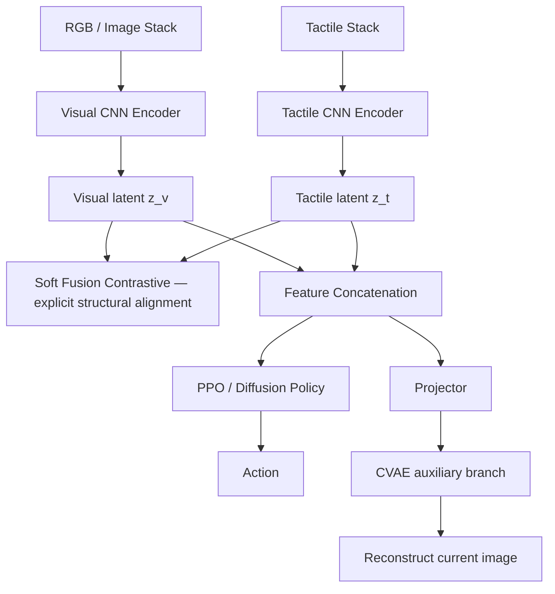
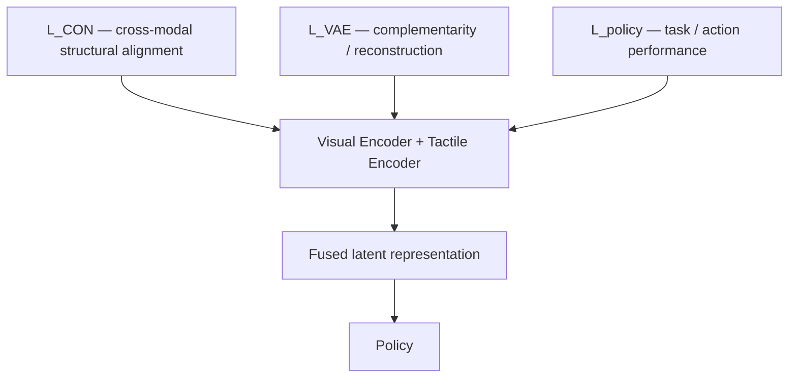

# ViTaS: Visual Tactile Soft Fusion Contrastive Learning for Visuomotor Learning

[문헌 비교표](../README.md) · [논문](https://arxiv.org/abs/2602.11643) · [노션 원본](https://www.notion.so/3e6952c9e273811fa3aac09ed8e0dd52)

> 2026-09-26 노션 정리의 GitHub 스냅샷. 논문별 수치·해석은 원본 정리 기준이며, 이번 이전 작업에서 모든 논문을 재검증한 것은 아니다.

## 현재 연구 목표와의 연결

모달리티별 표현, 관계 정렬, 상보성 학습을 분리하는 틀을 참고한다. Vision–Tactile의 구조적 정렬을 Language–F/T 및 parameterized sub-goal로 확장할 수 있는지는 아직 검증하지 않았다.

이 문헌의 결과를 접촉 기반 sub-goal 생성의 입증으로 간주하지 않는다. 아래 이전 연구 시사점은 작성 당시 맥락을 보존한 것이며 현재의 확정 아키텍처가 아니다.

---

> **관점:** 통계적·의미적 성격이 다른 Vision과 Tactile을 어디에서 만나게 하고, 무엇으로 정렬하며, 어떤 방식으로 policy representation으로 융합하는지에 초점을 둔다.

> **한 줄 분류 — Separate encode → explicit structural alignment → mid-level concat → reconstruction-based complementarity → policy**
> ViTaS는 Vision과 Tactile을 별도 CNN으로 먼저 encode한 뒤, **Soft Fusion Contrastive Learning**으로 두 latent space의 neighborhood structure를 명시적으로 정렬한다. 이후 feature를 concatenate하고, **CVAE reconstruction loss**를 auxiliary objective로 사용해 fused representation이 두 modality의 complementary information을 담도록 encoder를 학습한다.

## 1. 왜 이 논문이 Multimodal Context Fusion / Alignment 관점에서 중요한가
ViTaS는 Vision–Language가 아니라 **Vision–Tactile**을 다룬다. 이 논문에서 중요한 점은 두 sensor를 단순히 입력에 추가하는 것이 아니라, **서로 통계적 성격이 다른 modality를 먼저 따로 encode하고, alignment와 complementarity를 서로 다른 학습 목표로 설계했다는 점**이다.

*Fig. 1을 이 관점에서 보면, 동일한 fusion framework가 dexterous hand, gripper, dual-arm, mobile manipulation, real-world humanoid까지 적용된다. Tactile은 language 같은 semantic modality가 아니라 embodiment/contact-dependent physical observation으로 들어간다.*

| Modality | 통계적·의미적 성격 | ViTaS에서의 역할 |
| --- | --- | --- |
| Vision | RGB image / global scene, appearance, geometry | Global perceptual context |
| Tactile | Contact-local map / normal·shear force 또는 haptic response | Local physical interaction context |
| Action | Manipulation control output | PPO 또는 Diffusion Policy가 생성 |

## 2. 어디에서 처음 연결되는가? — Raw fusion이 아니라 latent / feature level
논문 Figure 2의 구조를 fusion 관점으로 재구성하면 다음과 같다.

> **Fusion Stage = Mid / feature-level.** Raw RGB와 raw tactile map을 하나의 shared encoder에 바로 넣지 않는다. 각 modality-specific representation을 먼저 형성한 뒤 latent level에서 cross-modal relation을 학습하고, 이후 feature를 concatenate한다.

## 3. Alignment — 무엇을 서로 맞추는가?
ViTaS는 contrastive objective를 명시적으로 두므로 **Explicit Alignment**로 분류한다. 다만 단순히 같은 timestep의 visual embedding과 tactile embedding을 직접 동일하게 만드는 방식과는 다르다. 핵심은 **한 modality에서 발견한 Top-K neighborhood structure를 counterpart를 이용해 다른 modality에 전달하는 것**이다.

| 방향 | Neighbor를 찾는 공간 | Positive 구성 | 업데이트되는 encoder |
| --- | --- | --- | --- |
| Vision → Tactile | Visual latent | Top-K 유사 image의 tactile counterparts | Tactile encoder |
| Tactile → Vision | Tactile latent | Top-K 유사 tactile의 visual counterparts | Visual encoder |

이 두 방향은 switching schedule에 따라 번갈아 수행된다. 따라서 가장 정확한 태그는 **Alternating cross-modal neighborhood / structural alignment**다. 즉 representation value 자체를 동일한 shared semantic vector로 강제하기보다, **한 modality의 similarity structure가 다른 modality에서도 유지되도록 학습**한다.
## 4. Alignment와 실제 Fusion은 별개
Soft Fusion Contrastive Learning은 **alignment mechanism**이고, policy에 들어갈 multimodal context를 만드는 기본 fusion은 encoded visual/tactile feature의 **concatenation**이다.

| 기능 | ViTaS 메커니즘 | 이 테이블에서의 분류 |
| --- | --- | --- |
| Alignment | Soft Fusion Contrastive Learning | Explicit structural / neighborhood alignment |
| Fusion | Visual + tactile latent concatenation | Mid-level feature concat |
| Complementarity learning | CVAE current-image reconstruction | Reconstruction-based auxiliary regularization |
| Task learning | PPO / Diffusion Policy loss | Policy-level supervision |

## 5. CVAE — Fusion module보다 encoder-training regularizer에 가깝다
Concatenate된 visuo-tactile feature c를 condition으로 사용해 **현재 image frame을 reconstruction**한다. CVAE loss는 reconstruction error와 KL divergence로 구성되며, 이 gradient가 CVAE뿐 아니라 **visual encoder와 tactile encoder에도 전달**된다.
즉 이 branch의 핵심 목적은 inference에서 image를 생성하는 것이 아니라, **두 modality를 함께 사용할 때 현재 observation을 잘 설명할 수 있는 complementary representation을 encoder가 만들도록 추가 학습 신호를 주는 것**이다.

> **Occlusion 해석에서 주의:** 논문은 CVAE를 self-occlusion과 complementarity의 핵심으로 설명하지만, reconstruction target은 clean / unoccluded ground truth가 아니라 **현재 관측 image 자체**다. 따라서 직접적인 de-occlusion supervision으로 보기보다는, tactile feature가 visual context를 설명하는 데 유용한 정보를 보존하도록 유도하는 **indirect complementarity objective**로 보는 편이 정확하다.

## 6. Training — 세 개의 loss가 encoder representation을 함께 만든다
최종 objective는 **L = λL_CON + μL_VAE + L_policy**다. 역할을 분리하면 다음과 같다.

| Loss | Encoder에 주는 학습 신호 |
| --- | --- |
| L_CON | 다른 modality와 correspondence가 맞는 latent structure를 만들어라 |
| L_VAE | 두 modality를 합쳤을 때 observation을 설명할 수 있도록 complementary information을 보존하라 |
| L_policy | 실제 manipulation task를 잘 수행하는 representation을 만들어라 |

**Inference에서는 CVAE encoder / decoder / projector를 제거하고 image encoder와 tactile encoder를 유지한다.** 따라서 CVAE는 policy inference module이 아니라 training-time representation regularizer로 분류하는 것이 적절하다.
## 7. Paper Fig. 4 — ViTaS encoder를 Diffusion Policy에 연결

*이 그림에서 볼 부분:* tactile stack과 image stack은 계속 **별도 encoder**를 거치고, soft fusion contrastive + CVAE 학습 recipe를 유지한 상태에서 concatenate된 feature가 Diffusion Policy의 condition으로 들어간다. 즉 ViTaS는 특정 PPO architecture 자체라기보다 **multimodal representation-learning recipe**에 가깝다.
Simulation IL에서는 Box Stack, Wiping, Assembly를 평가한다. Original DP는 3 cameras를 사용하는 반면 ViTaS 설정은 **1 head camera + tactile sensor**를 사용한다.
## 8. Paper Fig. 5 — Real-world에서 physical modality가 실제로 어떤 형태인가

Real-world에서는 Galaxea-R1 humanoid와 gripper에 **3D-ViTaC tactile sensor**를 부착한다. ViTaS는 head camera를 visual input으로 사용하며, tactile은 **16×16×1 haptic map**으로 처리된다. Contact가 발생하면 대응 위치의 tactile map 값이 변한다.
이 그림은 heterogeneous-modality 관점에서 특히 중요하다. Vision은 scene-level dense appearance signal이고, tactile은 gripper contact surface의 local physical signal이다. 즉 **공간 범위, 값의 분포, 물리적 의미가 크게 다른 두 input**을 raw shared encoder로 섞지 않고, separate encoding 이후 latent relation learning으로 연결한다.
## 9. 정량 결과와 ablation — 단순히 tactile을 추가한 효과인가, fusion/alignment 설계의 효과인가?
### Paper Table I — 12개 simulation task

12-task 평균은 **ViTaS 91.4**, MVT 70.3, CVT 71.5, M3L 46.6, PoE 35.7, VTT 47.5, Concat 40.6이다. 특히 Egg Rotate, Block Rotate, Block Spin 같은 contact-rich / dexterous task에서 격차가 크다.
### Learning curves

*시각적으로 볼 포인트:* 쉬운 Door에서는 여러 방법이 높은 성능에 도달하지만, Pen Rotate·Egg Rotate·Block Rotate·Noisy Insertion 등에서는 ViTaS의 수렴과 최종 성능 차이가 크게 나타난다. 따라서 “tactile input 존재 여부”뿐 아니라 representation/fusion recipe의 차이를 볼 필요가 있다.
### Paper Table V — 핵심 component ablation

| Variant | Average | 이 관점에서의 해석 |
| --- | --- | --- |
| **ViTaS** | **92.5** | Separate encoders + structural alignment + CVAE |
| w/o Tactile | 60.9 | Physical modality 자체가 task에 중요 |
| Unified Encoder | 27.1 | 통계적으로 다른 modality를 shared encoder로 거칠게 섞을 때 큰 성능 손실 |
| w/o Soft Fusion Contrastive | 54.7 | Explicit cross-modal structural alignment의 기여 |
| w/o CVAE | 63.2 | Alignment만으로 충분하지 않고 complementarity objective가 추가 기여 |
| Time Contrastive | 70.6 | 단순 temporal neighbor보다 feature-neighbor 기반 positive가 우수 |
| K = 1 | 78.8 | same-pair 중심 conventional contrastive보다 K=10 soft positive가 우수 |
| K = 20 / 50 | 68.1 / 67.3 | positive neighborhood가 너무 넓어져도 성능 하락 |

> **이 관점에서 가장 중요한 ablation:** Unified Encoder의 평균이 27.1까지 떨어진다. 이 결과는 ViTaS가 단순히 “sensor를 더 넣자”가 아니라, **heterogeneous modality는 먼저 modality-specific representation을 만들고 그 사이 relation을 별도로 설계해야 한다**는 주장을 강하게 뒷받침한다. 또한 w/o Soft Fusion 54.7과 w/o CVAE 63.2는 **alignment와 complementarity가 서로 다른 역할**을 한다는 저자 해석과 일치한다.

## 10. Qualitative evidence — CVAE complementarity를 어디까지 보여주는가?
Paper Fig. 6은 Egg Rotate에서 visuo-tactile embedding을 condition으로 reconstruction을 시각화한다. 저자들은 noise를 한 modality 또는 두 modality 모두에 주었을 때의 reconstruction, 그리고 core visual region을 masking했을 때의 reconstruction을 비교한다.

| Paper Fig. 6 setting | 저자 해석 | 이 관점에서의 읽기 |
| --- | --- | --- |
| ViTaS vs M3L reconstruction | ViTaS가 interaction-critical detail을 더 잘 보존 | Fused latent가 reconstruction에 유용한 multimodal information을 포함한다는 qualitative evidence |
| 한 modality에 heavy noise | 두 modality 모두 noisy할 때보다 reconstruction이 양호 | 한 modality가 약해질 때 다른 modality가 보완할 수 있음을 시사 |
| Core image region masking | Tactile + masked visual condition으로 observation reconstruction 가능 | Complementarity를 보여주는 실험이지만, training 자체가 clean-image de-occlusion supervision이라는 뜻은 아님 |

> **중요한 구분:** Fig. 6은 tactile이 visual degradation을 보완할 수 있다는 qualitative evidence다. 그러나 Eq. 7의 기본 reconstruction target은 current observation이므로, **“CVAE가 hidden clean image를 정답으로 직접 배운다”**고 해석하면 안 된다.

## 11. 이 데이터베이스 관점에서의 정확한 분류

| 항목 | ViTaS |
| --- | --- |
| Modalities | Vision + Tactile + Action |
| Modality-specific encoder | **Yes — separate CNN encoders** |
| First connection point | Latent / feature level |
| Alignment objective | **Yes — Soft Fusion Contrastive Loss** |
| Alignment target | Direct shared embedding보다는 **cross-modal neighborhood structure** |
| Alignment direction | Vision→Tactile / Tactile→Vision alternating |
| Fusion mechanism | Feature concatenation |
| Complementarity mechanism | CVAE current-image reconstruction auxiliary objective |
| Fusion Stage | **Mid / feature-level** |
| Alignment Type | **Explicit** |
| Training-only auxiliary module | CVAE encoder / decoder / projector |
| Inference path | Image encoder + tactile encoder → fused feature → policy |

### 결과 요약

| Setting | ViTaS | Comparison |
| --- | --- | --- |
| Simulation RL, 12-task avg | **91.4** | CVT 71.5, MVT 70.3 |
| Simulation IL avg | **60.4** | DP+CNN 38.2, DP+Transformer 33.4 |
| Real-world avg | **46.0** | DP 30.0 |

## 12. Vision–Language / F/T / Proprioception 문헌과 나란히 볼 때의 의미
ViTaS는 language semantic grounding을 직접 다루지는 않는다. 대신 **통계적으로 다른 physical/perceptual modality를 어떻게 representation level에서 연결할 것인가**에 대한 좋은 reference다.

| 관점 | ViTaS의 Vision↔Tactile | Vision–Language↔F/T로 확장할 때 추가되는 문제 |
| --- | --- | --- |
| Correspondence source | 같은 trajectory / timestep의 natural counterpart 존재 | Language semantic unit과 force sample 사이의 자연스러운 1:1 correspondence가 약함 |
| Alignment anchor | 한 modality의 Top-K latent neighborhood | Task phase, contact event, action, language concept 등 별도 anchor 설계가 필요할 수 있음 |
| Representation role | Vision = global perception, Tactile = local contact state | Language = semantic/task context, F/T·tactile = physical interaction context, proprioception = robot internal state |

> **현재 연구 관점에서의 시사점 — 논문의 직접 주장은 아님**
> 모든 modality를 하나의 raw token stream에 넣는 것보다, **(1) modality-specific representation 형성 → (2) explicit/implicit relation learning → (3) task-dependent fusion**으로 분리해 설계하는 틀이 유용하다. ViTaS는 그중 **explicit structural alignment + reconstruction-based complementarity**의 대표 예로 볼 수 있다.

## 13. 이 관점에서의 Strength / Limitation
### Strength
- Heterogeneous observation을 **separate encoder**로 먼저 처리한다.
- Alignment와 실제 feature fusion을 명확히 분리해서 해석할 수 있다.
- Same-timestep pair만 positive로 두지 않고 **cross-modal neighborhood structure**를 이용한다.
- CVAE를 통해 correspondence/alignment와 다른 **complementarity objective**를 추가한다.
- Unified encoder, tactile 제거, contrastive 제거, CVAE 제거, time contrastive, K ablation이 있어 이 관점의 evidence가 풍부하다.
- PPO와 Diffusion Policy 모두에 적용하여 특정 policy architecture에만 종속되지 않는 representation recipe임을 보여준다.
### Limitation / Research Gap
- Language-semantic modality가 없으므로 Vision–Language–physical modality alignment를 직접 검증하지 않는다.
- Explicit alignment loss는 있지만 **embedding alignment quality 자체를 직접 측정하는 representation metric**은 없다.
- CVAE는 current image를 reconstruct하므로 clean/unoccluded target을 이용한 직접적인 de-occlusion supervision은 아니다.
- Vision–Tactile에는 natural temporal counterpart가 있지만 Language–F/T처럼 correspondence가 약한 조합에서 동일 전략이 성립하는지는 미검증이다.
- Proprioception이나 wrist F/T를 별도의 heterogeneous context로 분석하지 않는다.
- 저자들도 real-world high-dynamic accurate manipulation과 deformable-object manipulation을 향후 과제로 남긴다.
## 14. Paper / Source
[arXiv abstract](https://arxiv.org/abs/2602.11643)
[Project page](https://skyrainwind.github.io/ViTaS/index.html)
[Code](https://github.com/SkyRainWind/ViTaS)
[ViTaS — uploaded paper PDF](https://arxiv.org/pdf/2602.11643)
