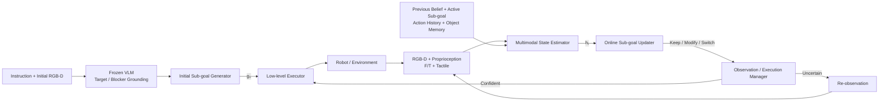
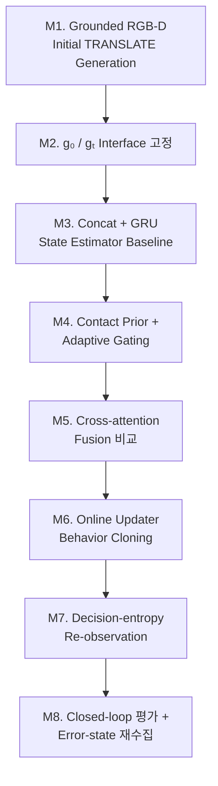

# Multimodal State Estimation 기반 Online Sub-goal Adaptation

> **최종 연구 목표** — 가림과 접촉이 계속 변하는 cluttered shelf manipulation에서, 로봇이 현재 task state를 multimodal belief로 유지하고 실행 중인 parameterized sub-goal을 필요한 순간에만 유지·수정·전환하도록 만든다.

| 항목 | 내용 |
|---|---|
| 상태 | Working design |
| 설계 기준일 | 2026-10-01 |
| 시스템 수준 | State-aware mid-level decision layer |
| 초기 semantic grounding | Frozen VLM |
| 온라인 입력 | RGB-D, proprioception, F/T, tactile, action history, active sub-goal, object memory |
| 온라인 출력 | 유지·수정·전환된 parameterized sub-goal |
| 실행 계층 | Cartesian/impedance, DiffIK/motion planning 또는 contact-rich DRL executor |
| 현재 중간 목표 | [Grounded RGB-D 기반 TRANSLATE 전용 초기 sub-goal 생성](milestones/grounded-rgbd-translate/) |

## 1. 이 연구가 해결하려는 문제

선반 안의 target을 꺼내기 위해 blocker를 옮기는 동안에는 다음과 같은 변화가 발생한다.

- 로봇 팔과 gripper가 카메라 시야를 가린다.
- 물체가 예상과 다르게 움직이거나 다른 물체에 걸린다.
- 접촉 전에는 유용하지 않던 F/T와 tactile 정보가 접촉 후 중요해진다.
- 처음 만든 sub-goal의 방향이나 이동량이 더 이상 적절하지 않을 수 있다.
- 모든 시점에 VLM을 다시 호출하거나 장면을 재관측하면 지연과 비용이 커진다.

따라서 이 연구의 핵심은 단순한 sensor fusion이 아니다. **현재 task에 필요한 상태를 belief로 유지하고, 그 belief를 근거로 active sub-goal을 언제 그대로 실행하고 언제 바꿀지 판단하는 것**이다.

핵심 연구 질문은 다음과 같다.

> Cluttered shelf manipulation 중 vision이 부분적으로 가려지고 physical interaction이 계속 변할 때, 이전 belief와 multimodal evidence를 이용해 active parameterized sub-goal을 online으로 유지·수정·전환할 수 있는가?

## 2. 전체 시스템에서의 역할 분리



각 모듈의 책임은 다음과 같이 구분한다.

1. **Frozen VLM**
   - 자연어 목표를 초기 장면의 target 및 blocker ID·mask와 연결한다.
   - 실행 중의 빠른 physical state estimation은 담당하지 않는다.
2. **Initial Sub-goal Generator**
   - grounded RGB-D로 최초 parameterized sub-goal `g₀`를 만든다.
   - 현재 중간 목표에서는 TRANSLATE의 방향과 이동 거리를 검증한다.
3. **Task/Object Memory**
   - target identity, 현재 blocker, 이미 관측한 물체와 관계를 유지한다.
   - 재관측 후 object ID를 다시 연결한다.
4. **Multimodal State Estimator**
   - 현재 sensor evidence와 execution context를 task-aware belief `hₜ`로 변환한다.
5. **Online Sub-goal Updater**
   - active sub-goal을 유지할지, parameter만 수정할지, 다른 primitive로 전환할지 결정한다.
6. **Observation/Execution Manager**
   - 현재 결정을 신뢰할 수 있으면 실행을 계속한다.
   - 결정이 애매할 때만 semantic refresh 또는 active re-observation을 요청한다.
7. **Low-level Executor**
   - parameterized sub-goal을 실제 joint/Cartesian motion으로 실행한다.
   - 본 연구의 state estimator/updater와 contact-rich DRL 정책의 경계를 형성한다.

## 3. 핵심 인터페이스

### 3.1 Parameterized sub-goal

모듈 사이에서 전달하는 sub-goal은 joint command가 아니라 다음과 같은 중간 수준 목표다.

```text
gₜ = (action, object_id, reference_frame, direction, magnitude)
```

예시는 다음과 같다.

```json
{
  "action": "TRANSLATE",
  "object_id": 57,
  "reference_frame": "ShelfFrame",
  "direction": "UP_RIGHT",
  "distance_m": 0.015
}
```

초기 generator의 출력 `g₀`와 online updater의 출력 `gₜ`는 같은 의미 체계를 사용해야 한다. 중간 목표에서 사용하는 LEFT/RIGHT 방향은 이후 shelf-frame 단위벡터 표현으로 확장할 수 있어야 한다.

### 3.2 Current sensor evidence

```math
o_t^{sensor}=\{I_t,D_t,P_t,F_{t-k:t},T_{t-k:t}\}
```

- `Iₜ`, `Dₜ`: 현재 RGB와 metric depth
- `Pₜ`: joint state, end-effector pose/velocity, gripper state
- `Fₜ₋ₖ:ₜ`: F/T의 최근 변화 이력
- `Tₜ₋ₖ:ₜ`: tactile/contact의 최근 변화 이력

F/T와 tactile은 순간값보다 contact onset, force increase, slip과 같은 시간 변화가 중요하므로 history representation을 기본으로 한다.

### 3.3 Execution context

```math
o_t^{exec}=\{h_{t-1},g_{t-1},A_{t-k:t-1}\}
```

- 이전 belief `hₜ₋₁`
- 현재 실행 중인 active sub-goal `gₜ₋₁`
- 실제로 실행된 action/motion history

같은 force 증가라도 TRANSLATE 중인지 LIFT 중인지에 따라 의미가 다르므로 sensor 해석은 active sub-goal과 action history에 조건화한다.

### 3.4 Task/Object memory

`mₜ`는 다음 정보를 실행 전체에 걸쳐 유지한다.

- persistent target identity
- current blocker identity와 역할
- previously observed objects
- target–blocker 및 object 관계
- re-observation 이후의 ID re-association

## 4. Multimodal State Estimator

목표는 완전한 3D world model을 복원하는 것이 아니라, **다음 sub-goal decision에 충분한 task-aware belief `hₜ`**를 만드는 것이다.

### 4.1 Modality-specific encoding

```math
z_V=E_V(I_t,D_t),\quad
z_P=E_P(P_t),\quad
z_F=E_F(F_{t-k:t}),\quad
z_T=E_T(T_{t-k:t})
```

- RGB-D: CNN 또는 ViT 계열 encoder
- Proprioception: MLP
- F/T 및 tactile history: MLP 또는 1D-CNN 계열 temporal encoder

각 modality를 먼저 독립적으로 표현한 뒤 gating과 fusion에서 상호작용시킨다.

### 4.2 Physical validity prior와 learned relevance의 분리

F/T와 tactile은 contact가 없을 때 task state에 반영하지 않도록 binary prior를 둔다.

```math
v_F,v_T\in\{0,1\}
```

Adaptive gate는 modality feature와 현재 context로 relevance를 학습한다.

```math
[\alpha_V,\alpha_P,\alpha_F,\alpha_T]
=G(z_V,z_P,z_F,z_T,h_{t-1},g_{t-1},m_t)
```

최종 기여도는 다음과 같다.

```math
w_V=\alpha_V,\quad w_P=\alpha_P,\quad
w_F=v_F\alpha_F,\quad w_T=v_T\alpha_T
```

- **When-to-use:** `v_F`, `v_T`가 physical modality를 사용할 수 있는 시점을 제한한다.
- **How-much-to-use:** `αₘ`이 현재 task에서 실제 기여도를 학습한다.

Vision과 proprioception에는 별도의 binary validity label을 두지 않고 task loss에서 relevance를 직접 학습한다.

### 4.3 Context-dependent feature fusion

Gating은 무엇을 얼마나 볼지 정하지만, modality 사이의 관계까지 해석하지는 않는다. 따라서 active sub-goal과 previous belief를 query로 사용하는 cross-modal interaction을 검토한다.

```math
q_t=E_q([h_{t-1};g_{t-1}])
```

```math
K,V=[w_Vz_V;w_Pz_P;w_Fz_F;w_Tz_T]
```

```math
z_t^{fused}=CrossAttention(q_t,K,V)
```

- **Gating:** 무엇을 얼마나 사용할지 선택
- **Fusion:** 선택된 정보를 현재 sub-goal의 관점에서 함께 해석

Concat과 weighted sum을 baseline으로 두고 cross-attention의 필요성을 검증한다.

### 4.4 Temporal memory

```math
h_t=M(h_{t-1},z_t^{fused})
```

초기 baseline은 GRU를 사용한다. Temporal memory가 담당하는 기능은 다음과 같다.

- 로봇 팔이나 gripper에 가려진 object relation 유지
- 현재 frame에서 사라진 정보를 이전 belief로 보존
- proprioception과 action history를 이용한 진행 상태 propagation
- contact 이후 physical evidence의 누적
- 순간적인 sensor noise에 따른 state 급변 완화

즉, feature fusion은 **cross-modal integration**, temporal memory는 **cross-time integration**을 담당한다.

## 5. Online Sub-goal Updater

Updater의 입력은 다음과 같다.

```math
x_t^{update}=\{h_t,g_{t-1},m_t\}
```

### 5.1 Decision head

Updater는 세 가지 결정을 내린다.

- **Keep:** 현재 sub-goal이 유효하고 정상적으로 진행 중이다.
- **Modify:** primitive는 유효하지만 direction 또는 magnitude를 바꿔야 한다.
- **Switch:** 현재 primitive가 부적절하므로 다른 sub-goal로 전환해야 한다.

매 timestep마다 residual distance를 새로운 sub-goal로 다시 생성하지 않는다. 정상 진행에서는 기존 sub-goal을 유지하고, **stuck, slip, unexpected contact, progress failure와 같은 의미 있는 state change가 있을 때만 갱신**한다.

### 5.2 Parameter head

Modify 또는 Switch가 선택되면 action, object, reference frame, direction, magnitude를 출력한다. 유지 결정에서는 기존 active sub-goal을 그대로 전달한다.

## 6. Decision confidence와 re-observation

Occlusion 자체를 uncertainty로 간주하지 않는다. Vision이 가려져도 belief, proprioception, action history와 physical evidence로 현재 결정이 명확하면 실행을 계속한다.

초기 baseline은 updater decision distribution의 normalized entropy를 사용한다.

```math
p_t=p(r_t\mid h_t,g_{t-1},m_t)
```

```math
U_t=-\frac{\sum_{i=1}^{K}p_{t,i}\log p_{t,i}}{\log K}
```

- `Uₜ ≤ τ`: 현재 또는 갱신된 sub-goal을 실행
- `Uₜ > τ`: 실행을 안전하게 보류하고 re-observation

Re-observation은 두 수준으로 나눈다.

1. 현재 RGB/RGB-D를 다시 처리하는 semantic/scene refresh
2. robot 또는 camera viewpoint를 바꾸는 active re-observation

Softmax entropy는 높은 confidence로 틀리는 사례를 놓칠 수 있으므로, 이후 ensemble disagreement나 learned decision-risk estimation을 확장 후보로 둔다.

## 7. 학습 데이터와 학습 전략

### 7.1 Episode 단위 동기화 데이터

한 episode에서 다음 항목을 같은 시간축으로 저장한다.

- RGB와 depth
- joint/end-effector state
- F/T 및 tactile history
- physical contact validity
- active sub-goal
- executed action history
- object memory snapshot
- operator intervention/update event
- update 이후 sub-goal parameter
- success, collision, force statistics

Frame을 독립적으로 섞지 않고 sequence chunk로 학습한다.

### 7.2 Telemanipulation supervision

Telemanipulation trajectory에서 operator intervention을 update event로 사용한다.

```math
(h_t,g_{t-1},m_t)\rightarrow(r_t^*,g_t^*)
```

수집 데이터에는 정상 진행뿐 아니라 다음 event를 충분히 포함해야 한다.

- contact 증가
- stuck 또는 progress failure
- slip
- 방향·이동량 수정
- primitive 전환

초기에는 behavior cloning으로 decision classification과 parameter prediction을 학습하고, 이후 learner가 실제로 방문한 error state를 추가하는 DAgger-style refinement를 검토한다.

### 7.3 Auxiliary supervision

필요하면 latent belief가 task/physical state를 표현하도록 다음 auxiliary prediction을 추가한다.

- contact/no-contact
- object moving/stuck
- task progress
- slip 또는 abnormal force trend

## 8. 평가 계획

최종 평가는 단순한 offline prediction accuracy가 아니라 closed-loop adaptation의 효과를 확인해야 한다.

### 8.1 주요 평가 축

- 전체 task success rate
- sub-goal update decision의 precision/recall과 event별 성능
- direction/magnitude 등 갱신 parameter의 오차
- collision 및 force-limit violation
- stuck/slip에서 recovery 성공률
- occlusion 구간에서 belief와 target/blocker identity 유지율
- 불필요한 sub-goal update 수
- re-observation 횟수, 지연 및 성공률과의 trade-off

### 8.2 핵심 ablation

| 비교 | 확인할 질문 |
|---|---|
| Vision-only vs +Proprioception vs +F/T vs +Tactile | 각 modality가 어떤 failure/adaptation event를 개선하는가? |
| Always-on physical input vs Binary validity prior | No-contact physical signal을 차단할 필요가 있는가? |
| Concat vs Learned gating vs Prior-guided gating | Modality contribution을 어떻게 조절해야 안정적인가? |
| Weighted sum vs Cross-attention | Context-dependent cross-modal interaction이 필요한가? |
| No memory vs GRU | Occlusion 중 이전 belief와 execution history가 필요한가? |
| Always vs Fixed interval vs Decision-entropy re-observation | 성공률을 유지하면서 관측 비용을 줄일 수 있는가? |

## 9. 단계별 실행 계획



1. **초기 sub-goal 생성 가능성 검증:** Grounded RGB-D에서 TRANSLATE 방향과 거리를 예측하고, 정적 목표 유효성과 일반화를 확인한다. 현재 상세 설계와 결과는 [중간 목표 README](milestones/grounded-rgbd-translate/)에 기록한다.
2. **인터페이스 고정:** Initial generator, updater, executor가 공유할 object ID, reference frame, direction, magnitude의 의미와 단위를 확정한다.
3. **State estimator baseline:** Concat/weighted-sum과 GRU로 sequence baseline을 만들고 event별 state prediction을 검증한다.
4. **Physical validity와 adaptive gating:** F/T·tactile contact prior와 learned relevance의 효과를 분리해 평가한다.
5. **Context-dependent fusion:** Weighted sum과 cross-attention을 비교한다.
6. **Online updater 학습:** Telemanipulation intervention으로 Keep/Modify/Switch 및 parameter head를 학습한다.
7. **Selective re-observation 연결:** Decision entropy baseline의 threshold를 validation trajectory에서 정한다.
8. **Closed-loop refinement:** 실제 learner가 방문하는 error state를 재수집하고 end-to-end task success와 recovery를 평가한다.

## 10. 성공의 의미

이 연구의 성공은 모든 센서를 하나의 네트워크에 넣는 것으로 정의하지 않는다. 다음 현상이 ablation과 closed-loop 평가에서 확인되어야 한다.

- 정상 진행에서는 기존 sub-goal을 불필요하게 바꾸지 않는다.
- 가림 중에도 target/blocker identity와 task progress를 유지한다.
- 접촉 이후에는 F/T·tactile evidence가 실제 update decision에 기여한다.
- stuck, slip, unexpected contact에서 적절한 parameter 수정 또는 primitive 전환이 발생한다.
- 항상 재관측하는 방법보다 적은 관측으로 유사하거나 더 높은 task success를 달성한다.
- 모듈별 개선이 최종 task success와 safety 향상으로 연결된다.

## 11. 현재 확정해야 할 사항

- 최종 sub-goal action vocabulary와 action별 parameter schema
- shelf frame 축 정의와 direction의 이산/연속 표현
- initial generator의 LEFT/RIGHT 출력을 일반 direction vector로 연결하는 규칙
- object 기준점과 magnitude의 물리적 의미
- contact validity를 정하는 F/T·tactile 기준
- updater의 Keep/Modify/Switch event annotation 규칙
- operator intervention과 실제 state change 사이의 label alignment
- uncertainty threshold와 안전한 motion hold 정책
- state estimator/updater의 update frequency와 executor 주기 분리
- 실제 로봇 평가 전 통과해야 할 offline/simulation 기준

---

이 문서는 최종 연구 방향을 설명하는 상위 설계 문서다. 개별 실험의 설정과 원시 결과를 이 저장소로 이관할 때는 `experiments/`에 immutable snapshot으로 남기고, 연구 단계의 범위와 다음 의사결정은 이 경로에서 관리한다.
