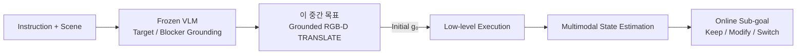
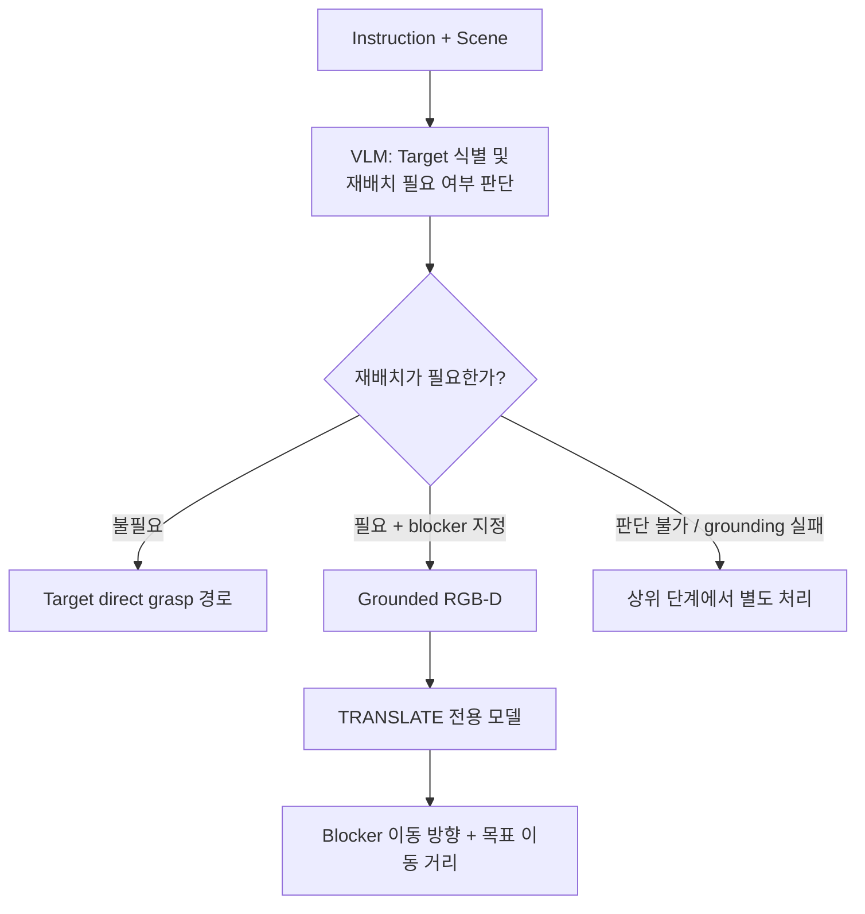
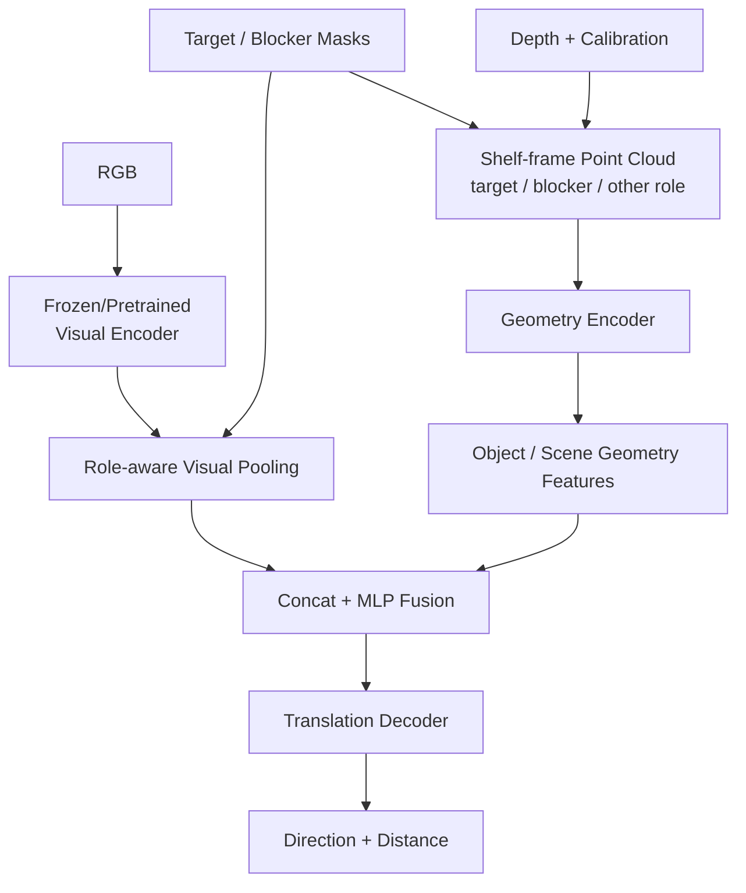

# Grounded RGB-D 기반 TRANSLATE 전용 Sub-goal Generation

> **중간 연구 목표** — VLM이 target과 blocker를 정확히 지정했다고 가정하고, 현재 RGB-D 장면에서 target 접근성을 개선하기 위해 blocker를 어느 방향으로 얼마나 이동해야 하는지 학습할 수 있는지 검증한다.

| 항목 | 내용 |
|---|---|
| 상태 | Initial feasibility milestone |
| 설계 기준일 | 2026-10-01 |
| 결과 갱신일 | 2026-10-06 |
| 상위 목표 | [Multimodal State Estimation 기반 Online Sub-goal Adaptation](../../) |
| 입력 | RGB, depth, target/blocker mask·ID, camera calibration, shelf transform |
| 고정 action | `TRANSLATE` |
| 예측값 | Blocker 이동 방향과 물체 자체의 목표 이동 거리 |
| 기준 좌표계 | Shelf frame |
| 현재 검증 범위 | LEFT/RIGHT, 합성 RGB-D, 정적 geometry proxy |
| 범위 밖 | Action selection, executor, contact dynamics, online adaptation, 실제 로봇 성공률 |

## 1. 왜 이 중간 목표가 필요한가

최종 연구는 실행 중의 multimodal state estimation과 online sub-goal adaptation을 다룬다. 하지만 최초 sub-goal `g₀`가 부정확하면 이후 estimator와 updater의 오류를 분리해서 해석하기 어렵다.

따라서 먼저 다음 질문을 독립적으로 검증한다.

> Target과 blocker가 지정된 RGB-D 장면에서, blocker를 어느 방향으로 얼마나 옮겨야 target에 접근하기 좋은 상태가 되는지 학습할 수 있는가?

이 단계에서는 action을 TRANSLATE로 고정한다. 이를 통해 다음 문제를 분리한다.

- VLM이 어떤 action을 선택해야 하는가?
- 로봇이 그 action을 어떻게 접촉 실행해야 하는가?
- 실행 중 언제 sub-goal을 갱신해야 하는가?

위 문제들은 이 중간 단계의 평가 대상이 아니다. 여기서는 **visual context와 metric geometry로 initial translation goal을 만들 수 있는지**만 확인한다.

## 2. 최종 목표와의 연결



이 모듈은 최종 시스템의 **initial sub-goal generator**다. 출력 `g₀`는 실행을 시작할 때 active sub-goal이 되고, 최종 시스템의 online updater는 이를 `gₜ₋₁`로 받아 유지·수정·전환한다.

중간 단계와 최종 단계는 동일한 인터페이스를 공유해야 한다.

```text
g = (object_id, action, reference_frame, direction, magnitude)
```

현재 LEFT/RIGHT 전용 검증은 최종 action space 전체를 의미하지 않는다. 이는 shelf-frame 방향 표현과 거리 예측의 가장 작은 검증 단위다.

## 3. 호출 조건과 역할 경계



다음 세 상태를 구분한다.

1. **사전 재배치 불필요:** direct grasp 경로로 이동한다.
2. **재배치 필요 + blocker grounding 성공:** 이 모델을 호출한다.
3. **판단 불가 또는 grounding 실패:** blocker가 없다고 간주하지 않고 상위 모듈에서 별도로 처리한다.

모든 blocker 장면에 TRANSLATE가 적절하다고 가정하지 않는다. 이 단계의 데이터는 translation으로 target 접근성을 개선할 수 있는 장면으로 제한한다.

## 4. 확정된 범위

| 항목 | 정의 |
|---|---|
| 조작 대상 | VLM이 미리 지정한 blocker. Object ID를 다시 예측하지 않는다. |
| Target | 접근성을 개선하려는 물체를 알려주는 goal context다. |
| Action | `TRANSLATE`로 고정하며 action classification head를 사용하지 않는다. |
| 출력 | 이동 방향과 이동 거리 |
| 이동 거리 | Blocker의 현재 기준점에서 목표 기준점까지의 물체 변위 크기(m) |
| Reference frame | Shelf coordinate frame |
| PUSH/PULL | 별도 action label로 구분하지 않는다. |
| ROTATE | 후속 확장 후보이며 현재 범위에서 제외한다. |
| GRASP | 이 모델에서 제외하고 상위 direct-grasp 경로로 분기한다. |
| Executor/online adaptation | 현재 모델 학습과 성능 검증의 범위 밖이다. |

## 5. 입력과 출력

### 5.1 입력

```math
X=\{I_{RGB},D,M_T,M_B,K,T_{cam\rightarrow shelf}\}
```

| 입력 | 의미 |
|---|---|
| RGB | 현재 장면의 색상 이미지 |
| Depth | RGB와 정렬된 metric depth |
| Target mask/ID | 목표 물체 영역과 identity |
| Blocker mask/ID | 이동할 물체 영역과 identity |
| Camera intrinsic `K` | Depth를 camera-frame 3D point로 변환 |
| Camera→Shelf transform | 모든 geometry와 목표 방향을 shelf frame으로 정렬 |

Point cloud에는 target과 blocker뿐 아니라 주변 물체와 선반 경계도 유지한다. Invalid/occluded depth 영역은 free space와 구분해야 한다.

### 5.2 출력

```math
g_0=(blocker\_id,TRANSLATE,ShelfFrame,\hat d,\hat s)
```

```json
{
  "object_id": 57,
  "action": "TRANSLATE",
  "reference_frame": "ShelfFrame",
  "direction": "RIGHT",
  "distance_m": 0.05
}
```

Blocker의 목표 변위는 다음과 같이 정의한다.

```math
\Delta p_B=p_B^{goal}-p_B^{current}=s d,\qquad \|d\|_2=1
```

`s`는 물체의 목표 변위 크기다. 이동 경로의 누적 길이나 end-effector 이동량이 아니다. 현재 위치와 목표 위치는 같은 물체 기준점을 사용해야 한다.

## 6. 첫 모델 구조



### 6.1 Visual branch

- Pretrained CNN을 초기 baseline으로 사용한다.
- 하나의 RGB feature map에서 target, blocker, 전체 장면 특징을 mask pooling한다.
- 외형, 이미지상 배치, 가림 관계와 주변 visual context를 표현한다.

### 6.2 Geometry branch

- Depth를 shelf-frame point cloud로 변환한다.
- 각 point에 target/blocker/other role을 one-hot 또는 embedding으로 부여한다.
- PointNet 계열 encoder로 object와 scene geometry를 표현한다.
- 거리 예측에 필요한 metric scale을 보존한다.

### 6.3 Fusion과 decoder

첫 baseline은 역할별 visual/geometry feature를 concatenate한 뒤 MLP로 결합한다.

```math
z_{scene}=MLP([v_T;g_T;v_B;g_B;v_C;g_C])
```

공유 feature에서 방향과 거리를 함께 출력한다.

```math
(\hat d,\hat s)=H_{translate}(z_{scene})
```

초기 검증은 LEFT/RIGHT 방향 분류와 양의 metric distance 예측으로 단순화했다.

## 7. 데이터와 annotation

한 sample에는 다음 정보를 저장한다.

- RGB와 metric depth
- target/blocker mask와 ID
- camera intrinsic과 shelf transform
- scene, asset, target–blocker pair, layout group
- blocker의 일관된 현재/목표 기준점
- 목표 이동 방향과 거리 또는 목표 위치
- label 생성/annotation 방법
- 목표 상태의 통로 확보, 경계, 충돌 유효성

데이터 분할은 이미지 단위가 아니라 scene/layout 및 필요 시 asset/pair 단위로 수행한다. 같은 배치의 시점 변화나 증강본이 train/test에 나뉘어 들어가지 않도록 한다.

단일 최소 변위만 정답으로 쓰면 실제로 유효한 여러 목표를 오답으로 처리할 수 있다. 따라서 다음 두 관점을 구분한다.

- **Canonical label:** 지정한 방향과 목표 변위를 얼마나 정확히 맞혔는가?
- **Functional validity:** 예측 결과가 실제로 통로를 확보하고 충돌·경계를 피했는가?

## 8. 학습 objective와 평가

초기 방향 분류 + 거리 회귀 baseline은 다음 loss를 사용한다.

```math
\mathcal L_{translate}
=\lambda_d CE(\hat p_d,d^*)
+\lambda_s SmoothL1(\hat s,s^*)
```

전체 목표 변위 오차는 다음과 같다.

```math
E_{goal}=\|\hat s\hat d-s^*d^*\|_2
```

주요 지표는 다음과 같다.

| 지표 | 확인하는 내용 |
|---|---|
| Direction accuracy/confusion | Canonical 방향과 좌우 편향 |
| Distance MAE/RMSE | 물체 목표 이동 거리 오차 |
| Full displacement error | 방향과 거리를 합친 최종 목표 오차 |
| Joint tolerance success | 방향·거리 또는 목표 위치가 동시에 허용오차 만족 |
| Passage-clearing success | Target 앞 관심 영역의 점유 감소 |
| Collision/boundary safety | 목표 상태와 swept AABB의 정적 유효성 |
| Static goal validity | 통로 확보와 충돌·경계 안전을 모두 만족 |

정적 목표 유효성은 로봇 kinematics, contact stability 또는 실제 실행 성공률을 의미하지 않는다.

## 9. 현재까지의 검증 결과

### 9.1 데이터와 비교 조건

- 합성 RGB-D shelf 장면 1,000개
- Train 800 / Validation 100 / Test 100
- LEFT 500 / RIGHT 500
- 15개 asset, 50개 target–blocker 조합
- Frozen ImageNet ResNet-18 visual encoder
- Trainable PointNet-style geometry encoder와 fusion/head
- 동일 asset/pair에서 새로운 배치만 held-out
- 정확한 target/blocker mask가 주어진 조건

초기 baseline은 방향 정확도 74%, 실제 예측 방향 기준 거리 MAE 25.60 mm, 정적 목표 유효성 40%를 기록했다. 이후 방향·거리 결합 방식과 안전 objective를 바꾸어 총 5개 모델을 같은 Test 100장에서 비교했다.

| 모델 | 방향 | 방향+안전 | 정적 안전 | 통로 확보 | 충돌·경계 안전 | 최소거리 MAE | 평균 이동 |
|---|---:|---:|---:|---:|---:|---:|---:|
| Baseline | 74% | 40% | 40% | 54% | 75% | 25.60 mm | 66.78 mm |
| Signed scalar | 68% | 41% | 43% | 63% | 74% | 35.24 mm | 81.48 mm |
| Joint + mirror | 72% | 54% | 61% | 87% | 73% | 40.53 mm | 105.25 mm |
| Joint + short-safe | 71% | **54%** | **64%** | **87%** | **76%** | 38.72 mm | 98.64 mm |
| Direction-first | **79%** | 53% | 55% | 74% | **76%** | 30.67 mm | 83.19 mm |

현재 해석은 다음과 같다.

- **Canonical 방향이 중요한 경우:** Direction-first가 79%로 가장 좋다.
- **기능적 정적 안전이 중요한 경우:** Joint + short-safe가 64%로 가장 좋다.
- 한 모델이 방향과 안전을 모두 최고로 만들지는 못했다.
- 여러 안전 목표를 허용한 모델에서는 최소거리 MAE가 커도 정적 안전 성공률이 높을 수 있다.
- Initial TRANSLATE goal의 학습 가능성은 확인했지만 실제 sub-goal generator로 사용하기에는 아직 부족하다.

## 10. 결과 해석의 제한

- 동일 Test 100장을 여러 개선안 비교에 재사용했으므로 최종 일반화 성능으로 주장할 수 없다.
- 단일 seed 결과다.
- 같은 15개 asset과 50개 target–blocker pair를 사용했다.
- unseen-object 및 unseen-pair 성능은 확인하지 않았다.
- RGB-only ablation이 없어 RGB-D geometry의 순효과가 아직 분리되지 않았다.
- 정확한 target/blocker grounding을 가정하므로 VLM 오류가 포함되지 않았다.
- LEFT/RIGHT만 학습했으며 3D translation, ROTATE와 action selection은 검증하지 않았다.
- 정적 AABB proxy이며 실제 robot kinematics, contact dynamics와 executor 성공률을 포함하지 않는다.
- 여러 목표가 유효한 장면에서 canonical label accuracy와 functional validity는 서로 다른 의미를 가진다.

## 11. 이 중간 목표의 다음 통과 조건

최종 online adaptation 단계와 연결하기 전에 다음 검증을 우선한다.

1. 새로운 untouched test split을 만든다.
2. Direction-first와 short-safe 계열을 최소 3개 seed로 반복한다.
3. 동일 grounding/split에서 RGB-only와 RGB-D를 비교한다.
4. unseen-object와 unseen target–blocker pair split을 평가한다.
5. 선택한 방향 내부에서 안전한 거리를 강하게 학습하는 결합 모델을 비교한다.
6. Initial `g₀`와 online updater `gₜ`가 공유할 reference frame, direction, magnitude schema를 고정한다.
7. 정적 proxy가 충분히 안정된 뒤 executor/simulation closed loop로 연결한다.
8. 이후에만 contact-rich 실행과 multimodal online update를 결합한다.

중간 목표의 종료는 특정 offline accuracy 하나만으로 결정하지 않는다. **재현성, 새로운 분포에서의 일반화, functional validity, 최종 시스템과의 인터페이스 일관성**을 함께 만족해야 한다.

## 12. 아직 확정해야 할 설계 선택

- 선반 평면 이동만 다룰지 3D translation으로 확장할지
- 이산 방향 집합과 shelf-frame 단위벡터 정의
- 연속 방향 예측의 도입 시점
- 물체 현재/목표 위치의 기준점
- 거리 범위, 정규화와 출력 상한
- 여러 유효 목표 중 canonical label을 정하는 기준
- 안전 구간과 통로 확보의 geometry 정의
- Visual/geometry backbone과 fine-tuning 범위
- 목표 위치와 swept path 평가의 허용오차
- 실제 VLM grounding error를 포함하는 end-to-end 평가 시점

---

이 문서는 최종 연구 목표에 진입하기 위한 현재 중간 검증의 역할과 판단 기준을 설명한다. 개별 학습 run의 config, checkpoint, raw prediction과 audit 결과를 이 저장소로 이관할 때는 `experiments/`에 별도 snapshot으로 보존한다.
