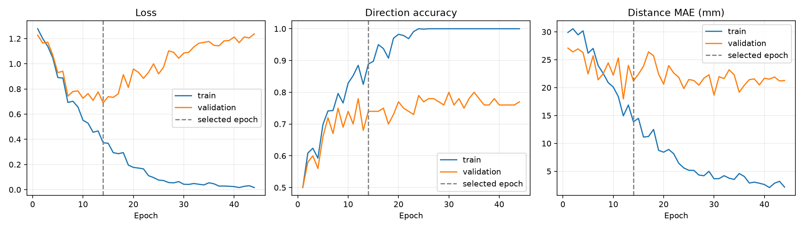
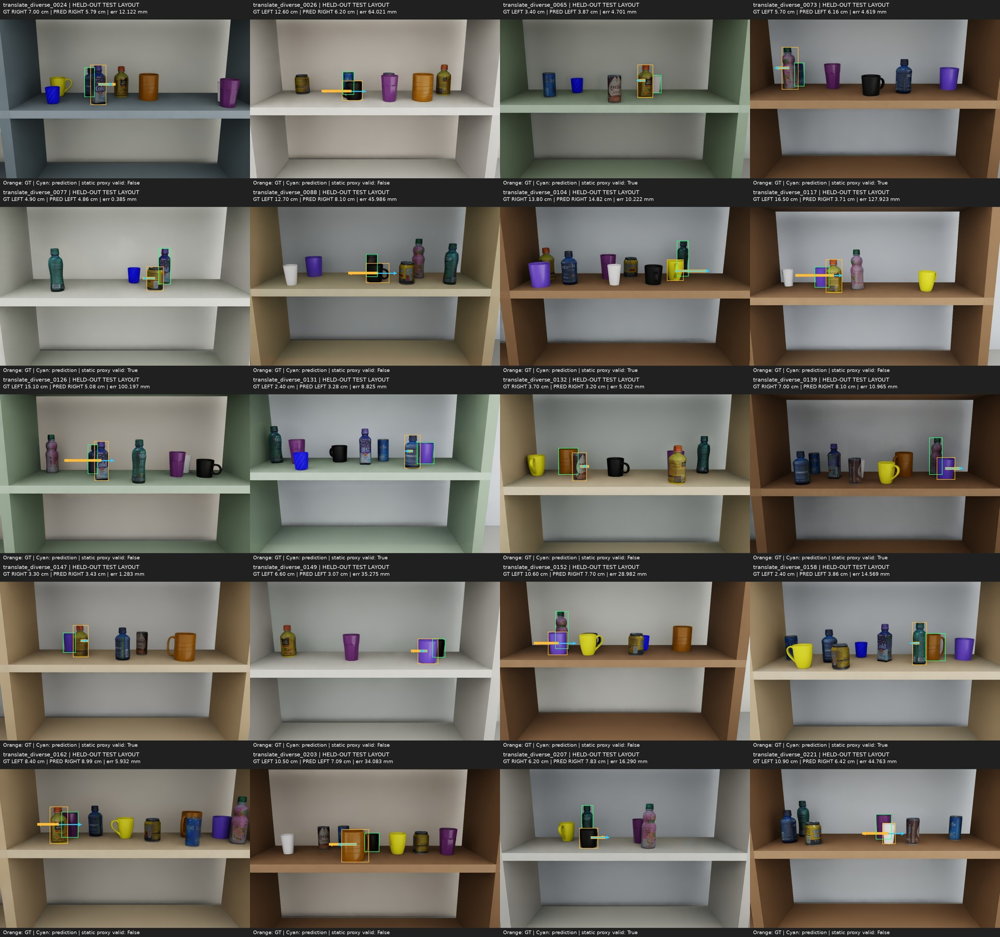

# 01 — Baseline: 방향 분류 + 방향별 거리 회귀

[실험 로그 인덱스](../) · [공통 데이터](../dataset/)

첫 검증 모델이다. RGB-D로 canonical LEFT/RIGHT 방향과 최소 이동 거리를 기본적으로 학습할 수 있는지 확인했다.

## 모델과 학습

- Frozen ImageNet ResNet-18 visual encoder
- Trainable PointNet-style geometry encoder, fusion MLP, direction/distance heads
- 기존 코드의 8방향 logit과 8개 거리 head를 유지했지만 label은 LEFT/RIGHT만 사용
- 방향 cross entropy + `5 × SmoothL1(distance / 0.25m)`
- Adam, batch 32, initial LR 0.001, cosine schedule, gradient clipping 5
- 최대 200 epoch, validation loss 30 epoch 미개선 시 early stopping
- Epoch 44에서 종료, validation loss 최저인 epoch 14 선택
- Test는 checkpoint 선택 후 한 번 평가

## 결과

| 지표 | 값 |
|---|---:|
| Canonical 방향 정확도 | 74/100 |
| 실제 예측 방향 기준 거리 MAE | 25.60 mm |
| Full displacement MAE | 57.40 mm |
| 방향+5mm 이내 | 25/100 |
| 통로 확보 | 54/100 |
| 충돌·경계 안전 | 75/100 |
| 정적 목표 유효 | 40/100 |

- LEFT 30/50, RIGHT 44/50로 RIGHT 편향이 나타났다.
- 9cm 이상 이동 구간은 방향 정답 11/29, 거리 MAE 52.79mm로 긴 이동에 취약했다.
- 방향이 맞은 74개에서는 거리 MAE 10.81mm, 틀린 26개에서는 67.70mm였다.
- 최소 거리 하나를 회귀하면 조금 덜 움직여 통로가 남거나, 더 움직여 충돌하는 문제가 직접 반영되지 않는다.

## 선택 checkpoint

```text
epoch: 14
sha256: d64e87452d400eb5c0cb5e3cba85750db7cb6f8b710b8239d55cf7a8a3d3602f
```

Checkpoint 자체는 저장소 크기 정책에 따라 제외했다. 선택 시점 기록은 `selection_complete.json`, 최종 test와 hash는 `completion.json`에서 확인한다.

## 시각화





주황색은 정답, 하늘색은 예측이다. 첫 20개를 manifest 순서대로 표시했으며 성공 사례를 선별하지 않았다.

## 로그와 결과

- 원본 실행 설명: [`RUN_NOTES.md`](RUN_NOTES.md)
- 설정: [`config.json`](config.json)
- 전체 epoch 로그: [`history.csv`](history.csv), [`history.json`](history.json)
- 최종 요약: [`completion.json`](completion.json)
- 상세 test metrics: [`results/metrics.json`](results/metrics.json)
- 장면별 예측: [`results/predictions.csv`](results/predictions.csv)
- 실행 코드 snapshot: [`source/`](source/)

이 모델은 이후 네 개선안의 등록 baseline이다.
