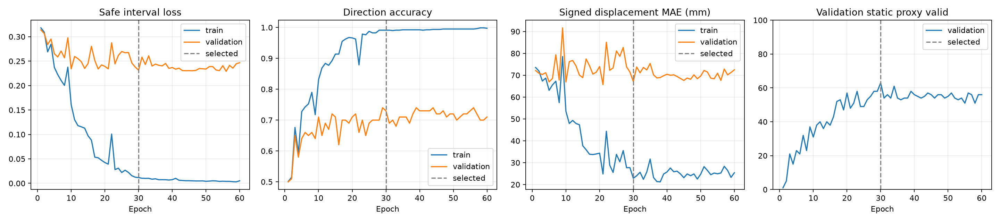

# 02 — Signed scalar: 부호 있는 안전 변위

[실험 로그 인덱스](../) · [이전 Baseline](../01-baseline/) · [공통 데이터](../dataset/)

방향을 틀렸을 때 다른 distance head가 선택되는 baseline의 결합 문제를 줄이기 위해, 방향과 거리를 하나의 signed shelf-X displacement로 표현했다.

## 변경점

- 음수는 LEFT, 양수는 RIGHT, 절댓값은 이동 거리
- 단일 최소 거리 대신 충돌 없는 signed safe interval을 계산
- 예측이 안전 구간 안이면 거리 loss 0, 밖이면 가장 가까운 경계까지 SmoothL1
- 안전 구간 경계에 최대 10mm의 적응형 margin
- Validation 정적 안전을 우선해 epoch 30 선택, 총 60 epoch

## 결과

| 지표 | Baseline | Signed scalar | 변화 |
|---|---:|---:|---:|
| 방향 정확도 | 74% | 68% | -6%p |
| 최소거리 MAE | 25.60 mm | 35.24 mm | +9.64 mm |
| 정적 목표 유효 | 40/100 | 43/100 | +3 |
| 통로 확보 | 54/100 | 63/100 | +9 |
| 충돌·경계 안전 | 75/100 | 74/100 | -1 |

LEFT와 RIGHT가 각각 34/50으로 편향은 줄었지만 전체 방향 정확도도 낮아졌다. 연속 scalar가 0 근처에서 좌우 구분을 흐릴 수 있었고, 안전 구간 학습만으로는 주 모델을 교체할 만큼 개선되지 않았다.

## 선택 checkpoint

```text
epoch: 30
sha256: f9977563f051a30381f9737fc5d46cbe3b71f2af980de5c2f1736ad82d0d1cad
```




## 로그와 결과

- 원본 실행 설명: [`RUN_NOTES.md`](RUN_NOTES.md)
- 설정과 전체 history: [`config.json`](config.json), [`history.csv`](history.csv)
- 선택/완료 기록: [`selection_complete.json`](selection_complete.json), [`completion.json`](completion.json)
- 상세 metrics와 장면별 예측: [`results/metrics.json`](results/metrics.json), [`results/predictions.csv`](results/predictions.csv)
- 모델·학습 코드 snapshot: [`source/`](source/)

이 run부터 같은 test 100장을 개선안 비교에 재사용했으므로 결과는 controlled comparison으로 해석한다.
