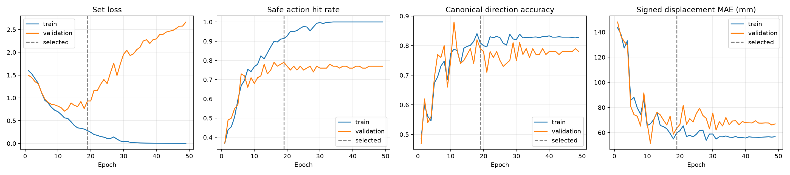
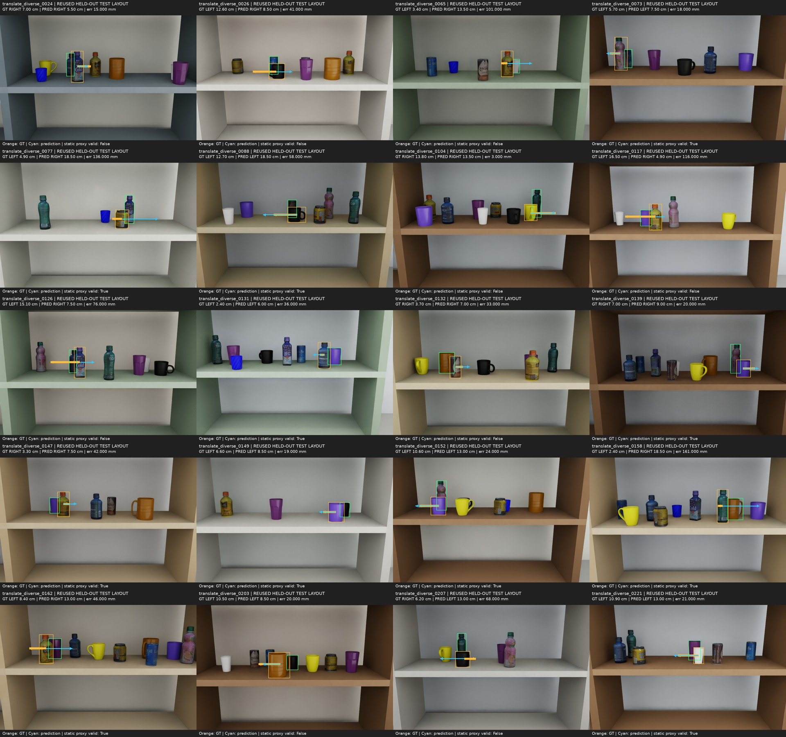

# 03 — Joint action + horizontal mirror

[실험 로그 인덱스](../) · [이전 Signed scalar](../02-signed-scalar/) · [공통 데이터](../dataset/)

방향과 거리를 완전히 하나의 action으로 묶고, 한 장면에 여러 안전한 정답을 허용했다. 좌우 반전 증강으로 방향 대칭성도 명시적으로 학습했다.

## 변경점

- 50개 거리 대표값 × LEFT/RIGHT = 100개 joint action class
- 원본 800장 + horizontal mirror를 학습 중 1,600개처럼 사용
- RGB/mask 반전과 함께 shelf X 좌표·LEFT/RIGHT label도 반전
- 통로 확보와 충돌·경계 검사를 통과한 모든 catalog action을 정답 후보로 인정
- Safe-set NLL + `0.25 × ranking loss`
- Validation safe action 우선으로 epoch 19 선택, 총 49 epoch

## 결과

| 지표 | Signed scalar | Joint + mirror |
|---|---:|---:|
| 방향 정확도 | 68% | 72% |
| 방향+정적 안전 | 41% | 54% |
| 정적 목표 유효 | 43/100 | 61/100 |
| 통로 확보 | 63/100 | 87/100 |
| 충돌·경계 안전 | 74/100 | 73/100 |
| 평균 이동 | 81.48 mm | 105.25 mm |

복수 안전 정답과 mirroring으로 기능적 안전이 크게 개선됐다. 그러나 안전하기만 하면 긴 거리도 같은 정답이어서 평균 이동이 105.25mm까지 증가했다. Canonical 방향과 반대여도 안전한 장면이 7개 있었으므로 방향 정확도와 기능적 안전을 분리해서 해석해야 한다.

## 선택 checkpoint

```text
epoch: 19
sha256: 4f8471e64e4269f13f3f184cebaa53379fbeeda37c7803f41bf1cf33de39a4cd
```





## 로그와 결과

- 원본 실행 설명: [`RUN_NOTES.md`](RUN_NOTES.md)
- 설정과 전체 history: [`config.json`](config.json), [`history.csv`](history.csv)
- 선택/완료 기록: [`selection_complete.json`](selection_complete.json), [`completion.json`](completion.json)
- 상세 metrics와 장면별 예측: [`results/metrics.json`](results/metrics.json), [`results/predictions.csv`](results/predictions.csv)
- Joint action model과 학습 코드: [`source/`](source/)
