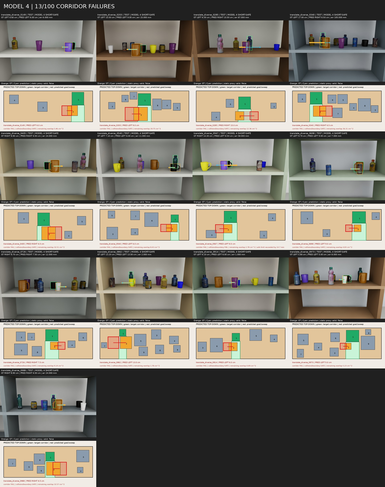
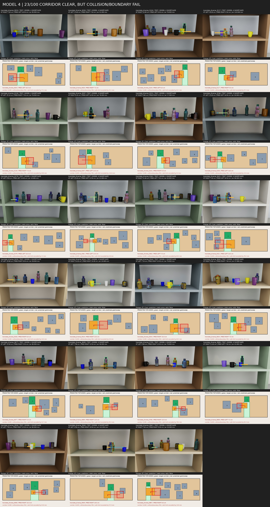
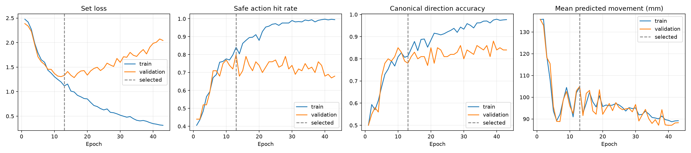

# 04 — Joint action + mirror + short-safe preference

[실험 로그 인덱스](../) · [이전 Joint + mirror](../03-joint-mirror/) · [공통 데이터](../dataset/)

Joint + mirror의 정적 안전은 유지하면서 필요 이상으로 긴 이동을 줄이기 위해 짧고 경계 여유가 있는 safe action을 보조 목표로 추가했다.

## 변경점

- 100개 joint action과 horizontal mirroring 유지
- 각 방향 safe interval의 양쪽 경계에서 최대 10mm 안쪽에 있는 action 중 짧은 action을 preferred set으로 정의
- 모든 안전 action은 계속 정답으로 인정
- 기존 loss에 `0.20 × preferred-set NLL` 추가
- Validation 안전 우선, 동률이면 방향과 평균 이동으로 epoch 13 선택
- 총 43 epoch

## 결과

| 지표 | Joint + mirror | Short-safe |
|---|---:|---:|
| 방향 정확도 | 72% | 71% |
| 방향+정적 안전 | 54% | 54% |
| 정적 목표 유효 | 61/100 | **64/100** |
| 통로 확보 | 87/100 | **87/100** |
| 충돌·경계 안전 | 73/100 | **76/100** |
| 평균 이동 | 105.25 mm | 98.64 mm |
| Preferred action 적중 | — | 9/100 |

정적 안전은 다섯 모델 중 가장 높고 평균 이동은 이전 모델보다 6.61mm 감소했다. 다만 preferred action 적중은 9%에 불과해 짧은 이동 선호가 충분히 강하게 학습됐다고 보기는 어렵다.

## 실패 분석

- 통로 미확보 중심 실패: [`results/failure_analysis/failure_cases.csv`](results/failure_analysis/failure_cases.csv)
- 집계: [`results/failure_analysis/summary.json`](results/failure_analysis/summary.json)





## 선택 checkpoint

```text
epoch: 13
sha256: 7811653c02ce06de414ad442447fb05cecd05bcf19ba1aaa55bdc88b5634ec1f
```




## 로그와 결과

- 원본 실행 설명: [`RUN_NOTES.md`](RUN_NOTES.md)
- 설정과 전체 history: [`config.json`](config.json), [`history.csv`](history.csv)
- 선택/완료 기록: [`selection_complete.json`](selection_complete.json), [`completion.json`](completion.json)
- 상세 metrics와 장면별 예측: [`results/metrics.json`](results/metrics.json), [`results/predictions.csv`](results/predictions.csv)
- Preferred-set 구현을 포함한 source snapshot: [`source/`](source/)
