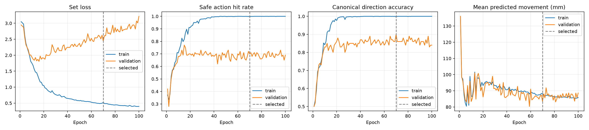

# 05 — Direction-first joint action

[실험 로그 인덱스](../) · [이전 Short-safe](../04-joint-short-safe/) · [공통 데이터](../dataset/)

기능적으로 안전한 반대 방향보다 사용자가 지정한 canonical LEFT/RIGHT를 우선 맞히도록 학습·decoding 순서를 변경했다.

## 변경점

- 166개 거리 대표값 × LEFT/RIGHT = 332개 joint action class
- 각 방향의 거리 class 확률을 합산해 방향 marginal을 먼저 선택
- 선택된 방향 안에서 거리 class 결정
- Canonical 방향 안의 안전 거리만 direction-conditioned 정답으로 사용
- `2.0 × direction CE(label smoothing 0.05)` + conditional safe-set NLL + ranking + preferred NLL
- Horizontal mirroring 유지
- Dropout 0.2, AdamW, weight decay 0.0001
- Validation 방향 정확도를 최우선으로 epoch 70 선택, 총 100 epoch

## 결과

| 지표 | Short-safe | Direction-first |
|---|---:|---:|
| 방향 정확도 | 71% | **79%** |
| 방향+정적 안전 | 54% | 53% |
| 정적 목표 유효 | **64/100** | 55/100 |
| 통로 확보 | **87/100** | 74/100 |
| 충돌·경계 안전 | 76/100 | 76/100 |
| 평균 이동 | 98.64 mm | 83.19 mm |
| 최소거리 MAE | 38.72 mm | 30.67 mm |

방향 우선 loss와 marginal decoding으로 방향 정확도는 baseline 대비 5%p, short-safe 대비 8%p 개선됐다. 반면 안전한 반대 방향을 supervision에서 제외하면서 정적 안전은 short-safe보다 9개 감소했다. Validation 방향 90%와 Test 79%의 차이는 배치 일반화 또는 과적합 가능성을 보여준다.

## 선택 checkpoint

```text
epoch: 70
sha256: a6a50435c265dd6ab123b387bcbbb072f2644920808a2ac4ade4eb344fb8cbcd
```




## 로그와 결과

- 원본 실행 설명: [`RUN_NOTES.md`](RUN_NOTES.md)
- 설정과 전체 history: [`config.json`](config.json), [`history.csv`](history.csv)
- 선택/완료 기록: [`selection_complete.json`](selection_complete.json), [`completion.json`](completion.json)
- 상세 metrics와 장면별 예측: [`results/metrics.json`](results/metrics.json), [`results/predictions.csv`](results/predictions.csv)
- Direction marginal과 conditional decoding source: [`source/`](source/)

현재 canonical 방향이 우선이면 이 checkpoint가 최선이고, 기능적 정적 안전이 우선이면 [04 Short-safe](../04-joint-short-safe/)가 최선이다. 아직 두 기준을 동시에 최고로 만드는 단일 모델은 없다.
