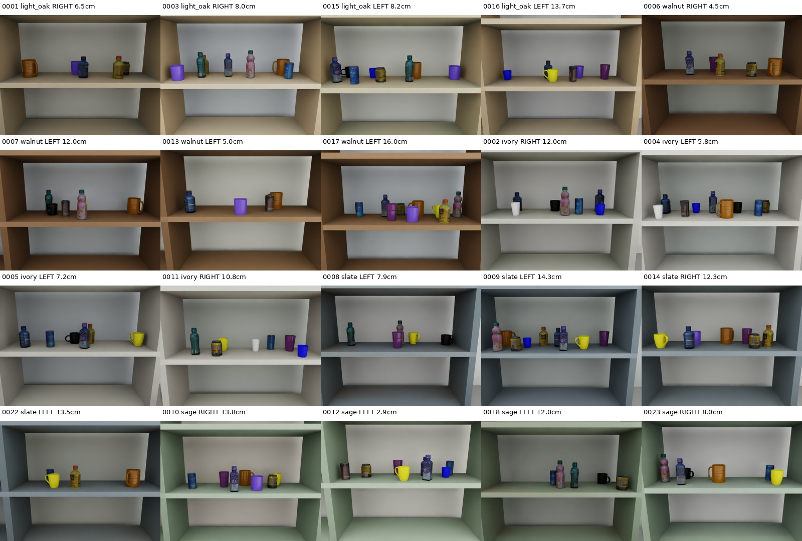

# 공통 합성 RGB-D 데이터 snapshot

[실험 로그 인덱스](../)

다섯 모델이 공통으로 사용한 `translate_diverse_1000_20261001_v1` 데이터의 생성 설정, split과 검증 기록을 보존한다. 원본 RGB-D sample은 약 6.1GB이므로 저장소에는 포함하지 않고, 데이터 구성과 label을 감사할 수 있는 manifest를 남긴다.

## 구성

| 항목 | 값 |
|---|---|
| 전체 장면 | 1,000 |
| Split | Train 800 / Validation 100 / Test 100 |
| 방향 | LEFT 500 / RIGHT 500 |
| Asset | 15개 |
| Target–blocker pair | 50개 |
| Distractor | 장면당 2–7개 |
| 변화 요소 | 배치, yaw, 재질, 조명, 카메라 |
| Label | Target 전면 통로를 확보하는 blocker의 최소 정적 AABB 변위 |
| 일반화 범위 | 동일 asset/pair에서 새로운 배치만 held-out |

## 포함 파일

| 파일 | 역할 |
|---|---|
| `generation_config.json` | 데이터 생성 범위와 고정 설정 |
| `dataset_summary.json` | 장면·방향·asset/pair 요약 |
| `splits.json` | train/validation/test scene ID |
| `manifest_*.json` | split별 입력 경로, label과 scene metadata |
| `schedule.json` | 생성 schedule |
| `validation.json` | 데이터 무결성·분포 검증 결과 |
| `completion.json` | 생성 완료 상태 |
| `RUN_NOTES.md` | 원본 데이터 폴더의 상세 기록 |
| `source/` | 생성·수정·검증 당시 코드 snapshot |
| `assets/scenes_0001_0050.jpg` | 첫 50장면 contact sheet |

Manifest 안의 절대 경로는 원본 생성 머신의 provenance이며 다른 컴퓨터에서 그대로 유효하다고 가정하면 안 된다. Scene ID, label, split, asset/pair와 생성 조건을 확인하는 audit record로 사용한다.

## 저장소만으로 가능한 것과 불가능한 것

가능:

- Split 중복과 LEFT/RIGHT 균형 확인
- Scene별 label과 target/blocker pair 확인
- 생성·검증 코드와 설정 확인
- 모델 run의 input fingerprint와 manifest를 대조

불가능:

- 원본 RGB, depth array와 mask를 직접 로드
- point cloud/cache 재생성
- 원본 데이터만을 사용하는 재학습 또는 inference

완전한 재현 패키지를 만들 때는 6.1GB sample bundle을 별도 artifact로 배포하고 이 snapshot의 scene ID 및 hash와 연결해야 한다.
